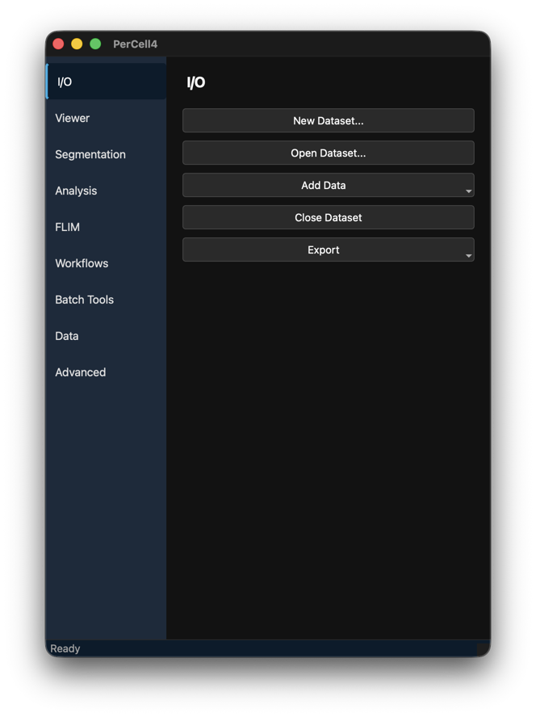
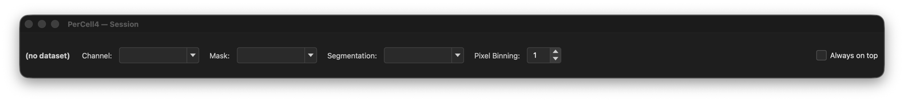
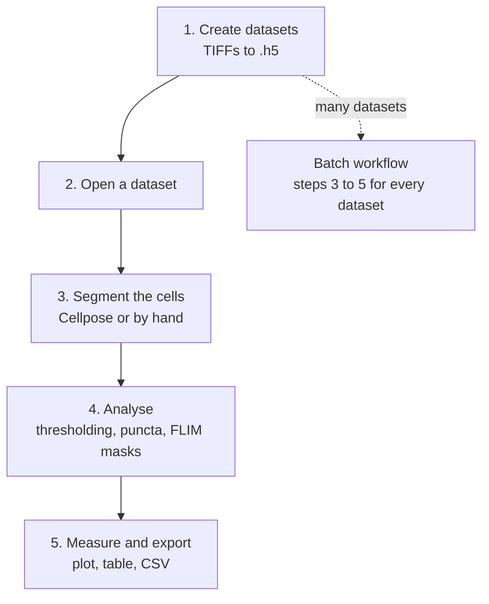

# 1. Overview

PerCell is a platform for single-cell microscopy data analysis. It can be used to segment the cell boundaries, extract cellular features, quantify extracted features on a per-cell basis, and includes fluorescence lifetime analysis with phasors. Single datasets can be explored and analyzed interactively, or many datasets can be analyzed together in batch workflows.

## Requirements

| | |
|---|---|
| **Operating system** | macOS, Linux or Windows. |
| **Python** | 3.12. Newer versions install and run, but only 3.12 is tested. See [Which Python version](../installation.md#which-python-version). |
| **GPU** (optional) | Speeds up Cellpose. NVIDIA GPUs through CUDA, and Apple silicon through MPS; without one, Cellpose runs on the CPU. On Windows without an NVIDIA GPU, install the CPU build of PyTorch (see [Windows](../installation.md#windows)). |
| **Disk space** | Several GB for PyTorch and the other dependencies, plus about 1.2 GB for each Cellpose model, downloaded on first use. |
| **Linux only** | The `libxcb` system libraries for the Qt windows (see [Linux](../installation.md#linux)). |
| **For some features** | FLIM wavelet filtering needs the `flim` extra; ImageJ ROI import needs the `imagej` extra. |

## Installing PerCell

Install PerCell with Python 3.12 as described in [Installation](../installation.md). The short form, from the repository folder:

```bash
python -m venv .venv
source .venv/bin/activate        # Windows: .venv\Scripts\activate
pip install -e .
```

Optional extras add FLIM wavelet filtering (`flim`), ImageJ ROI import (`imagej`) and GPU Cellpose (`gpu`). See [Optional extras](../installation.md#optional-extras).

## Starting PerCell

**How to start PerCell:**

1. Activate the environment you installed PerCell into.
2. Run:

   ```bash
   percell
   ```

   (`percell4-gui` also works; it is the older name.)

3. A splash screen with the PerCell logo shows while the application loads.
4. Two windows open:
   - the **launcher** (**PerCell4**), with the tool tabs on the left, and
   - the **Session bar** (**PerCell4 — Session**), which selects the active channel, mask and segmentation.

   The viewer opens when you open a dataset.





The status bar at the bottom of the launcher shows **Ready**. It carries most progress and result messages while you work. Both windows are described in [The user interface](02-user-interface.md).

## The dataset

Everything in PerCell revolves around the **dataset**: one `.h5` file per acquisition that holds the images and everything derived from them. You create it once from the microscope's files, and every later step reads from it and writes back to it.

| A dataset holds | Made by |
|---|---|
| **Channels** — the intensity images | [Creating a dataset](03-datasets.md#creating-percell-datasets), [adding layers](03-datasets.md#add-layer-to-dataset), [lifetime maps](07-flim.md#lifetime-map) |
| **Segmentations** — one number per cell | [Cellpose](05-segmentation.md), [tracking](05-segmentation.md#tracking-time-lapse), import from Cellpose, ImageJ or a TIFF |
| **Masks** — which pixels belong to condensates, puncta or other structures | [Thresholding](06-analysis.md), [phasor ROIs](07-flim.md#the-phasor-plot-window), [workflows](08-workflows.md), import from a TIFF |
| **FLIM data** — decay histograms and phasor coordinates per channel | [TCSPC import](03-datasets.md#tcspc-bin), [Batch TCSPC Append](03-datasets.md#batch-tcspc-append), [Compute Phasor](07-flim.md#phasor-analysis) |
| **Measurements** — the per-cell table | [Measure Cells](06-analysis.md#measurements), [particle analysis](06-analysis.md#particle-analysis) |
| **Metadata** — pixel size, binning, stitching, FLIM calibration, and a free-text description | Set at creation; [edited on the Data tab](03-datasets.md#the-data-tab) |

Masks and segmentations answer different questions: a mask says *which pixels*, a segmentation says *which cell*. Most analyses combine the two — for example, "the condensate pixels inside each cell".

## Typical use

Most work in PerCell follows the same path, from raw microscope files to numbers.



1. **Create datasets.** Turn the microscope's TIFFs into `.h5` datasets with **I/O → New Dataset...**: choose how files group into datasets, how z-stacks are projected and how tiles are stitched, and read FLIM `.bin` files at the same time. This is done once per acquisition. See [Compress TIFF Dataset](03-datasets.md#creating-percell-datasets).

2. **Open a dataset.** **I/O → Open Dataset...** loads it and shows every channel in the viewer. In the Session bar, choose the channel to work on. See [The I/O tab](03-datasets.md#the-io-tab) and [The Session bar](02-user-interface.md#the-session-bar).

3. **Segment the cells.** Everything else is measured per cell, so the cell boundaries come first. Either:
   - run **Cellpose** on the **Segmentation** tab and correct its mistakes by hand, or
   - draw the cells yourself: **Create Empty Labels Layer**, then **Add New Label (next ID)** for each cell.

   A segmentation made elsewhere can also be imported with **Add Data → Layer...**. For time-lapse data, track the cells over time. See [Segmentation](05-segmentation.md).

4. **Analyse.** Use the **Analysis** tab to find the structures you want to quantify, as masks:
   - **Grouped Thresholding** or **Whole Field Thresholding** for condensates and other bright structures,
   - **Adaptive Local Clipping** for puncta, then **CNR Subpopulation Classification** or **Segment by Metric** to split them into populations,
   - or, for FLIM data, phasor ROIs on the **FLIM** tab to select pixels by lifetime.

   See [Analysis](06-analysis.md) and [FLIM](07-flim.md).

5. **Measure, explore and export.** **Measure Cells** measures every channel in every cell, inside and outside the active mask; **Analyze Particles** adds particle counts and sizes. Explore the results in the **Data Plot** and the **Cell Table** — selecting cells there highlights them in the viewer — and export them with **I/O → Export → Measurements (CSV)...**. See [Measurements](06-analysis.md#measurements) and [Viewing and selecting cells](04-viewer.md).

**Many datasets.** Once the settings work on one dataset, run them on the whole experiment with a batch workflow instead of repeating steps 2 to 5. The [Single-cell thresholding analysis workflow](08-workflows.md#single-cell-thresholding-analysis-workflow) segments every dataset (with a review of each segmentation), runs the thresholding rounds, measures, and writes one CSV table for the whole experiment. It can also compress the TIFFs for you. Other workflows cover FLIM phasor masks, FLIM-FRET and dilute-phase masks. See [Workflows and analyses](08-workflows.md).

## Features

### Getting data in

- **Create datasets from TIFFs** in three folder layouts: one subfolder per dataset, a flat folder told apart by file-name tokens, or files named by channel with no tokens. Channels can be renamed or imported as masks and segmentations.
- **Collapse z-stacks** by maximum, mean or sum projection.
- **Stitch tile scans** in any tile order, with overlap, phase-correlation registration and optional blending.
- **Bin on import** to reduce large images.
- **Read TCSPC `.bin` FLIM files** with the images, or add them later — to one dataset, or to many at once with calibration from a CSV, a Leica `.lif` or an `.xml` file.
- **Add layers** from single TIFFs, folders of TIFFs, ImageJ ROI sets, Cellpose `_seg.npy` files and phasor `.npz` files.

See [Datasets: I/O and Data](03-datasets.md).

### Managing datasets

- Rename or delete channels, masks and segmentations.
- Keep a description of the sample and conditions inside the file.
- **Pixel binning** at view time, without changing the file.

See [The Data tab](03-datasets.md#the-data-tab) and [The Session bar](02-user-interface.md#the-session-bar).

### Viewing and selecting cells

- A [napari](https://napari.org) viewer with every channel, segmentation and mask as a layer, coloured by channel name.
- **Linked selection**: a cell selected in the viewer, the Data Plot, the Cell Table or the Phasor Plot is selected in all of them.
- **Filters** that limit every window, and measurement, to chosen cells.
- **Multi-select** to pick many cells by clicking.

See [Viewing and selecting cells](04-viewer.md).

### Segmentation

- **Cellpose 4** with four models (cpsam_v2, cpsam, cpdino, cpdino-vitb), on CPU or GPU.
- Contrast stretching and blur before segmentation, with a live preview and a diameter reference circle.
- Removal of edge cells and small cells.
- **Tracking** of cells over time with division lineage.
- **Hand editing**: delete, draw and renumber cells; edits are saved as you make them.

See [Segmentation](05-segmentation.md).

### Finding condensates and puncta

- **Adaptive Local Clipping** — puncta detection cell by cell against a local background, with no hand-set threshold.
- **CNR classification** — split puncta into bright and dim populations by contrast-to-noise ratio, at a set value, automatically, or on an interactive histogram.
- **Segment by metric** — split particles by focus, size, intensity or contrast on an interactive histogram.
- **Grouped thresholding** — group cells of similar brightness, then threshold each group, with review of every group.
- **Whole-field thresholding** — one threshold (Otsu, Triangle, Li, adaptive or manual) for the image.
- **Dilute-phase masks** — the cytoplasm outside the condensates, round by round or from an existing condensate mask.

See [Analysis](06-analysis.md) and [Workflows](08-workflows.md#dilute-phase-mask-generation).

### Measuring

- Per-cell intensity metrics for every channel: mean, max, min, integrated, standard deviation, median, mode, area and more, inside and outside a mask.
- **Particle analysis**: count, area and intensity of the particles in each cell.
- A scatter plot and a table of the results, and export to CSV.

See [Measurements](06-analysis.md#measurements).

### FLIM

- **Phasor analysis** at harmonics 1–3, with per-channel calibration stored in the dataset.
- **Wavelet and median filtering** of the phasor.
- An interactive **Phasor Plot** with intensity, mask and lifetime reference filters.
- **Phasor ROIs**, drawn by hand or fitted with a Gaussian mixture model, turned into masks. ROIs can be saved and reused on other datasets.
- **Lifetime maps** from the unfiltered, median- or wavelet-filtered phasor.

See [FLIM](07-flim.md).

### Workflows over many datasets

- **Single-cell thresholding analysis workflow** — from TIFFs or datasets to a measurement table: Cellpose with review of each segmentation, tracking, any number of thresholding rounds, particle analysis, an optional dilute-phase mask, and parquet and CSV export with chosen columns.
- **Automated phasor-masks workflow** — two lifetime masks per channel from a fitted phasor ellipse.
- **FLIM-FRET analysis** — FRET efficiency from donor and donor + acceptor pairs, per pair or per cell.
- **Dilute phase mask from mask** — dilute-phase masks across many datasets.
- **Analyses** — per-particle donut background subtraction, per-particle multi-channel intensity, and whole-field decapping-sensor intensity, with presets for established protocols.

See [Workflows and analyses](08-workflows.md).

### Command-line tools

Every batch operation also runs without the GUI through the `percell-*` tools: segmentation and tracking, thresholding, measurement, phasor computation and masks, export, and renaming, deleting and describing across datasets. The **Batch Tools** window runs them from inside PerCell.

See [Batch Tools](09-batch-tools.md) and [Command-line tools](../cli.md).

## Three ways of working

| Way | Use it for | Where |
|---|---|---|
| **Interactively, one dataset at a time** | Exploring new data, choosing settings, checking results, FLIM phasor work | The launcher tabs, with the Session bar and the viewer |
| **Batch workflows** | Applying settled settings to a whole experiment, with review steps where judgement is needed | The **Workflows** tab |
| **Command line** | Unattended processing and scripted pipelines | The **Batch Tools** window or a terminal |

All three read and write the same datasets, so you can mix them: for example, choose thresholding settings on one dataset interactively, run them on the experiment with the single-cell workflow, then rename a mask across every dataset with `percell-batch-rename`.

## Where PerCell keeps things

| What | Where |
|---|---|
| Your data and every result | In the dataset `.h5`, wherever you saved it. PerCell writes nothing into its own folder. |
| Workflow and analysis results | A run folder in the output folder you choose, with CSV and parquet tables and the settings used. |
| Window positions, last-used folders and tool settings | The PerCell settings store (macOS: `com.LeeLabPerCell4.PerCell4` preferences). |
| Advanced settings (Cellpose device) | `advanced_settings.json` in your user config folder. See [Advanced settings](10-advanced.md). |
| Cellpose model weights | Downloaded by Cellpose on first use into `~/.cellpose/models/` (about 1.2 GB per model). |
