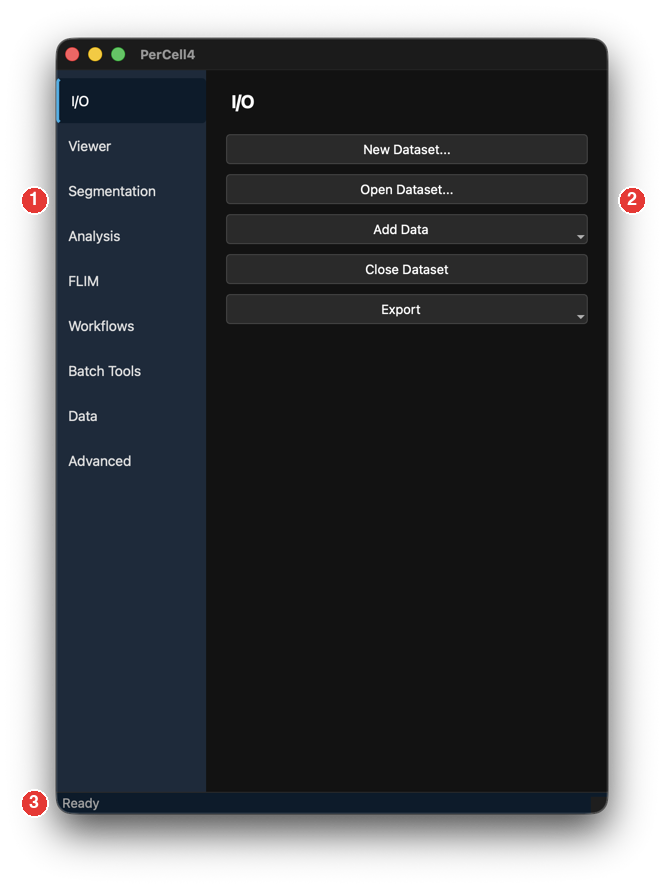
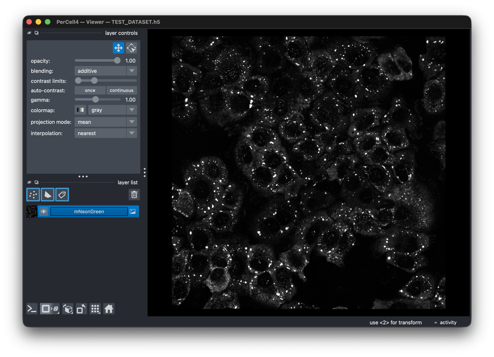

# 2. The user interface

## Overview

PerCell works in several separate windows rather than one large window. You can place each where you like; PerCell remembers their positions.

| Window | Title | Opens |
|---|---|---|
| Launcher | **PerCell4** | At start. All tools are here. |
| Session bar | **PerCell4 — Session** | At start. Selects the active channel, mask and segmentation. |
| Viewer | **PerCell4 — Viewer** | When you open a dataset, or with **Viewer → Open Viewer**. |
| Batch Tools | **PerCell4 — Batch Tools** | When you select the **Batch Tools** tab. |
| Phasor Plot | **PerCell4 — Phasor Plot** | From the **FLIM** tab. |
| Data Plot | **PerCell4 — Data Plot** | From **Analysis → Open Data Plot**. |
| Cell Table | **PerCell4 — Cell Table** | From **Analysis → Open Cell Table**. |

The viewer, Data Plot, Cell Table and Phasor Plot are linked: selecting a cell in one selects it in all of them. See [Selecting and filtering cells](04-viewer.md#selecting-and-filtering-cells).

## The launcher

| # | Area | Description |
|---|---|---|
| 1 | Sidebar | Nine tabs: **I/O**, **Viewer**, **Segmentation**, **Analysis**, **FLIM**, **Workflows**, **Batch Tools**, **Data**, **Advanced**. Click a tab to show its panel. **I/O** is selected at start. |
| 2 | Panel | The tools of the selected tab, in titled groups. Long panels scroll. |
| 3 | Status bar | Progress and result messages, for example `Loaded: sample.h5` or `Done: 212 cells (8 edge, 3 small removed)`. |

The tabs, and the chapter that describes each:

| Tab | Purpose | Chapter |
|---|---|---|
| **I/O** | Create, open, add to, close and export datasets. | [3](03-datasets.md) |
| **Viewer** | Open or hide the viewer; filter cells. | [4](04-viewer.md) |
| **Segmentation** | Cellpose, tracking over time, label editing. | [5](05-segmentation.md) |
| **Analysis** | Thresholding, puncta detection, particle analysis, measurements. | [6](06-analysis.md) |
| **FLIM** | Phasor analysis, filters, phasor segmentation, lifetime maps. | [7](07-flim.md) |
| **Workflows** | Batch workflows and analyses over many datasets. | [8](08-workflows.md) |
| **Batch Tools** | Run the `percell-*` command-line tools. | [9](09-batch-tools.md) |
| **Data** | Rename or delete channels, masks and segmentations; edit the description; dataset info. | [3](03-datasets.md#the-data-tab) |
| **Advanced** | Cellpose device and PyTorch environment. | [10](10-advanced.md) |

### Menu bar

| Menu | Item | Function |
|---|---|---|
| **File** | **Open Project...** | Choose a project folder. It becomes the start folder when you browse for TIFFs in **New Dataset...**. |
| **File** | **Quit** | Close PerCell. If a workflow is running, PerCell asks whether to cancel it first. |
| **Selection** | **Multi-select...** | Select several cells by clicking them in the viewer. See [Multi-select](04-viewer.md#selecting-several-cells-with-multi-select). The **M** key in the viewer does the same. |

### While a workflow runs

When a batch workflow runs, PerCell locks the launcher so you cannot change the dataset under it. The Cell Table, Data Plot and Phasor Plot close. The status bar shows the progress as `phase — i/N — dataset — (round k/M)`. Only one workflow can run at a time.

## The Session bar

The Session bar decides what every tool works on. It opens with the launcher and stays open.

| Control | Description |
|---|---|
| Dataset name | The open dataset's file name, or **(no dataset)**. |
| **Channel:** | The active channel. Cellpose, thresholding, FLIM and the other tools read this channel. |
| **Mask:** | The active mask. Measurements and particle analysis use it. |
| **Segmentation:** | The active segmentation: the set of cells that measurements, thresholding and filters refer to. |
| **Pixel Binning:** | Combine each N×N block of pixels into one when PerCell reads the dataset (1–16, default 1). Intensity and decay are summed, phasor values averaged, and masks and labels take the majority value. Binning changes only what you view and measure, never the file. It resets to 1 when you switch datasets. New results made at a bin above 1 get a `_bin<k>` suffix in their name. |
| **Always on top** | Keep the Session bar above the other PerCell windows. It stays where you put it. |

> **Tip:** When a tool says "Select a channel in the Session window first", choose one under **Channel:**.

## The viewer

The viewer is a [napari](https://napari.org) window. PerCell shows each channel of the dataset as an image layer, each segmentation as a labels layer, and each mask as a labels layer. See [The viewer window](04-viewer.md#the-viewer-window).

## Other windows

- **Batch Tools** — a console for the `percell-*` tools. See [Batch Tools](09-batch-tools.md).
- **Phasor Plot** — the phasor histogram with ROI tools. See [The Phasor Plot window](07-flim.md#the-phasor-plot-window).
- **Data Plot** and **Cell Table** — scatter plot and table of the measurements. See [The Data Plot](04-viewer.md#the-data-plot) and [The Cell Table](04-viewer.md#the-cell-table).
