# 3. Datasets: I/O and Data

## Overview

A **dataset** is one `.h5` file that holds an acquisition and everything derived from it. You create it from microscope TIFFs, open it to work on it, add data from other tools, and export results. The **I/O** tab does all of this. The **Data** tab renames and deletes what a dataset contains and shows its details.

A dataset holds these kinds of item. Each is addressed by name.

| Item | Stored at | What it is |
|---|---|---|
| Channel | `/intensity` | An intensity image: one stain, detector or band. |
| Segmentation | `/labels/<name>` | A labelled image in which each cell has its own number. |
| Mask | `/masks/<name>` | A yes/no image that marks pixels, for example condensates. |
| Decay | `/decay/<channel>` | Raw FLIM photon-arrival histograms for a channel. |
| Phasor | `/phasor/<channel>` | Phasor coordinates (G, S) computed from the decay. |
| Measurements | `/measurements` | The per-cell table from **Measure Cells**. |
| Groups | `/groups/<name>` | Which intensity group each cell fell into during grouped thresholding. |
| Metadata | `/metadata` | Channel names, pixel size, binning, stitching, FLIM calibration, and the description. |

A mask answers "which pixels", a segmentation answers "which cell". See the [Glossary](glossary.md).

---

## Feature descriptions

### The I/O tab

| Button | Function |
|---|---|
| **New Dataset...** | Opens **Compress TIFF Dataset** to build new datasets from TIFFs. |
| **Open Dataset...** | Opens a `.h5` dataset. A **Loading dataset…** progress dialog shows, then the viewer shows the dataset. The status bar shows `Loaded: <name>`. |
| **Add Data** ▾ | **Layer...** opens **Add Layer to Dataset** (needs an open dataset). **Batch TCSPC...** opens **Batch TCSPC Append**, which adds FLIM decay data to many datasets at once. |
| **Close Dataset** | Closes the dataset and clears the viewer. |
| **Export** ▾ | **Measurements (CSV)...** saves the measurements table. **Images (TIFF)...** opens **Export Images**. **Phasor (.npz)...** writes each channel's phasor data to a `.npz` file for use in your own scripts. |

| Add Data menu | Export menu |
|---|---|
| 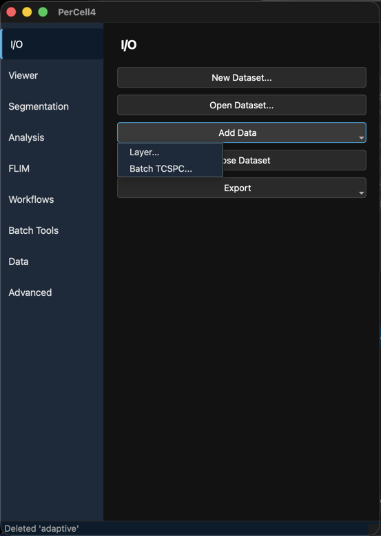 | 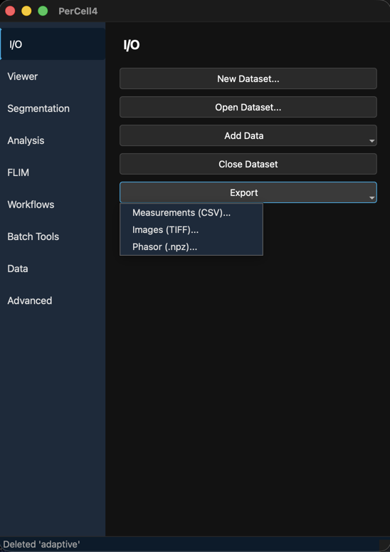 |

### Creating PerCell Datasets

Open with **I/O → New Dataset...**. It finds the TIFFs in a folder, groups them into datasets by their file names, and writes one `.h5` per dataset.

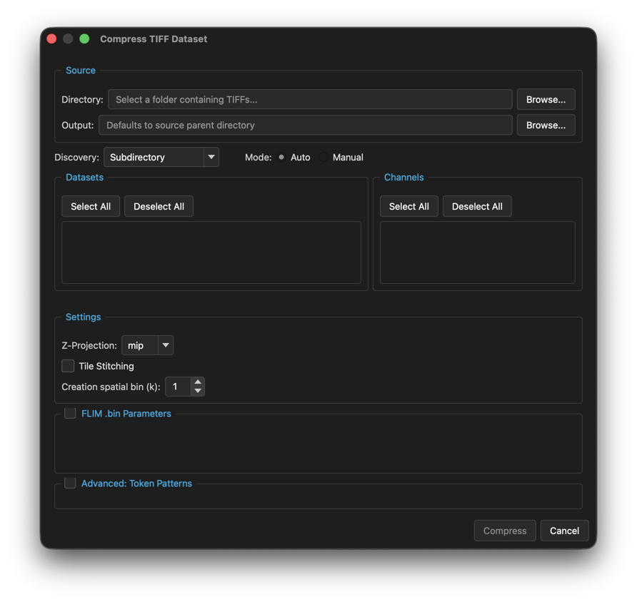

#### Source

- **Directory:** The folder that holds the TIFFs. Choosing a folder with **Browse...** starts discovery at once and fills in **Output:**.
- **Output:** Where the `.h5` files are written. By default, the folder that contains the source folder.

#### Discovery and Mode

- **Discovery:** How TIFFs are grouped into datasets:
  - **Subdirectory** (default) — each subfolder is one dataset.
  - **Flat Directory** — all files are in one folder. PerCell removes the channel, tile, z and time tokens from each file name; files left with the same name form one dataset.
  - **Tokenless (by name)** — for files with no `_ch00`-style token. The shared start of the file names becomes the dataset name and the end becomes the channel name, for example `…_DNA` and `…_SG_mask`. Use **Manual** mode to fix a channel name or mark a file as a mask or segmentation.
- **Mode:**
  - **Auto** (default) — channels are named from the file tokens.
  - **Manual** — each channel row gets a **Name** field and a type: **Channel**, **Segmentation** or **Mask**. Use it to import an existing segmentation or mask TIFF along with the images. Double-click a dataset to rename it.

#### Datasets and Channels

Each list has **Select All** and **Deselect All**. Only checked datasets are compressed, and only checked channels go into each dataset. A summary line shows how many tiles, z-slices and timepoints were found.

#### Settings

- **Z-Projection:** How a z-stack is collapsed into one image: **mip** (maximum intensity, default), **mean**, **sum** or **none**.
- **Tile Stitching** — Stitch tiles into one image. It is ticked automatically when tiles (`_s00`, `_s01`, …) are found, and it shows the stitching settings:
  - **Grid size X:** and **Grid size Y:** — tiles across and down (1–100).
  - **Pattern:** — **Row-by-row**, **Column-by-column**, **Snake-by-row** or **Snake-by-column**.
  - **Order:** — where the first tile is and which way the grid runs, for example **Right & Down**.
  - **Overlap:** — tile overlap in percent (0–99).
  - **Register overlapping tiles (phase correlation)** — refine the tile positions from the image content, using the **Reference:** channel.
  - **Fusion:** — **None** keeps each pixel from one tile, so intensities are not changed. It is required, and chosen automatically, when the dataset has FLIM decay. **Linear Blending** blends the overlap for a seamless mosaic.
  - A preview diagram beside the form shows the tile order.
- **Creation spatial bin (k):** Bin the images by k×k pixels when writing the dataset (1–16, default 1). This cannot be undone later.

#### FLIM .bin Parameters

Tick this group to read TCSPC `.bin` files alongside the TIFFs. It is ticked automatically when `.bin` files are found.

- **Laser frequency:** 80.0 MHz by default.
- **X dimension:**, **Y dimension:** Image size in pixels (512 × 512 by default).
- **Time bins:** Number of time bins per pixel (132 by default).
- **Data type:** and **Dimension order:** How the file is laid out.
- **Header bytes:** Bytes to skip at the start of each file. 0 means auto-detect.
- **Per-channel calibration** — for each channel, the **Phase:** (radians) and **Modulation:** of the instrument response, used by phasor analysis.

#### Advanced: Token Patterns

Regular expressions that find the channel, timepoint, z-slice and tile numbers in file names. Defaults: `_ch(\d+)`, `_t(\d+)`, `_z(\d+)`, `_s(\d+)`. After changing them, click **Re-scan with new patterns**. Hidden in **Tokenless** mode.

#### Buttons

**Compress** writes the datasets; **Cancel** closes the dialog. If an output file already exists, PerCell asks whether to overwrite it. A **Compressing...** progress dialog shows while it works, and any failures are listed at the end.

### Add Layer to Dataset

Opened with **I/O → Add Data → Layer...** when a dataset is open. It adds data from other files or programs to the open dataset. Each tab handles one source.

#### Single TIFF

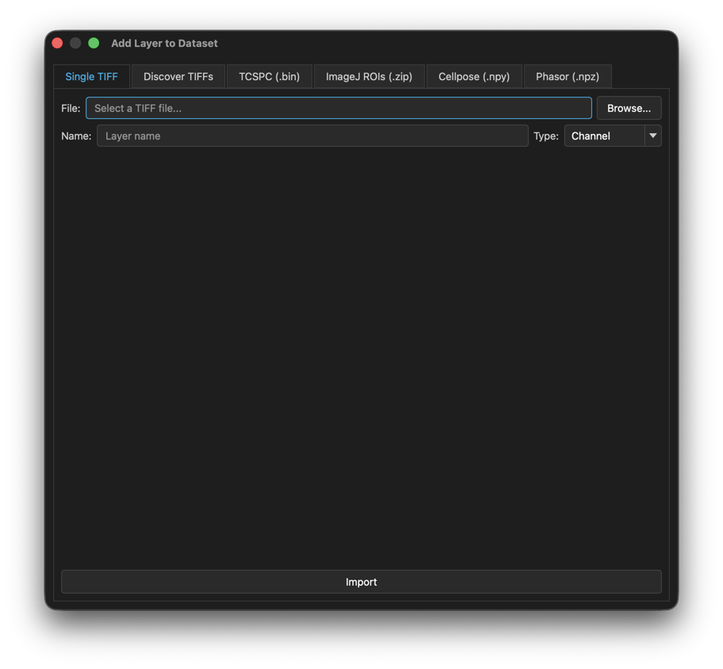

- **File:** The TIFF to add.
- **Name:** The name it gets in the dataset.
- **Type:** **Channel**, **Segmentation** or **Mask**. A new segmentation or mask becomes the active one.
- **Import** adds it. On time-lapse data, a single 2D image is used for every timepoint.

#### Discover TIFFs

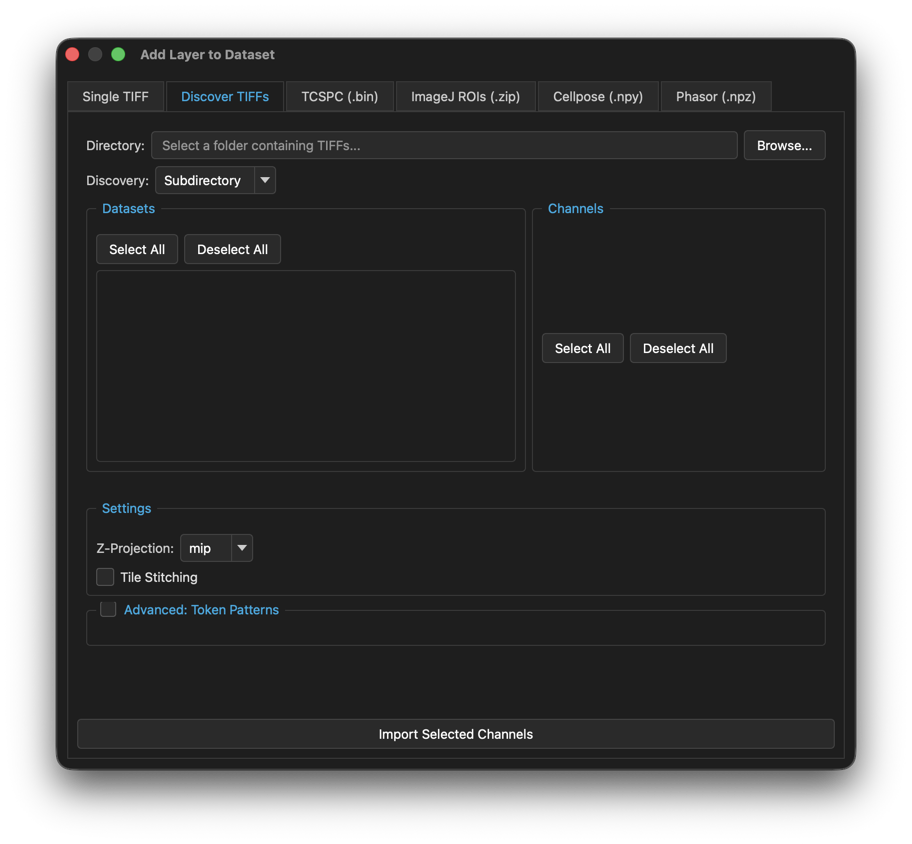

Adds several channels at once from a folder, found the same way as in **Compress TIFF Dataset**: choose the **Directory:** and **Discovery:** mode, check the datasets and channels, set the name and type of each channel, and click **Import Selected Channels**. **Tile Stitching** and **Advanced: Token Patterns** work as in Compress. The **Z-Projection:** setting on this tab has no effect.

#### TCSPC (.bin)

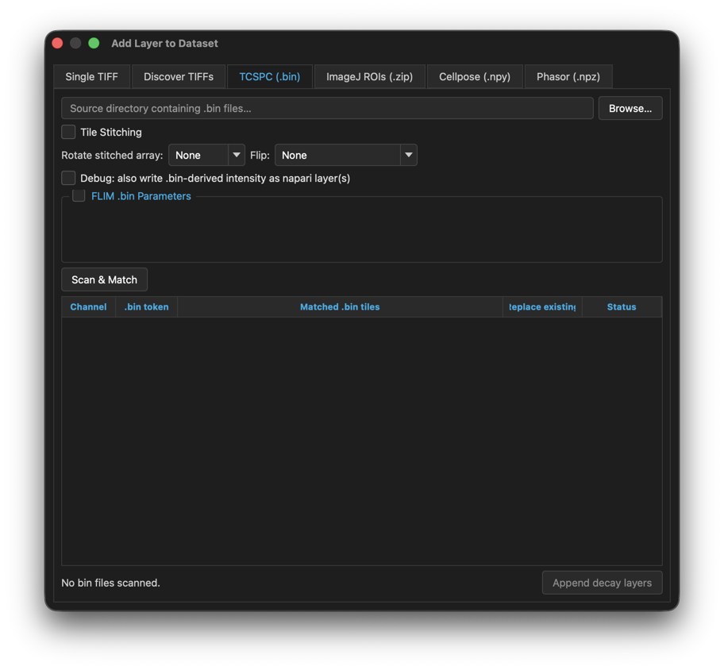

Adds FLIM decay data to the open dataset's channels.

1. Choose the folder of `.bin` files with **Browse...**.
2. Set **Tile Stitching**, **Rotate stitched array:** (**None**, **90° CCW**, **180°**, **90° CW**) and **Flip:** (**None**, **Vertical**, **Horizontal**) so the decay lines up with the intensity image. Stitching is pre-filled from the dataset.
3. Check the **FLIM .bin Parameters** (pre-filled from the dataset).
4. Click **Scan & Match**. The table pairs each dataset **Channel** with a **.bin token** and lists the **Matched .bin tiles**. Tick **Replace existing** to overwrite decay data already there. **Status** shows problems.
5. Click **Append decay layers**. PerCell writes `/decay/<channel>`. Any phasor already computed for that channel is now out of date; compute it again.

**Debug: also write .bin-derived intensity as napari layer(s)** shows the photon counts from the `.bin` files as a layer, so you can check the alignment.

#### ImageJ ROIs (.zip)

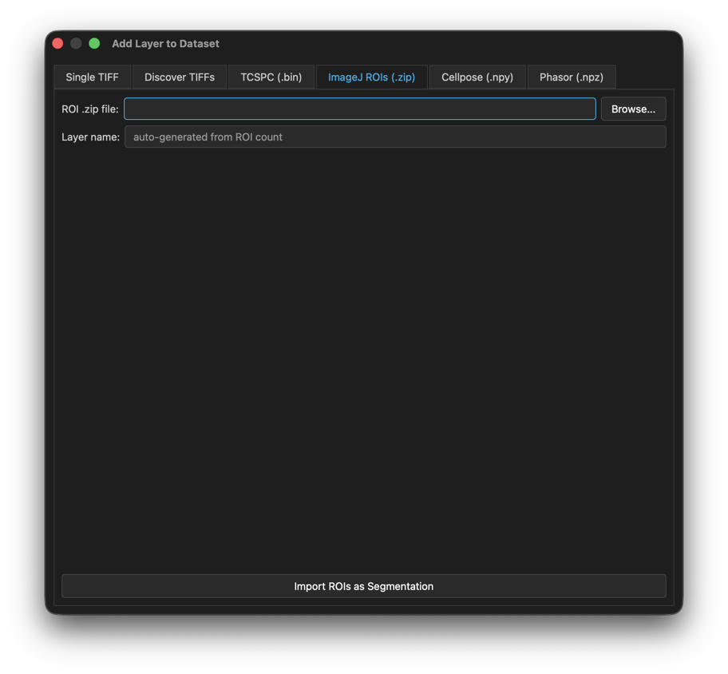

Imports an ImageJ/Fiji ROI set as a segmentation. Choose the **ROI .zip file:**, optionally a **Layer name:**, and click **Import ROIs as Segmentation**. Needs the `imagej` extra.

#### Cellpose (.npy)

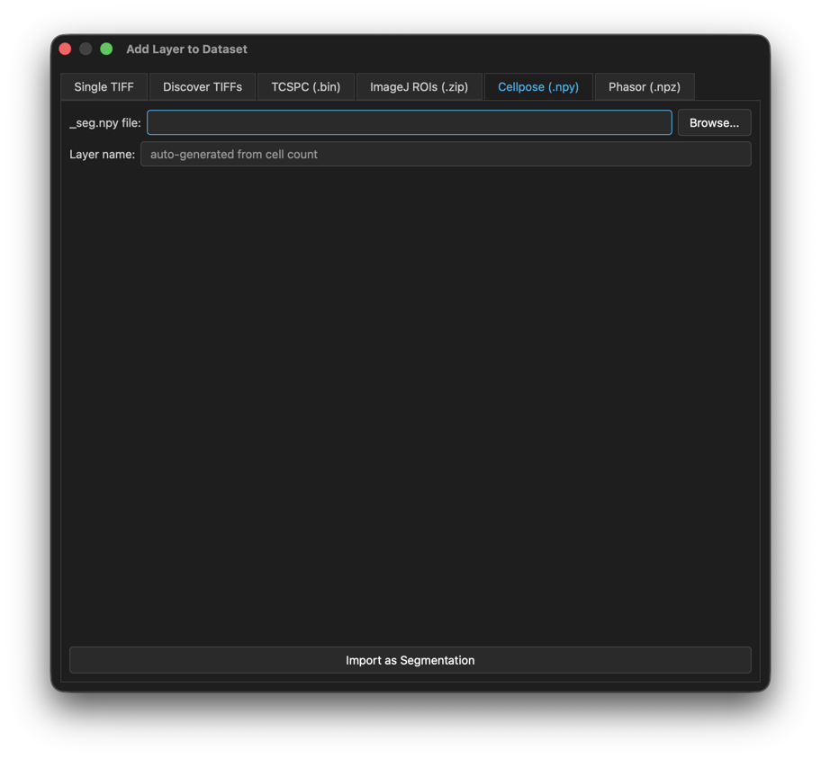

Imports a segmentation saved by the Cellpose GUI. Choose the **_seg.npy file:**, optionally a **Layer name:**, and click **Import as Segmentation**.

#### Phasor (.npz)

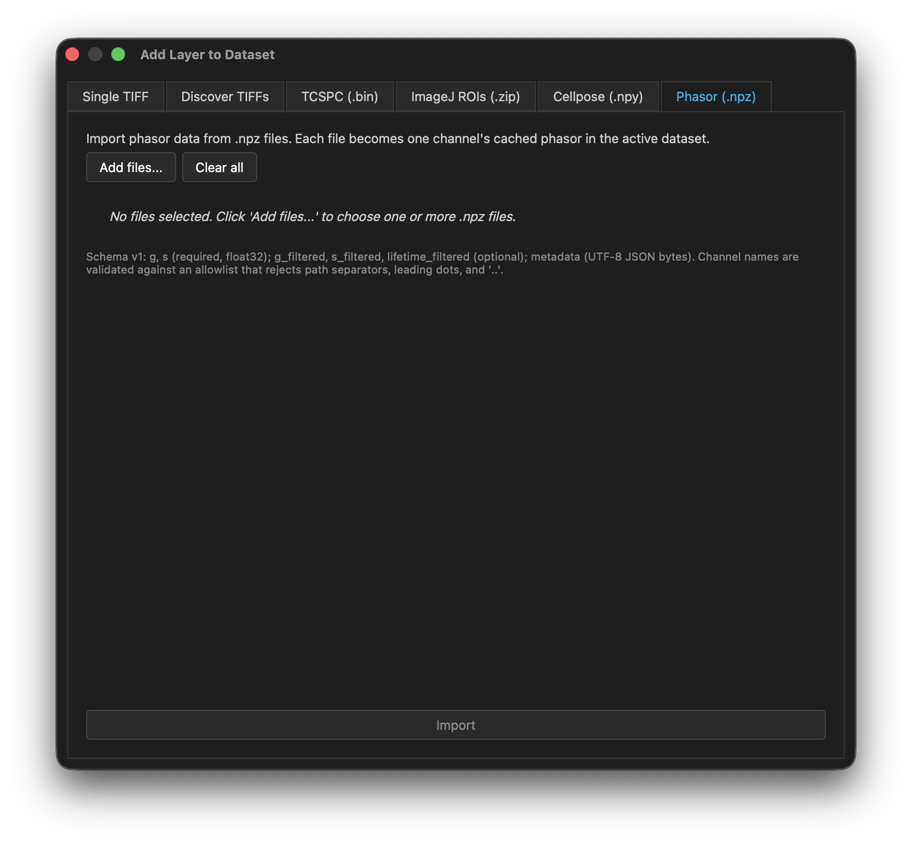

Imports phasor data made by PerCell's phasor export or by your own scripts. Click **Add files...** to choose one or more `.npz` files. For each file the table shows the detected channel, the image shape and whether filtered data is included. Set the **Target channel** and the **Action** (**Skip**, **Import** or **Overwrite**), then click **Import**. Each file needs `g` and `s` arrays; `g_filtered`, `s_filtered` and `lifetime_filtered` are optional.

### Batch TCSPC Append

Opened with **I/O → Add Data → Batch TCSPC...**. It adds FLIM decay data to many existing datasets in one run, using one calibration. No dataset needs to be open.

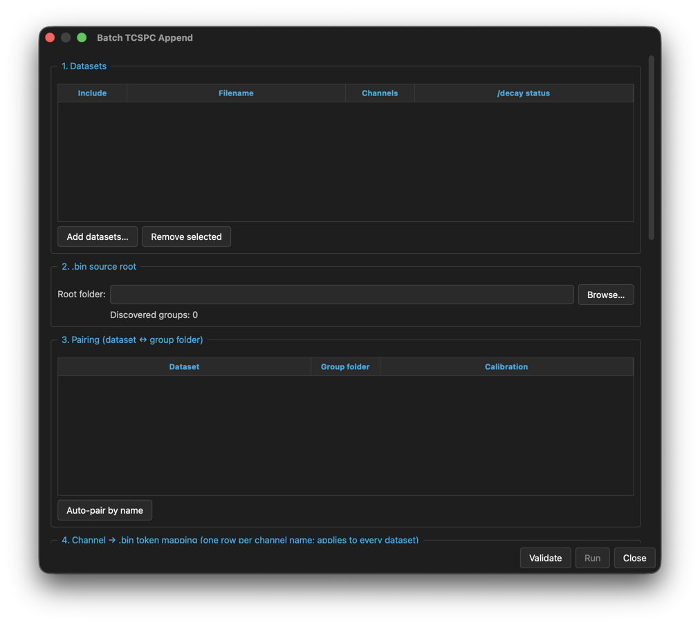

The dialog is a numbered list of steps:

1. **Datasets** — Add the `.h5` files with **Add datasets…**. The table shows each file's channels and whether it already has decay data.
2. **.bin source root** — The folder whose subfolders hold each dataset's `.bin` files.
3. **Pairing (dataset ↔ group folder)** — Which subfolder belongs to which dataset. **Auto-pair by name** matches them by name; choose **— skip —** to leave a dataset out.
4. **Channel → .bin token mapping** — Which `.bin` channel token belongs to each dataset channel name.
5. **Calibration (CSV, .lif, or .xml)** — The phase and modulation calibration, from a CSV file or read from a Leica `.lif` or `.xml` file.
6. **.lif/.xml → channel binding** — Shown for `.lif` or `.xml` calibration: which calibration entry belongs to which channel. **Auto-match** fills it in.
7. **Stitching & orientation** — Tile stitching, rotation, flip, and the **FLIM .bin Parameters**.
8. **If a /decay layer already exists** — **Skip existing layers** (default) or **Overwrite all**.
9. **Pre-flight report** — The result of **Validate**.

Click **Validate** first. **Run** becomes available when the check passes. At the end a summary lists what was written; **Copy report to clipboard** copies it.

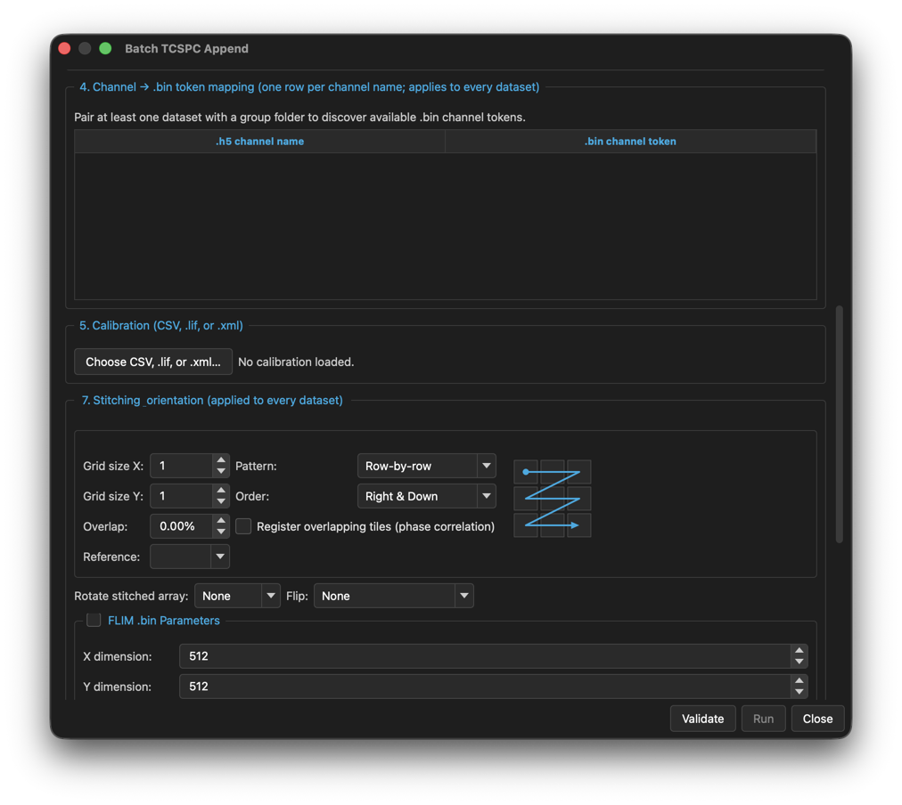

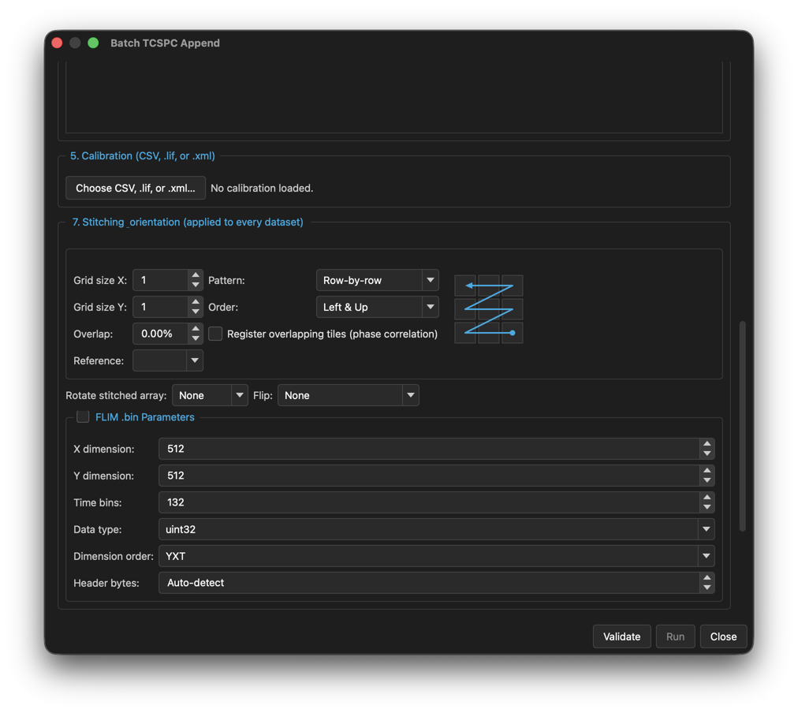

### Export Images

Opened with **I/O → Export → Images (TIFF)...**.

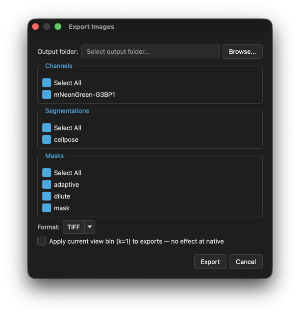

- **Output folder:** Where the TIFFs go.
- **Channels**, **Segmentations**, **Masks** — Tick the items to export. All are ticked by default; **Select All** toggles a group.
- **Format:** **TIFF**.
- **Apply current view bin (k=…) to exports** — Export at the Session bar's **Pixel Binning:** instead of full resolution. Disabled at k=1.

**Export** writes `<dataset>_<item>.tif` for each item (`_t00`, `_t01`, … for each timepoint of time-lapse data). The pixel size is written into each TIFF.

### The Data tab

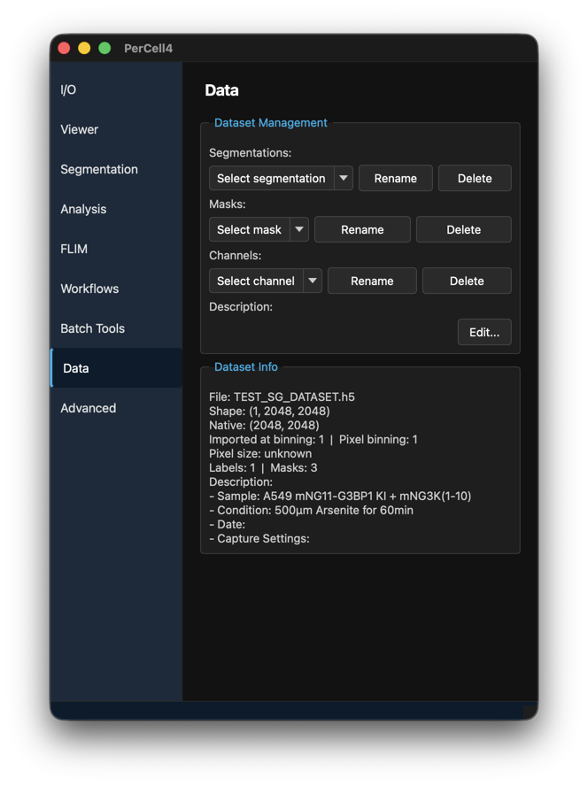

#### Dataset Management

For **Segmentations:**, **Masks:** and **Channels:**, choose an item and click:

- **Rename** — give it a new name. Renaming a channel also carries over its FLIM calibration.
- **Delete** — remove it after a confirmation. This cannot be undone. Deleting a channel also deletes its decay, phasor and calibration data.

**Description:** **Edit...** opens the **Dataset Description** dialog, a free-text note saved inside the `.h5` file. It starts with a template for the sample, condition, date and capture settings. **Save** stores it; **Cancel** closes without saving; **Clear** removes it after a confirmation.

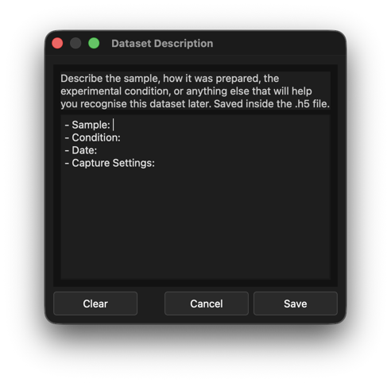

The description then shows under **Dataset Info**:

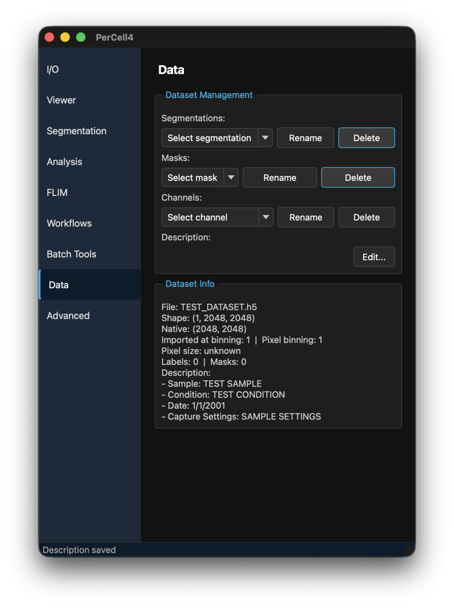

#### Dataset Info

Shows the open dataset's file name, image shape, native shape, the binning it was created at and the current view binning, pixel size, number of segmentations and masks, and the description.

---

## Instructions

### Creating a dataset from TIFFs

1. Open the **I/O** tab and click **New Dataset...**.
2. Next to **Directory:**, click **Browse...** and choose the folder of TIFFs.
3. Choose the **Discovery:** mode that matches how the files are arranged. The **Datasets** and **Channels** lists fill in.
4. Uncheck any dataset or channel you do not want.
5. If the images are z-stacks, choose the **Z-Projection:**.
6. If the images are tiles, check the **Tile Stitching** settings against how the microscope acquired them. The preview shows the tile order.
7. If `.bin` FLIM files are included, check the **FLIM .bin Parameters** and enter each channel's calibration.
8. Optionally change **Output:**.
9. Click **Compress**. When it finishes, open a dataset with **Open Dataset...**.

### Importing a segmentation made elsewhere

1. Open the dataset.
2. Choose **I/O → Add Data → Layer...**.
3. Use the tab for the source: **Single TIFF** with **Type: Segmentation** for a label image, **ImageJ ROIs (.zip)** for an ROI set, or **Cellpose (.npy)** for a Cellpose GUI file.
4. Enter a name and click the import button. The segmentation becomes the active one in the Session bar.

### Adding FLIM data to many datasets

1. Choose **I/O → Add Data → Batch TCSPC...**.
2. Work through steps 1 to 8 of the dialog.
3. Click **Validate** and read the **Pre-flight report**.
4. Fix any problem it lists, then click **Run**.

### Exporting results

- Measurements: **I/O → Export → Measurements (CSV)...**, then choose a file name. Run **Measure Cells** first.
- Images: **I/O → Export → Images (TIFF)...**, choose the items and folder, then **Export**.
- Phasor data: **I/O → Export → Phasor (.npz)...**, then choose a folder. PerCell writes `<dataset>_<channel>_phasor.npz` per channel.

For many datasets at once, use the `percell-batch-export` and `percell-batch-measure` tools. See [Batch Tools](09-batch-tools.md).
