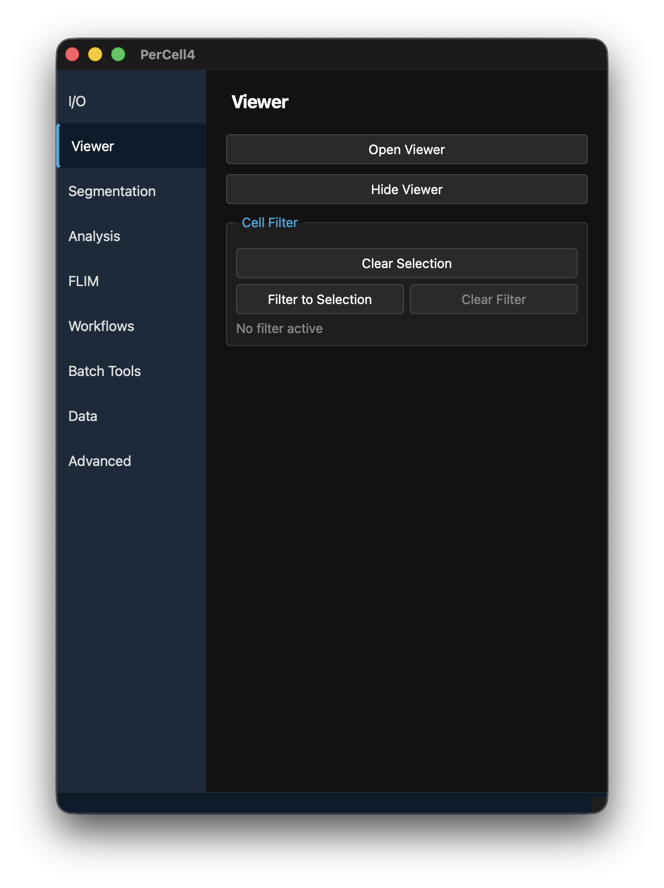
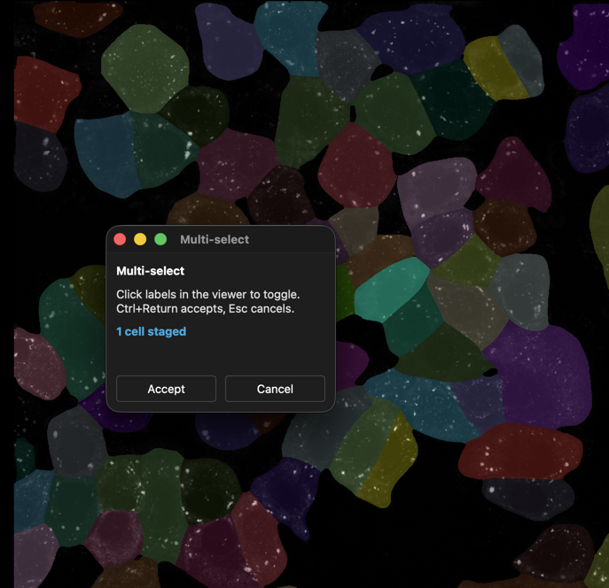
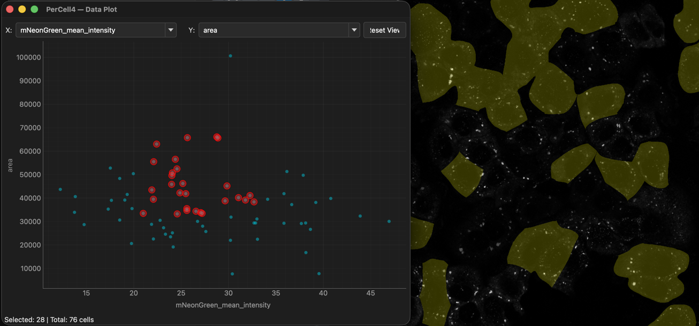
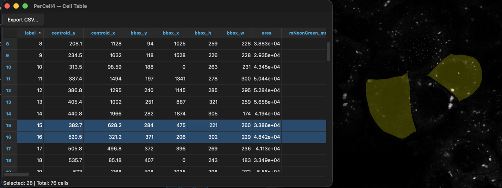

# 4. Viewing and selecting cells

## Overview

The viewer shows the open dataset: every channel, segmentation and mask as a layer. It is linked to the Data Plot, the Cell Table and the Phasor Plot. A cell you select in one window is selected in all of them. A filter limits every window to the selected cells.

---

## Dialog descriptions

### The Viewer tab

- **Open Viewer** — Show the viewer window. It also opens when you open a dataset.
- **Hide Viewer** — Hide it without closing the dataset.

#### Cell Filter

- **Clear Selection** — Deselect all cells.
- **Filter to Selection** — Show only the selected cells, in the viewer and in every linked window. With nothing selected, the status bar shows "No cells selected to filter".
- **Clear Filter** — Show all cells again. Available only while a filter is on.
- The line below shows **No filter active** or **Showing n of N cells**.

### The viewer window

The viewer is a [napari](https://napari.org) window titled **PerCell4 — Viewer — <dataset>**. All napari tools work as usual: zoom, pan, layer list, contrast, opacity, and the paint, fill and erase tools for labels.

PerCell adds these layers:

| Layer | Shown as | Appearance |
|---|---|---|
| Each channel | Image, additive blending | Colour chosen from the channel name (below). |
| Each segmentation | Labels | Each cell a random colour, 25% opacity. |
| Each mask | Labels | One colour, 75% opacity. |
| `<segmentation>_tracks` | Tracks | Cell tracks, after measuring tracked time-lapse data. |

Channel colours come from the channel name:

| Name contains | Colour |
|---|---|
| lifetime | turbo |
| dapi, hoechst | blue |
| gfp, fitc, alexa488, mtq2 | green |
| rfp, mcherry, tritc, alexa594 | red |
| cy5, alexa647, casir | magenta |
| bf, brightfield, dic, phase, mng, anything else | gray |

Tools add temporary layers whose names start with `_`, for example `_threshold_preview` or `_diameter_reference`. They are previews and are never saved to the dataset.

Edits you make to a segmentation with napari's paint, fill or erase tools are saved to the dataset automatically.

On time-lapse data, the time slider sets the timepoint that every tool works on.

Workflows change the title to show what is being reviewed, for example **Threshold QC — <dataset> — round: <round> (i/N)**.

### Multi-select

Opened with **Selection → Multi-select...** or the **M** key in the viewer. It needs a segmentation in the viewer.

- Click cells in the viewer to add or remove them. Staged cells show in cyan and the window counts them.
- **Accept** (or Ctrl+Return) selects the staged cells.
- **Cancel** (or Esc) discards them.

### The Data Plot

Opened with **Analysis → Open Data Plot** after **Measure Cells**. A scatter plot of the measurements, one point per cell.

- **X:** and **Y:** — The measurement to plot on each axis. X starts on `area`.
- **Reset View** — Zoom back to all points.
- Click a point to select that cell. Ctrl-click adds to the selection. Shift-drag selects a rectangle. Esc clears the selection.
- The status line shows **Selected: n | Total: N cells**.

Selected cells are ringed in red on the plot and highlighted in yellow in the viewer.

### The Cell Table

Opened with **Analysis → Open Cell Table** after **Measure Cells**. The measurements as a table, one row per cell.

- Click a column header to sort. Select rows to select those cells everywhere.
- **Export CSV...** — Save all rows, or only the filtered rows when a filter is on.
- Right-click menu: **Export Selection to CSV...** and **Export All to CSV...**.
- The status line shows **Selected: n | Total: N cells**.

---

## Instructions

### Selecting and filtering cells

1. Open a dataset and measure it (**Analysis → Measure Cells**).
2. Select cells in any linked window:
   - click a cell in the viewer, or
   - click or Shift-drag points in the Data Plot, or
   - select rows in the Cell Table.
3. The selected cells are highlighted in yellow in the viewer, and the others are dimmed.
4. To work only with those cells, open the **Viewer** tab and click **Filter to Selection**. Every window now shows only them.
5. Click **Clear Filter** to show all cells again.

### Selecting several cells with Multi-select

1. Press **M** in the viewer.
2. Click each cell you want. Click again to remove it.
3. Press Ctrl+Return to accept, or Esc to cancel.

### Finding cells by their measurements

1. Open the Data Plot and choose, for example, **X:** `area` and **Y:** `mean_intensity`.
2. Shift-drag a rectangle round the cells of interest.
3. Look at them in the viewer, or open the Cell Table to read their values.
