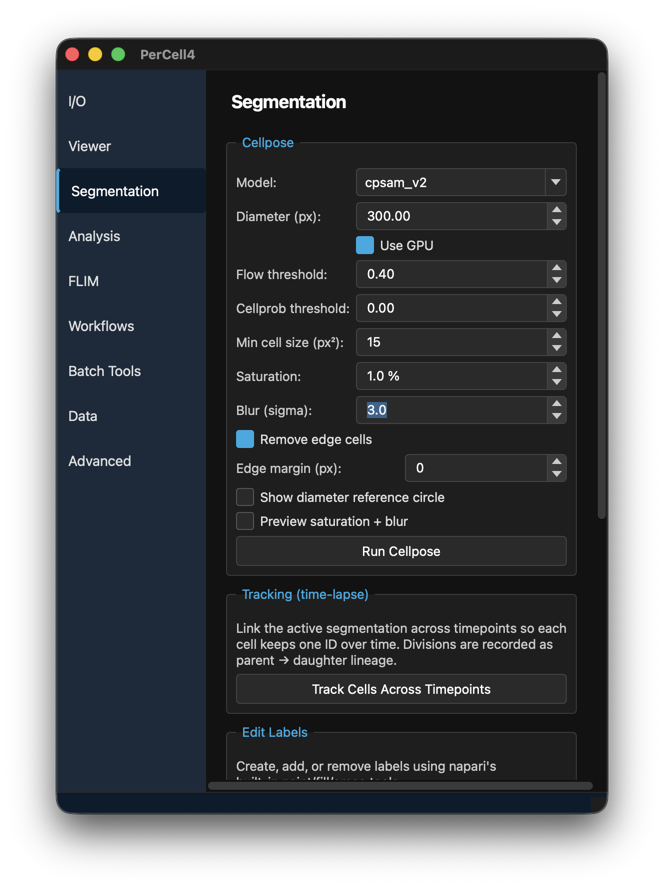
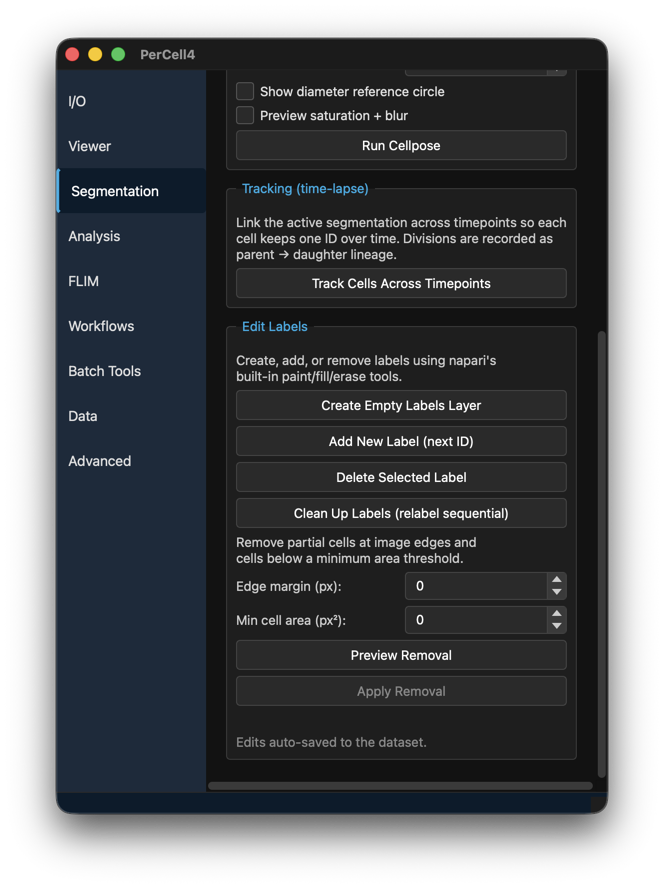

# 5. Segmentation

## Overview

Segmentation finds the cells. PerCell uses [Cellpose](https://www.cellpose.org) to label each cell in the active channel, and stores the result as a segmentation in the dataset. On time-lapse data it can then track the cells, so each cell keeps one number over time. The label tools let you correct the result by hand.

---

## Dialog descriptions

### The Segmentation tab

#### Cellpose

| Control | Default | Description |
|---|---|---|
| **Model:** | cpsam_v2 | The Cellpose model: **cpsam_v2**, **cpsam**, **cpdino** or **cpdino-vitb**. Each model is downloaded on first use (about 1.2 GB). |
| **Diameter (px):** | 300 | Typical cell diameter in pixels. 0 lets Cellpose estimate it. |
| **Use GPU** | on | Run on the GPU when one is available. The device can be set in [Advanced settings](10-advanced.md). |
| **Flow threshold:** | 0.40 | Higher values accept more irregular shapes; lower values reject poor cells. |
| **Cellprob threshold:** | 0.00 | Lower values find more and larger cells; higher values fewer and smaller. |
| **Min cell size (px²):** | 15 | Cells smaller than this are removed. |
| **Saturation:** | 1.0 % | Contrast stretch applied before Cellpose, like ImageJ's Enhance Contrast: this percentage of pixels is saturated. |
| **Blur (sigma):** | 0.0 | Gaussian blur applied before Cellpose. Helps with grainy images. |
| **Remove edge cells** | on | Remove cells that touch the image edge. |
| **Edge margin (px):** | 0 | Also remove cells within this many pixels of the edge. |
| **Show diameter reference circle** | off | Draw a magenta circle of the set diameter in the bottom-left corner of the viewer, so you can compare it with the cells. |
| **Preview saturation + blur** | off | Show the active channel as Cellpose will see it after saturation and blur. |

**Run Cellpose** segments the active channel at every timepoint. PerCell asks for a name (default `cellpose`) and saves the result as a segmentation, which becomes the active one. The status bar reports the number of cells and how many were removed at the edge or as too small.

#### Tracking (time-lapse)

**Track Cells Across Timepoints** links the active segmentation across timepoints so each cell keeps one number over time. Cell divisions are recorded as parent → daughter lineage. The result is saved as `<segmentation>_tracked`. It needs time-lapse data and a segmentation that covers every timepoint.

#### Edit Labels

- **Create Empty Labels Layer** — Start a new segmentation to draw by hand.
- **Add New Label (next ID)** — Switch to napari's polygon tool with the next free cell number, so you can draw a missed cell.
- **Delete Selected Label** — Remove the cell you clicked in the viewer.
- **Clean Up Labels (relabel sequential)** — Renumber the cells 1, 2, 3, … without gaps. Not available on tracked segmentations, because it would break the tracks.
- **Edge margin (px):** and **Min cell area (px²):** — Rules for removing partial cells at the edges and small cells.
- **Preview Removal** — Show in red the cells the rules would remove.
- **Apply Removal** — Remove them. Available after **Preview Removal**.

Edits are saved to the dataset automatically.

---

## Instructions

### Segmenting cells with Cellpose

1. Open the dataset.
2. In the Session bar, choose the channel to segment under **Channel:**. A membrane, cytoplasm or nuclear stain works best.
3. Open the **Segmentation** tab.
4. Set **Diameter (px):** to the typical cell diameter. Tick **Show diameter reference circle** to compare the circle with the cells in the viewer.
5. If the image is dim or grainy, adjust **Saturation:** and **Blur (sigma):** and tick **Preview saturation + blur** to check the result.
6. Click **Run Cellpose** and enter a name, or accept `cellpose`.
7. Check the result in the viewer. If cells are merged or split, change the diameter or thresholds and run again, or correct individual cells with the Edit Labels tools.

### Correcting a segmentation by hand

1. Make the segmentation active in the Session bar.
2. To remove a cell, click it in the viewer, then click **Delete Selected Label**.
3. To add a missed cell, click **Add New Label (next ID)** and draw round the cell.
4. To fix a boundary, use napari's paint and erase tools on the segmentation layer.
5. To remove edge and small cells, set **Edge margin (px):** and **Min cell area (px²):**, click **Preview Removal**, then **Apply Removal**.

Edits are saved as you make them.

### Tracking cells over time

1. Segment every timepoint with **Run Cellpose**.
2. Make that segmentation active.
3. Click **Track Cells Across Timepoints**. The tracked segmentation `<name>_tracked` becomes active.
4. Measure it with **Analysis → Measure Cells**. The viewer shows the tracks.
