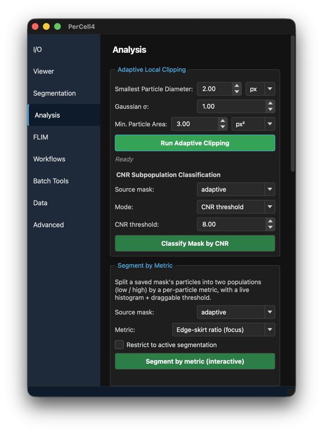
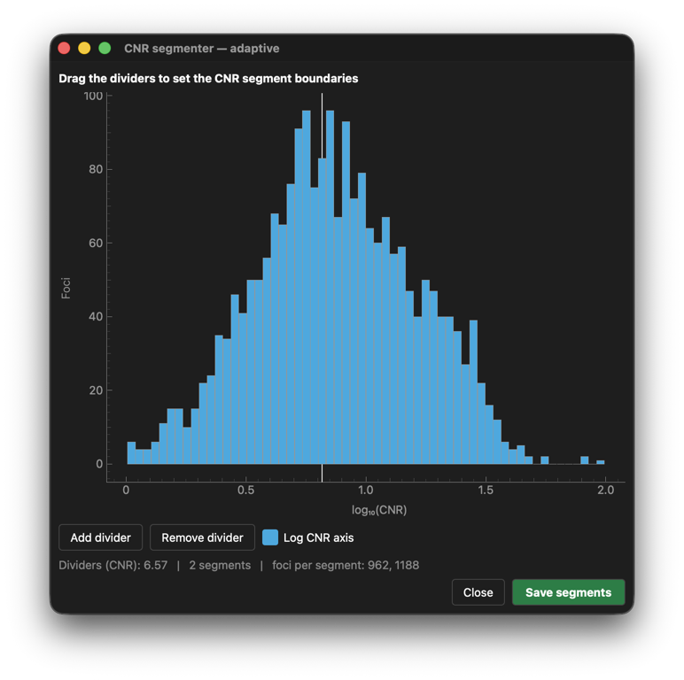
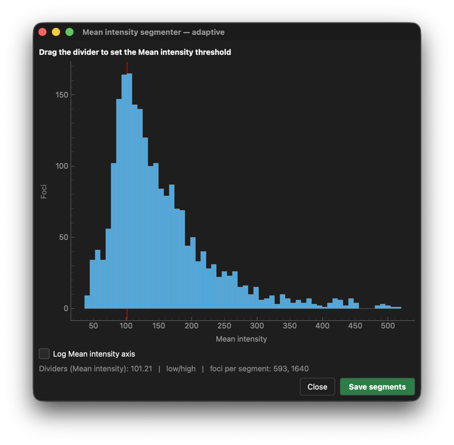
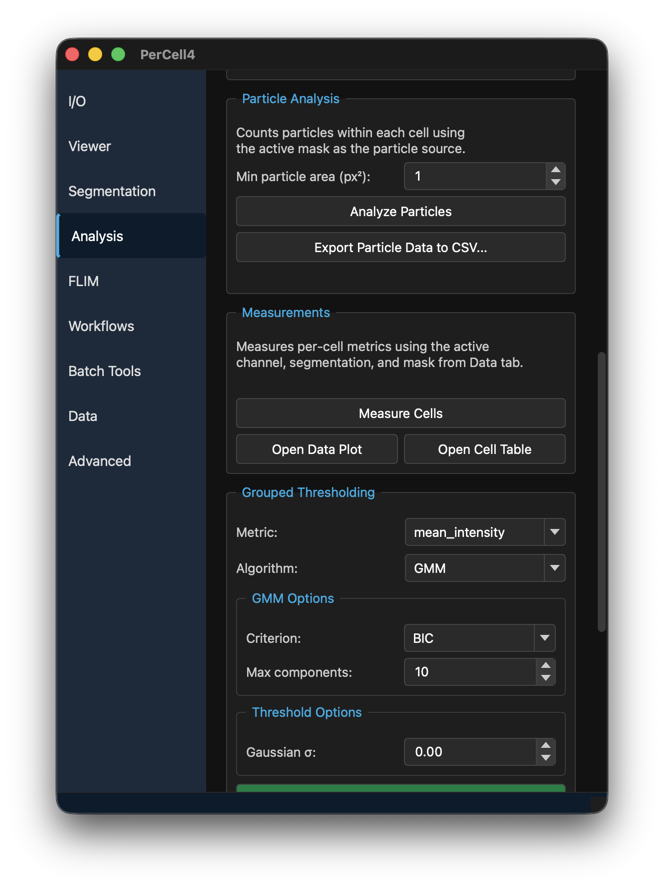
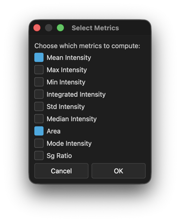
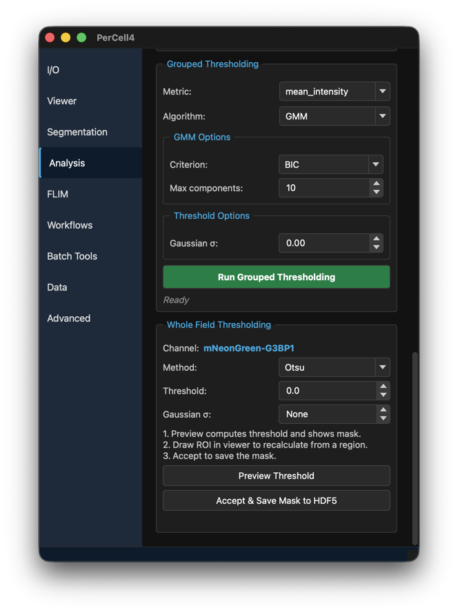
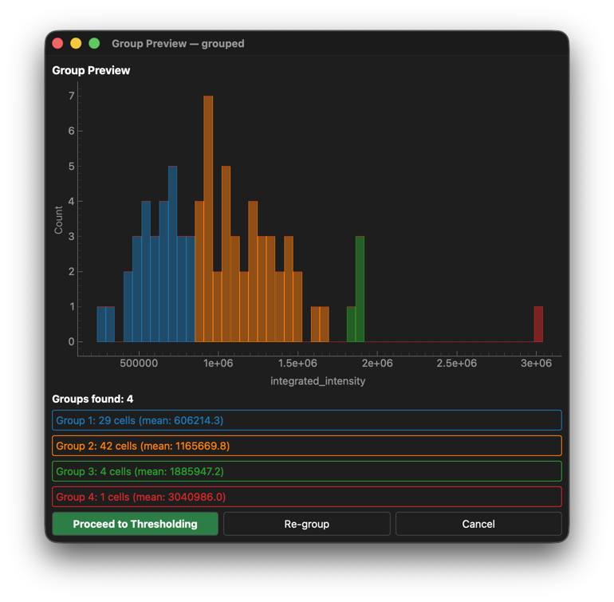
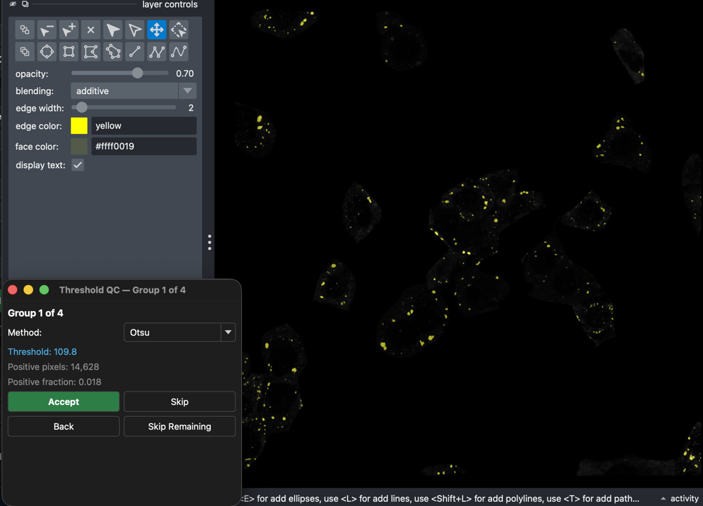
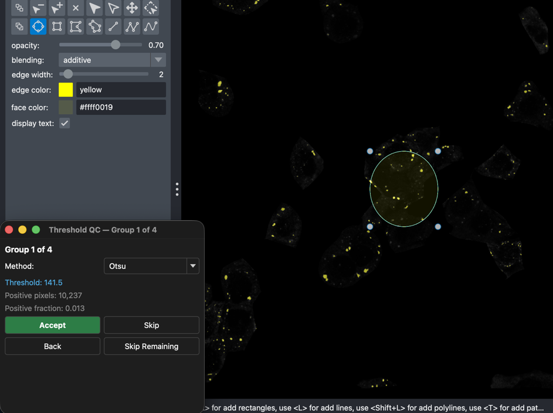

# 6. Analysis

## Overview

The **Analysis** tab turns a segmented dataset into masks and numbers. It works on the active channel, segmentation and mask in the Session bar.

| Group | What it makes |
|---|---|
| **Adaptive Local Clipping** | A mask of puncta or condensates, found cell by cell with no hand-set threshold. |
| **CNR Subpopulation Classification** | Splits a puncta mask into bright and dim populations by contrast-to-noise ratio. |
| **Segment by Metric** | Splits a mask's particles into two populations by a metric you choose, with a live histogram. |
| **Particle Analysis** | Particle counts, areas and intensities per cell. |
| **Measurements** | The per-cell measurement table. |
| **Grouped Thresholding** | A mask made by grouping cells of similar brightness and thresholding each group, with review. |
| **Whole Field Thresholding** | A mask from one threshold over the whole image. |

Every mask is saved to the dataset under a name you choose and becomes the active mask.

---

## Dialog descriptions

### Adaptive Local Clipping

Adaptive Local Clipping (ALC) finds puncta inside each cell. It estimates the noise of each cell and the local background round each pixel, and keeps pixels that stand clearly above that background at several spatial scales. Dim and bright cells are handled equally. See [Adaptive Local Clipping](../adaptive-local-clipping.md) for the method.

| Control | Default | Description |
|---|---|---|
| **Smallest Particle Diameter:** | 2.00 px | The diameter of the smallest particle to find. Sets the detection scale. Unit **px** or **µm**. |
| **Gaussian σ:** | 1.00 | Smoothing before detection. 0 shows **None**. |
| **Min. Particle Area:** | 3.00 px² | Particles smaller than this are removed. Unit **px²** or **µm²**. |

**Run Adaptive Clipping** asks for a mask name (default `adaptive`) and saves the mask. It needs an active channel and segmentation. Micrometre units need the pixel size, which is set when the dataset is created. On time-lapse data each timepoint is processed.

### CNR Subpopulation Classification

Splits the particles of a mask into populations by their contrast-to-noise ratio (CNR): how far each particle's peak stands above its local background, in units of the cell's noise. Bright, in-focus puncta have high CNR; dim or out-of-focus ones have low CNR.

- **Source mask:** The mask to split, usually the ALC mask.
- **Mode:**
  - **CNR threshold** — Split at the value in **CNR threshold:** (default 8.00).
  - **Auto Two Groups** — Find the split automatically by fitting two populations to the CNR histogram.
  - **Interactive** — Choose the split yourself on a histogram (see below).
- **Classify Mask by CNR** — In the first two modes, asks for a base name (default `<source>_cnr`) and saves `<base>_low` and `<base>_high` masks plus a per-particle CNR table.

In **Interactive** mode a **CNR segmenter** window opens with the CNR histogram. Drag the dividers to set the splits; **Add divider** and **Remove divider** change the number of populations, and **Log CNR axis** changes the scale. The viewer shows a live preview. **Save segments** saves `<base>_seg1`, `<base>_seg2`, … masks.

The line under the histogram shows the divider positions, the number of segments, and how many foci fall in each.

### Segment by Metric

Splits a mask's particles into a low and a high population by a per-particle metric, on a live histogram with one draggable threshold.

- **Source mask:** The mask to split.
- **Metric:** **Edge-skirt ratio (focus)**, **Variance of Laplacian (focus)**, **Tenengrad (focus)**, **Area / size**, **Mean intensity**, **Max intensity**, **Integrated intensity** or **CNR (contrast)**. The three focus metrics separate sharp particles from blurred ones.
- **Restrict to active segmentation** — Only use particles inside cells of the active segmentation.
- **Segment by metric (interactive)** — Opens the segmenter window. Drag the threshold, then save. PerCell writes `<base>_low` and `<base>_high` and makes `_high` active.

The window is titled **<metric> segmenter — <source mask>**. Drag the red divider to set the threshold; **Log … axis** changes the scale. The line under the histogram shows the threshold and how many foci fall below and above it. **Save segments** saves; **Close** discards.

### Particle Analysis

Counts the particles of the active mask inside each cell of the active segmentation, and adds per-cell particle columns to the measurements, such as `particle_count`, `total_particle_area` and `mean_particle_area`.

- **Min particle area (px²):** Particles smaller than this are ignored (default 1).
- **Analyze Particles** — Run it. Needs an active segmentation and mask.
- **Export Particle Data to CSV...** — Save the particle table (default `particles.csv`).

### Measurements

Measures every channel in every cell of the active segmentation. When a mask is active, each cell is also measured inside the mask. When a cell filter is on, only the filtered cells are measured. The results go to the measurements table in the dataset, and to the Data Plot and Cell Table.

- **Measure Cells** — Opens **Select Metrics**. Tick the metrics to compute: **Mean Intensity**, **Max Intensity**, **Min Intensity**, **Integrated Intensity**, **Std Intensity**, **Median Intensity**, **Area**, **Mode Intensity**, **Sg Ratio**. **Mean Intensity** and **Area** are ticked at first; PerCell remembers your choice.
- **Open Data Plot** — See [The Data Plot](04-viewer.md#the-data-plot).
- **Open Cell Table** — See [The Cell Table](04-viewer.md#the-cell-table).

### Grouped Thresholding

Cells in one image can differ many-fold in expression, so one threshold does not suit them all. Grouped thresholding sorts the cells into groups of similar brightness, then thresholds each group on its own, with your review.

| Control | Default | Description |
|---|---|---|
| **Metric:** | mean_intensity | The per-cell value used to group the cells. |
| **Algorithm:** | GMM | **GMM** finds the number of groups itself; **K-means** uses a fixed number. |
| **Criterion:** (GMM Options) | BIC | How GMM chooses the number of groups: **BIC** or **Silhouette**. |
| **Max components:** (GMM Options) | 10 | The most groups GMM may use. |
| **Number of groups:** (K-means Options) | 3 | Shown when **Algorithm:** is **K-means**. |
| **Gaussian σ:** (Threshold Options) | 0.00 | Smoothing before thresholding. |

**Run Grouped Thresholding** asks for a mask name (default `grouped`) and then runs these steps:

1. **Group Preview** — A histogram of the metric, coloured by group, with the number of groups found and one button per group to highlight it in the viewer. Click **Proceed to Thresholding**, **Re-group** to try again, or **Cancel**.
2. **Threshold QC — Group k of N** — One window per group. Choose the **Method:** (**Otsu**, **Triangle**, **Li** or **Adaptive**) and check the preview in the viewer. The window shows the **Threshold**, the number of **Positive pixels** and the **Positive fraction**. To base the threshold on part of the image only, draw one or more shapes on the `_group_roi` layer. The rectangle tool is selected; other shapes, such as an ellipse, also work, but PerCell uses the rectangle that encloses each shape. The threshold is recomputed from the group's pixels inside them. Then click **Accept**, **Skip** (leave this group out of the mask), **Back** (return to the previous group), or **Skip Remaining**.
3. PerCell saves the mask, records each cell's group, and adds a group column to the measurements.

On time-lapse data, each timepoint is reviewed in turn.

### Whole Field Thresholding

One threshold for the whole image of the active channel (shown as **Channel:**).

- **Method:** **Otsu**, **Triangle**, **Li**, **Adaptive** or **Manual**.
- **Threshold:** The threshold value. Computed by the method, or typed in with **Manual**.
- **Gaussian σ:** Smoothing before thresholding.
- **Preview Threshold** — Computes the threshold and shows the mask in the viewer. Draw a shape on the `_threshold_roi` layer to recompute the threshold from that region. PerCell uses the rectangle that encloses the first shape.
- **Accept & Save Mask to HDF5** — Saves the mask as `<method>_<channel>`, for example `otsu_GFP`.

---

## Instructions

### Finding puncta with Adaptive Local Clipping

1. Make the puncta channel and the cell segmentation active in the Session bar.
2. Set **Smallest Particle Diameter:** to the diameter of the smallest puncta you care about.
3. Click **Run Adaptive Clipping** and accept or change the mask name.
4. Check the mask in the viewer. To separate bright from dim puncta, set **Source mask:** to the new mask and click **Classify Mask by CNR**.
5. Click **Analyze Particles** to count the puncta in each cell, then **Measure Cells**.

### Thresholding with review (grouped)

1. Make the channel and segmentation active.
2. Keep **Algorithm: GMM** unless you know how many brightness groups there are.
3. Click **Run Grouped Thresholding** and name the mask.
4. In **Group Preview**, check the groups and click **Proceed to Thresholding**.
5. In each **Threshold QC** window, compare the preview with the cells, change the method if needed, and click **Accept**.
6. When all groups are done, the mask becomes active.

### Measuring cells

1. Make the segmentation active, and the mask if you want measurements inside it.
2. Click **Measure Cells**, tick the metrics, and confirm.
3. Click **Open Cell Table** or **Open Data Plot** to look at the results.
4. Save them with **I/O → Export → Measurements (CSV)...**.
