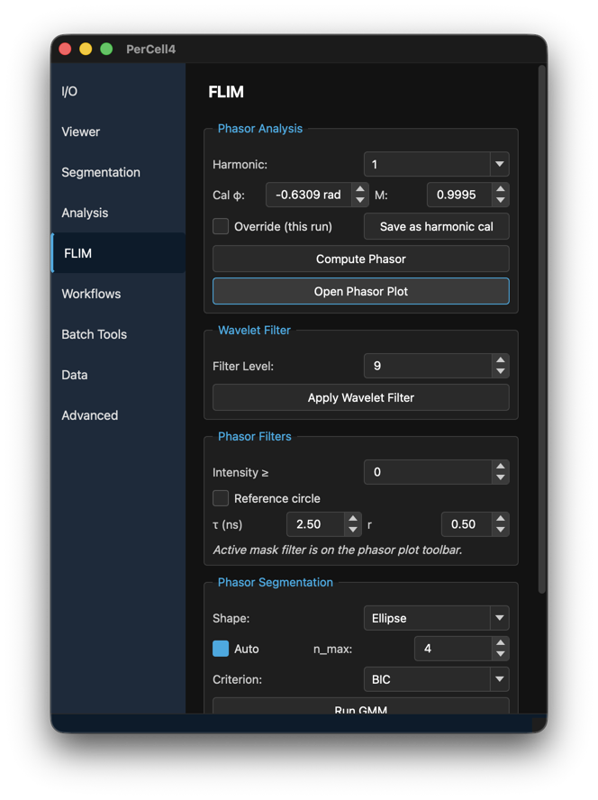
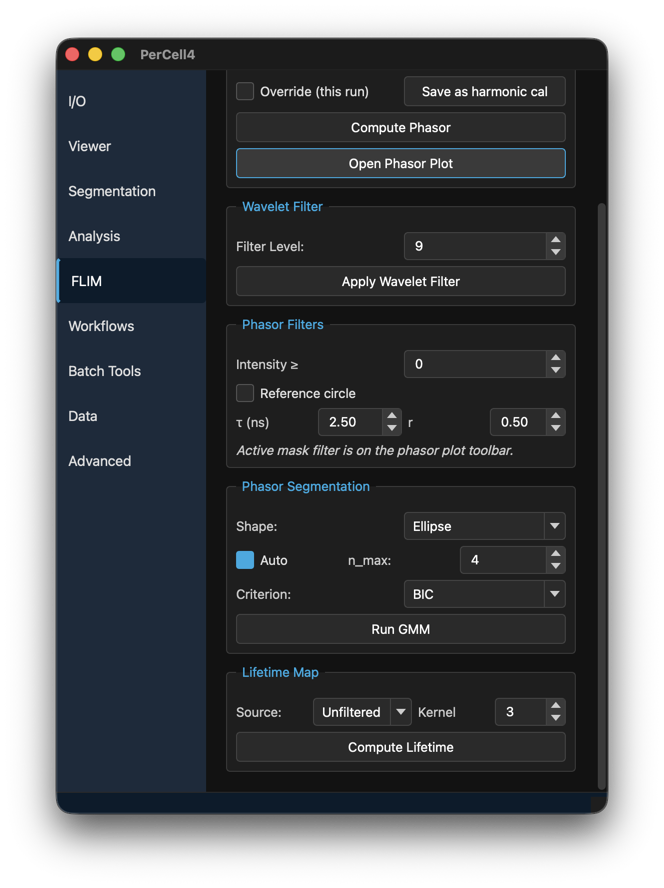
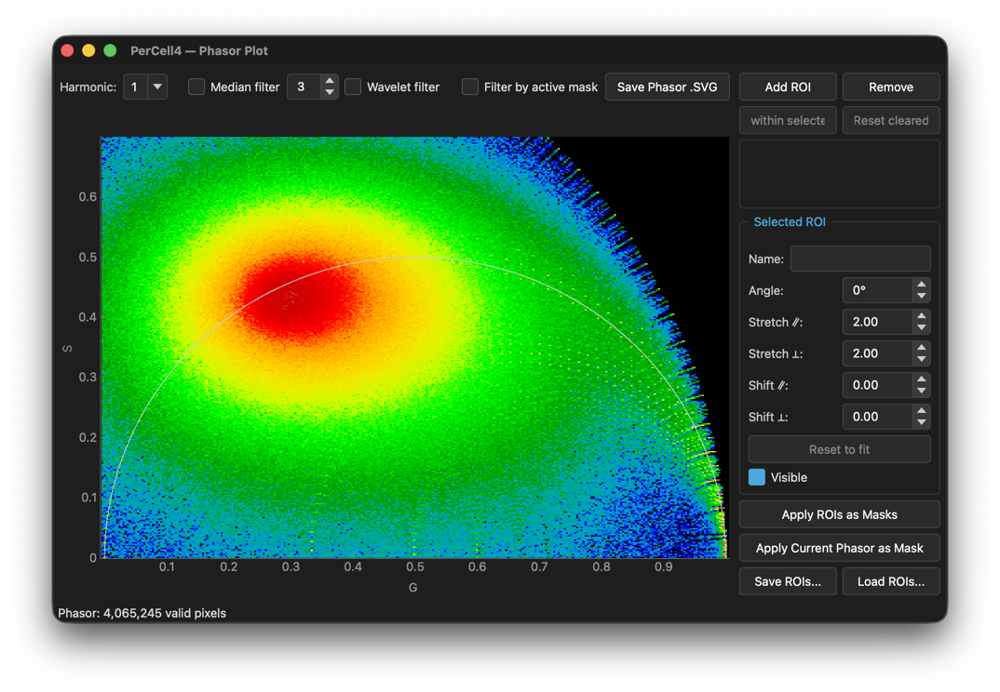
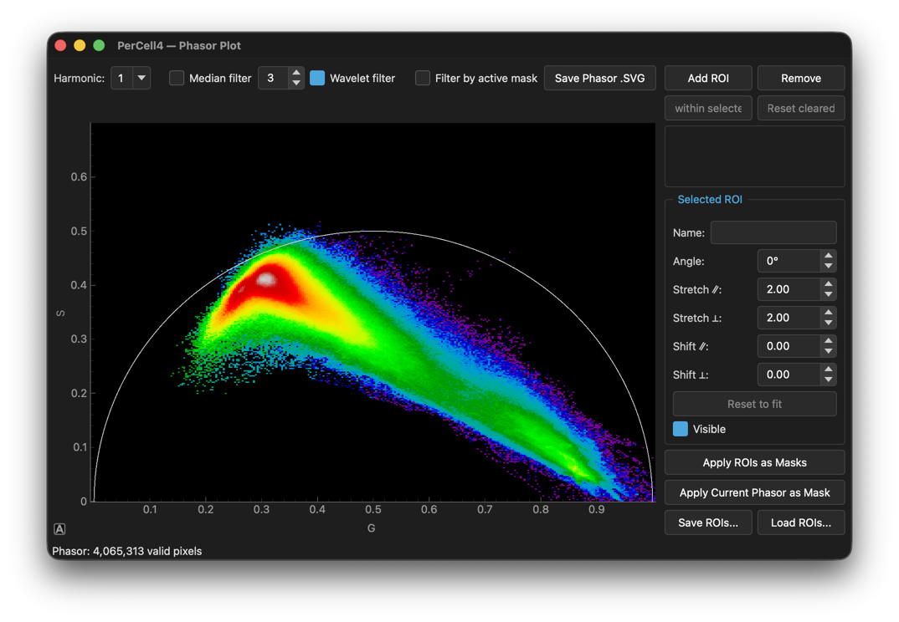
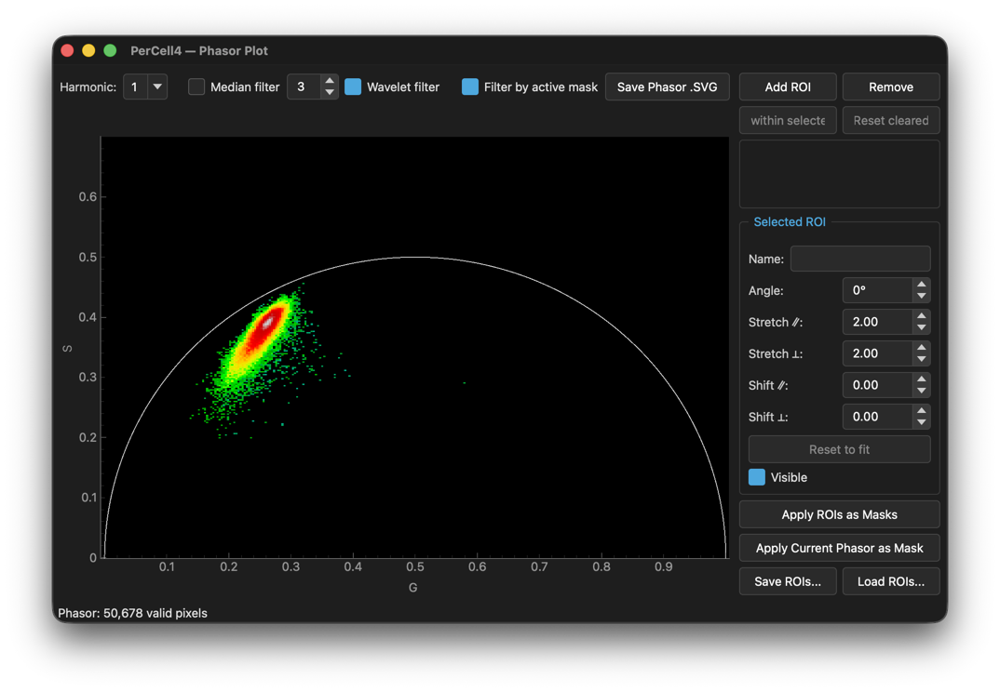

# 7. FLIM

## Overview

The **FLIM** tab analyses fluorescence lifetime with the phasor method. Each pixel's decay is turned into two phasor coordinates, G and S. Pixels with the same lifetime fall on the same point of the phasor plot, whatever their brightness, so you can select species by lifetime and turn the selection into a mask.

FLIM tools need decay data for the active channel. Add it when you create the dataset (**FLIM .bin Parameters** in [Compress TIFF Dataset](03-datasets.md#creating-percell-datasets)), or later with [Add Layer → TCSPC (.bin)](03-datasets.md#tcspc-bin) or [Batch TCSPC Append](03-datasets.md#batch-tcspc-append). Every FLIM tool works on the active channel, pixel binning and timepoint.

The usual order is:

1. **Compute Phasor**.
2. Optionally **Apply Wavelet Filter** to reduce noise.
3. Select species on the Phasor Plot, by hand or with **Run GMM**.
4. **Apply ROIs as Masks**.
5. Optionally **Compute Lifetime** for a lifetime image.

---

## Dialog descriptions

### The FLIM tab

#### Phasor Analysis

- **Harmonic:** **1**, **2** or **3**. Harmonic 1 is standard.
- **Cal φ:** and **M:** The phase (radians) and modulation of the instrument response for this channel and harmonic. They are loaded from the dataset's stored calibration.
- **Override (this run)** — Use the φ and M shown for the next computation only, without saving them.
- **Save as harmonic cal** — Store φ and M in the dataset as this channel's calibration for this harmonic.
- **Compute Phasor** — Compute G and S for every pixel and open the Phasor Plot. A phasor already computed for this harmonic is reused; Shift-click to compute it again. Computing a new phasor discards filtered data from the old one.
- **Open Phasor Plot** — Show the plot.

#### Wavelet Filter

Reduces phasor noise while keeping edges, with a dual-tree complex wavelet transform.

- **Filter Level:** 1–30 (default 9). Higher levels smooth more.
- **Apply Wavelet Filter** — Filter the phasor; Shift-click to recompute. Needs a computed phasor and the `flim` extra. When the laser frequency is known, a filtered lifetime is also stored.

#### Phasor Filters

Limit which pixels appear on the Phasor Plot. Changes show at once.

- **Intensity ≥** Hide pixels dimmer than this (default 0).
- **Reference circle** — Draw a circle on the plot at lifetime **τ (ns)** (default 2.50) with radius **r** (default 0.50). Needs the laser frequency.
- The filter by active mask is on the Phasor Plot's toolbar.

#### Phasor Segmentation

Finds clusters in the phasor cloud with a Gaussian mixture model (GMM) and places an ROI on each.

- **Shape:** **Ellipse** or **Circle**.
- **Auto** — Choose the number of clusters automatically, up to **n_max:** (default 4). Untick it to set an exact number, **n:**.
- **Criterion:** **BIC** or **AIC**, for choosing the number of clusters.
- **Run GMM** — Place the ROIs on the Phasor Plot. The plot must be open. Nothing is saved until you apply the ROIs as masks.

#### Lifetime Map

Computes a lifetime image from the phasor.

- **Source:** **Unfiltered**, **Median** or **Wavelet** (after wavelet filtering).
- **Kernel** — Median filter size, 3–15, odd numbers (default 3). Used with **Median** only.
- **Compute Lifetime** — Saves a new channel `<channel>_<source>_lifetime` and shows it with the turbo colours. Needs the laser frequency. Not available for time-lapse data.

### The Phasor Plot window

Opened by **Compute Phasor** or **Open Phasor Plot**. Title **PerCell4 — Phasor Plot**.

The plot shows the pixels as an intensity-weighted density map on the G (0–1) and S (0–0.7) axes, with the universal semicircle on which single-exponential lifetimes lie.

#### Toolbar

- **Harmonic:** The harmonic used for the reference circle and GMM.
- **Median filter** and its kernel size — Smooth the phasor with a median filter.
- **Wavelet filter** — Show the wavelet-filtered phasor. Ticked automatically after wavelet filtering. Median and wavelet cannot both be on.
- **Filter by active mask** — Show only pixels inside the active mask.
- **Save Phasor .SVG** — Save the plot as an SVG image.

#### ROI panel

- **Add ROI** — Add an elliptical ROI (up to 10). Drag it, and resize it with its handles.
- **Remove** — Delete the selected ROI.
- **Clear within selected ROI** and **Reset cleared** — Hide the pixels inside an ROI from the plot, or show them again.
- The ROI list, with a checkbox to show or hide each.
- **Selected ROI** — **Name:** and **Angle:**. For GMM ROIs also **Stretch ∥:**, **Stretch ⊥:**, **Shift ∥:** and **Shift ⊥:** to adjust the fitted ellipse, and **Reset to fit**. **Visible**.
- **Apply ROIs as Masks** — Save a mask named after each visible ROI. Every active filter (intensity, median or wavelet, active mask) is applied. The last mask becomes active.
- **Apply Current Phasor as Mask** — Save all pixels currently shown on the plot as one mask (default name `phasor_<channel>_<N>`).
- **Save ROIs...** and **Load ROIs...** — Store ROIs in a JSON file and reuse them on other datasets.

The status line shows the number of valid pixels on the plot, and how many pixels each ROI contains.

The filters change what the plot shows. Here is the same phasor after wavelet filtering, then also filtered by the active mask:

| Wavelet filter | Wavelet filter + Filter by active mask |
|---|---|
|  |  |

---

## Instructions

### Computing a phasor

1. Open a dataset with decay data and make the FLIM channel active.
2. Check **Cal φ:** and **M:**. If they are wrong, enter the correct values and click **Save as harmonic cal**.
3. Click **Compute Phasor**. The Phasor Plot opens.
4. Optionally set **Filter Level:** and click **Apply Wavelet Filter**. Tick **Wavelet filter** on the plot's toolbar to see the result.

### Making masks from lifetime populations

1. Compute the phasor and open the Phasor Plot.
2. Set **Intensity ≥** to hide background pixels.
3. Either click **Run GMM** to fit ROIs to the clusters, or click **Add ROI** and place the ROIs by hand.
4. Adjust the ROIs. The viewer shows a live preview of the pixels inside each ROI.
5. Rename each ROI under **Selected ROI**. The mask takes the ROI's name.
6. Click **Apply ROIs as Masks**.
7. Click **Save ROIs...** to apply the same ROIs to other datasets later with **Load ROIs...**.

### Making a lifetime image

1. Compute the phasor, and filter it if you want.
2. Under **Lifetime Map**, choose the **Source:**.
3. Click **Compute Lifetime**. The new lifetime channel appears in the viewer.

For many datasets, use the [Automated phasor-masks workflow](08-workflows.md#automated-phasor-masks-workflow) or the `percell-batch-phasor` and `percell-batch-phasor-masks` tools.
