# 8. Workflows and analyses

## Overview

The **Workflows** tab runs multi-step jobs over many datasets. Each button opens a setup dialog; **Start** runs the job.

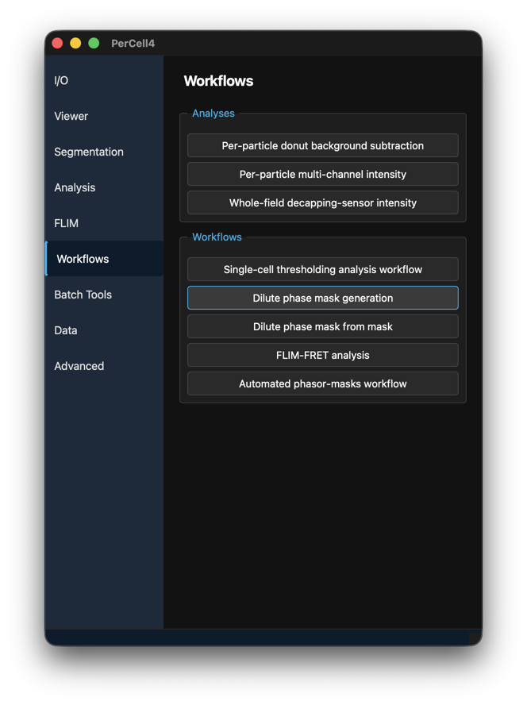

| Button | What it does |
|---|---|
| **Analyses** | |
| **Per-particle donut background subtraction** | Measures particle intensities with a local "donut" background subtracted. |
| **Per-particle multi-channel intensity** | Measures each particle in up to eight channels. |
| **Whole-field decapping-sensor intensity** | Measures condensate and dilute-phase intensities for decapping-sensor experiments. |
| **Workflows** | |
| **Single-cell thresholding analysis workflow** | Segment, review, threshold, measure and export many datasets in one run. |
| **Dilute phase mask generation** | Make a dilute-phase mask for the open dataset, round by round. |
| **Dilute phase mask from mask** | Make dilute-phase masks from existing condensate masks, across many datasets. |
| **FLIM-FRET analysis** | Compare donor and donor + acceptor datasets and compute FRET efficiency. |
| **Automated phasor-masks workflow** | Fit a phasor ellipse and make two lifetime masks per channel, across many datasets. |

While a workflow runs, the launcher is locked and the status bar shows its progress. Only one runs at a time.

---

## Single-cell thresholding analysis workflow

This workflow takes datasets from TIFFs (or existing `.h5` files) to a measurement table in one run. It segments each dataset with Cellpose, lets you review each segmentation, runs one or more thresholding rounds, measures every cell, and exports parquet and CSV files. For a detailed lab protocol, see [Workflow protocol](../workflow-protocol.md).

### Dialog description

#### Datasets and Cellpose Settings

**Datasets** lists the datasets in the run, with their **Source** (an existing `.h5`, or TIFFs still to be compressed), **Path** and **Channels**.

- **Add .h5 files...** and **Add folder of .h5...** — Add existing datasets.
- **Add .tiff files...** — Opens **Compress TIFF Dataset** to make datasets from TIFFs first.
- **Remove** — Take the selected datasets out of the run.

**Cellpose Settings (applied to every dataset)** uses the same controls as the [Segmentation tab](05-segmentation.md#cellpose), plus:

- **Segmentation channel:** The channel to segment. Only channels common to all datasets are offered.
- **Segmentation layer name:** The name of the segmentation this run creates (default `cp_mask`).
- **Edge cells:** What to do with cells at the image edge:
  - **Exclude (default)** — remove edge cells before anything else. They are not measured. Edge cells are partial, so they bias sum and area metrics.
  - **Include — count as whole cells** — keep edge cells and treat them as whole cells in grouping, thresholding and measurement. They are flagged `is_edge=True` in the results; their sum and area values are biased low.
  - **Include — synthesize edge-cohort row** — as above, plus one extra row per dataset (`cell_id` −1, `is_edge_synthetic=True`) that represents all edge cells together as an equivalent number of whole cells.

  The dialog opens with **Include — synthesize edge-cohort row** selected, because it suits phase-separation analysis.
- **Edge margin (px):** Cells within this distance of the edge count as edge cells (default 100). It has no effect in **count as whole cells** mode.

#### Segmentation Selection

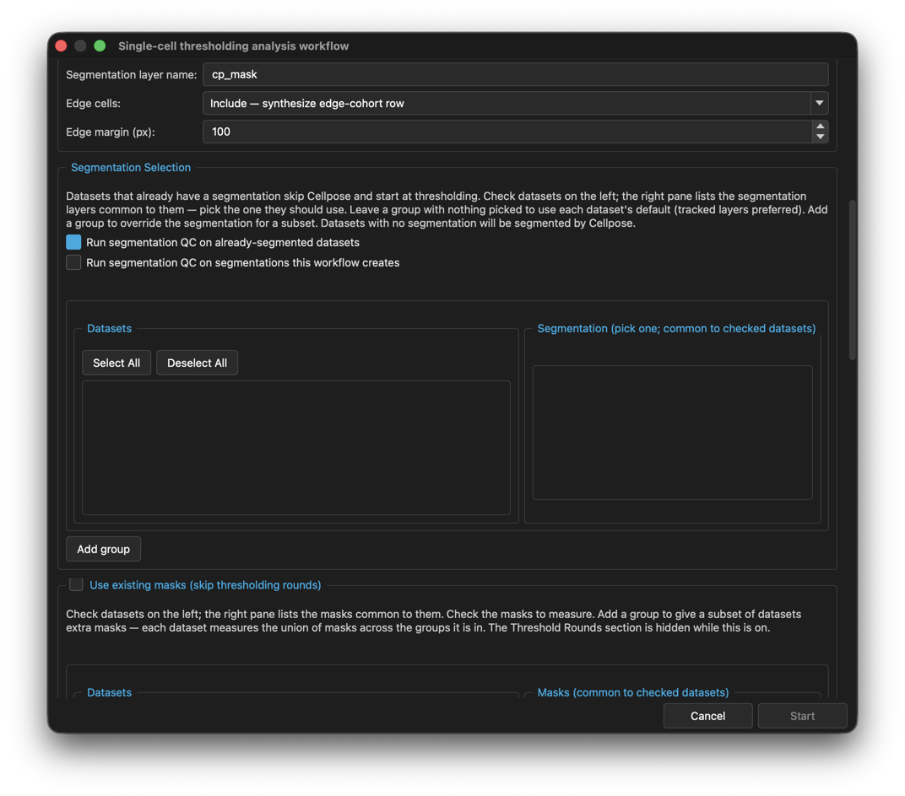

Datasets that already have a segmentation skip Cellpose.

- **Run segmentation QC on already-segmented datasets** — Review those segmentations during the run (on by default).
- **Run segmentation QC on segmentations this workflow creates** — Also review the new Cellpose segmentations.
- Tick datasets on the left; the right lists the segmentations common to them. Pick the one they should use. With nothing picked, each dataset uses a tracked segmentation if it has one, otherwise its only one, otherwise the first by name.
- **Add group** — Give a subset of datasets a different segmentation.

#### Use existing masks

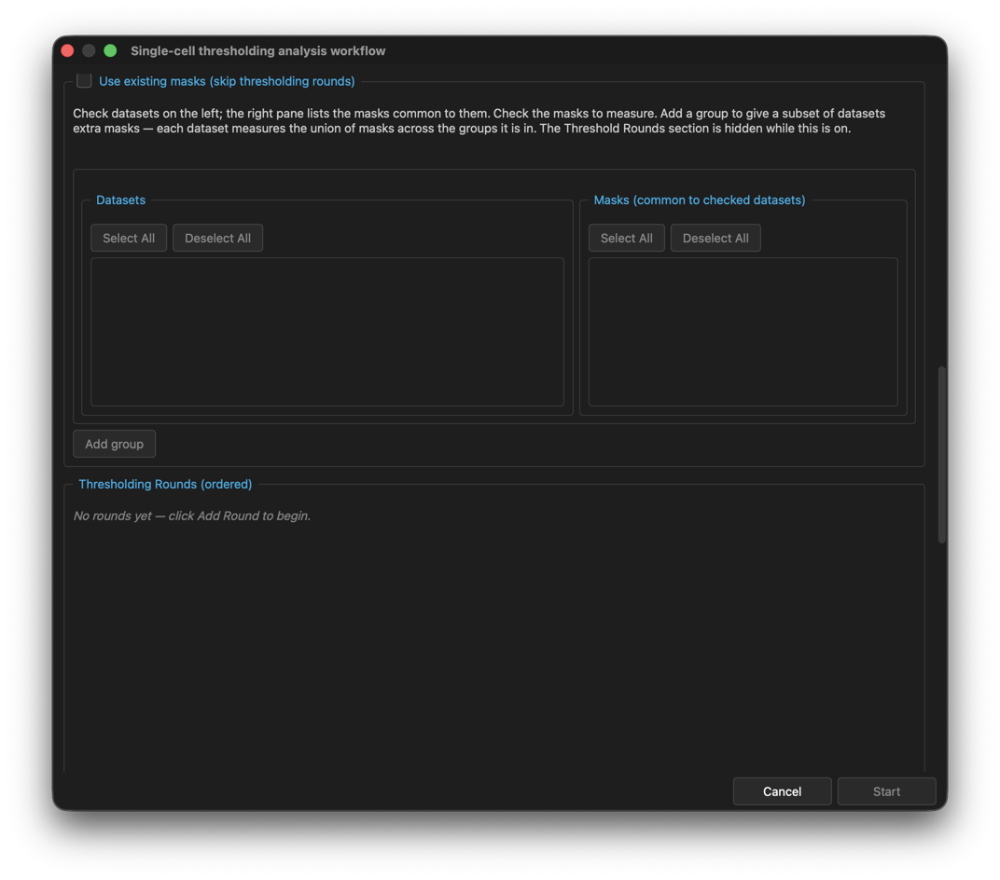

Tick **Use existing masks (skip thresholding rounds)** to measure masks the datasets already have instead of making new ones. Tick datasets on the left and the masks to measure on the right. **Add group** gives some datasets extra masks. The thresholding rounds are hidden while this is on.

#### Thresholding Rounds, particle analysis and dilute-phase mask

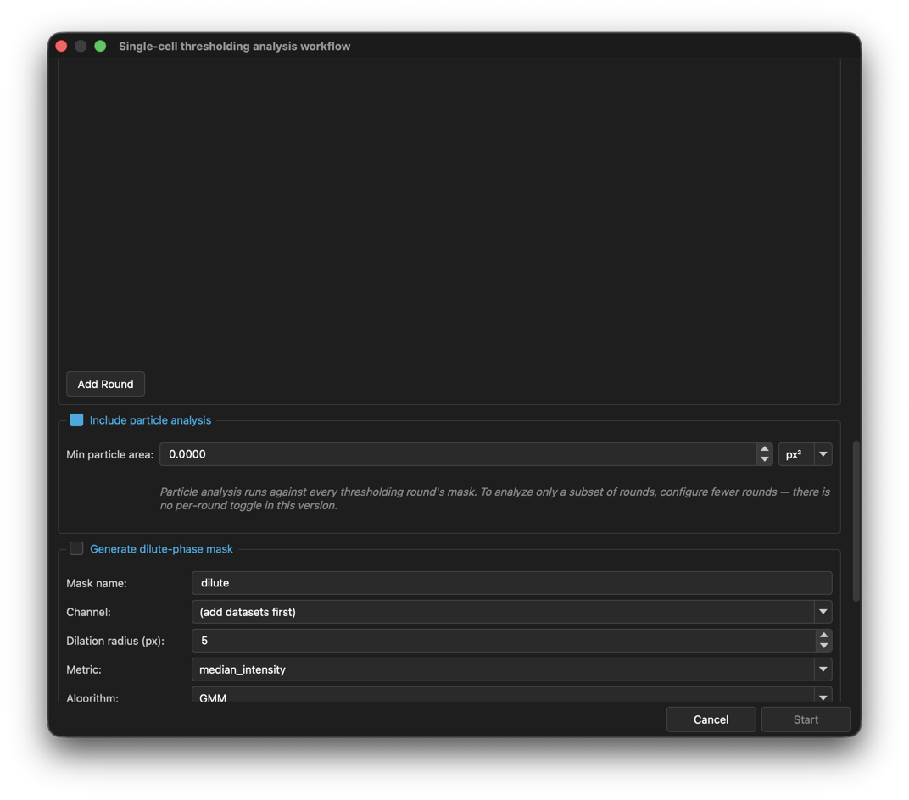

**Thresholding Rounds (ordered)** — Each round makes one mask. Click **Add Round** to add a round card; **↑**, **↓** and **×** reorder or remove it. Each round has:

- **Name:** The mask name (default `round_1`, `round_2`, …).
- **Channel:** The channel to threshold.
- **Method:**
  - **Grouped Otsu** — grouped thresholding with review, as on the [Analysis tab](06-analysis.md#grouped-thresholding). Also set **Metric:**, **Algorithm:** (gmm or kmeans), **GMM max:** and **K-means K:**.
  - **Adaptive Local Thresholding** — [Adaptive Local Clipping](06-analysis.md#adaptive-local-clipping), run without review. Also set **Smallest Particle Diameter:**, and optionally **CNR split** at **thr:** or **GMM 2-pop** to split bright and dim puncta.
- **Smoothing σ:** (default 1.00) and **Min. Particle Area:** (default 3.00 px²).

**Include particle analysis** — Count and measure particles in each round's mask for every cell (on by default). **Min particle area:** sets the smallest particle. It applies to every round; to analyse only some rounds, set up fewer rounds.

**Generate dilute-phase mask** — Also make a mask of the cytoplasm outside the condensates: **Mask name:** (default `dilute`), **Channel:**, **Dilation radius (px):** round the condensates, and the grouping settings (**Metric:**, **Algorithm:**, **GMM criterion:**, **GMM max components:**, **K-means n_clusters:**, **Gaussian σ:**).

| Grouped Otsu round | Adaptive Local Thresholding round |
|---|---|
| 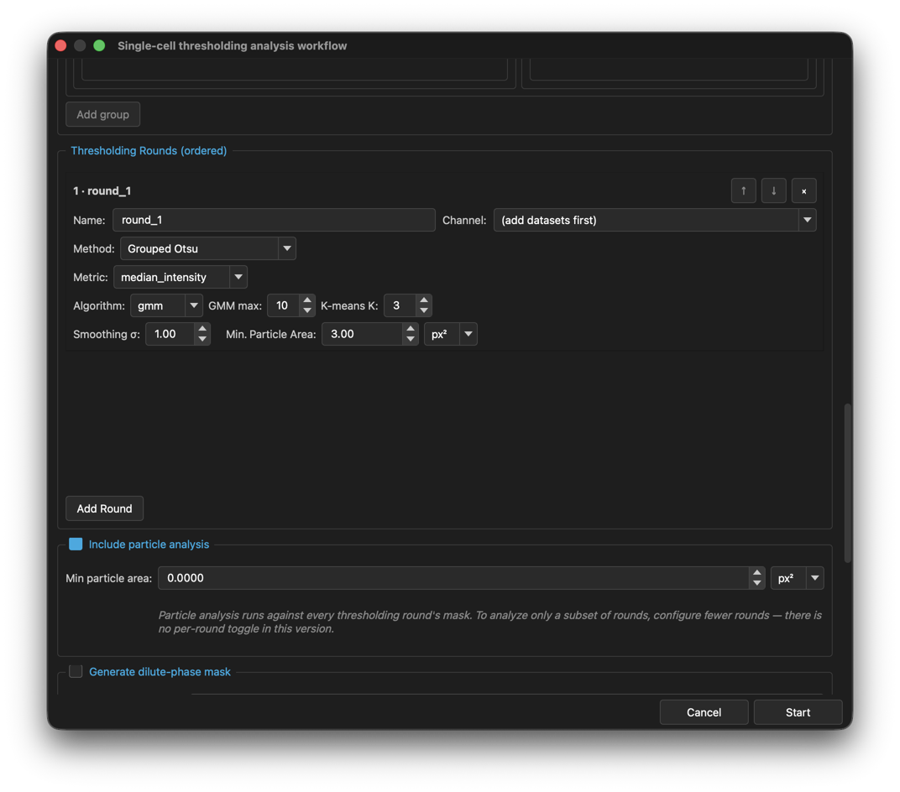 | 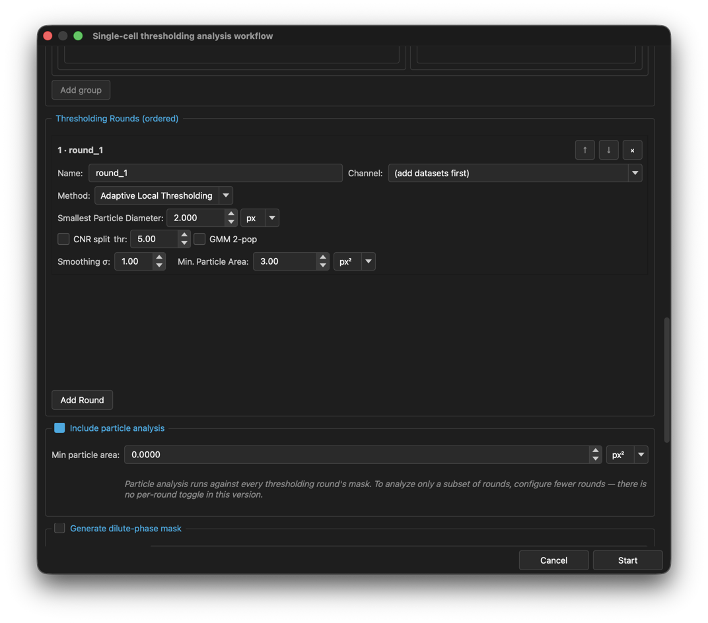 |

#### CSV Export and Output Folder

- **Configure CSV Export...** — Opens **Configure CSV Export Columns**, which chooses the columns of the CSV files. Each group has **All** and **None**:
  - **Channels to include in CSV**.
  - **Metrics to include in CSV** — **Area**, **Integrated Intensity** and **Mean Intensity** are ticked at first.
  - **Particle metrics — per cell** — **Particle Count**, **Total Particle Area** and **Mean Particle Area** at first; also **Max Particle Area** and **Particle Coverage Fraction**. One column per round, named `<round>_<metric>`.
  - **Particle metrics — per channel** — **Particle Mean Intensity** at first; also max, min, integrated, std, median, mode and Sg ratio. One column per round and channel, named `<round>_<channel>_<metric>`.

  The CSVs always also contain the label, centroid and area, each round's group, and inside/outside columns per round. The particle groups apply only when particle analysis is on. `measurements.parquet` always contains every column, whatever you choose here.

  | Channels and metrics | Particle metrics |
  |---|---|
  | 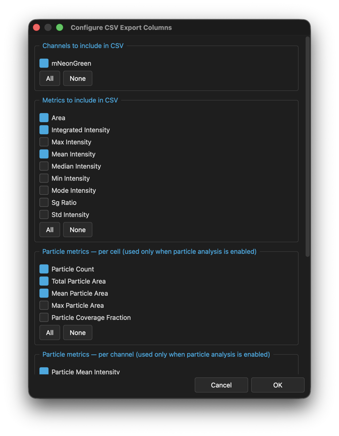 | 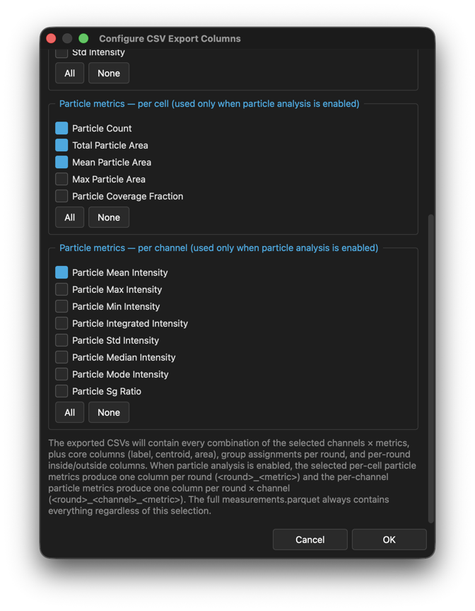 |
- **Output Folder** — Where the run folder is created. PerCell remembers it.

**Start** checks the settings and lists anything missing. **Cancel** closes the dialog.

### What happens during a run

1. PerCell asks to close the dataset that is open, if any.
2. Datasets from TIFFs are compressed.
3. Each dataset is segmented with Cellpose, or its existing segmentation is used.
4. **Segmentation QC** (if on) — A window **Segmentation QC — <dataset> (i/N)** opens next to the viewer for each dataset:
   - **Label Tools**: **Delete Selected Label**, **Draw New Label**, **Relabel Sequentially**.
   - **Cleanup**: remove edge and small cells with **Edge margin:** and **Min area (px²):**, then **Preview** and **Apply**.
   - **Re-run Cellpose** with other settings, or **Modify Channel** to adjust the image's contrast before re-running.
   - **Accept & Next →** (Ctrl+Enter) saves the segmentation and moves on. **✕ Cancel run** (Esc) stops the run.
5. Time-lapse datasets are tracked.
6. Each round runs. **Grouped Otsu** rounds open the **Group Preview** and **Threshold QC** windows for each dataset. Here **Re-group** skips the dataset for that round and **Cancel** stops the whole run. **Adaptive Local Thresholding** rounds run without windows.
7. If on, the dilute-phase mask is made in a **Dilute-phase mask** window. Round 1 runs automatically. Click **Run another round** to remove more condensed pixels, or **Done — save and continue**.
8. Every dataset is measured and the results are exported.
9. A summary box reports the result and any failures.

| Segmentation QC | Scrolled down |
|---|---|
| 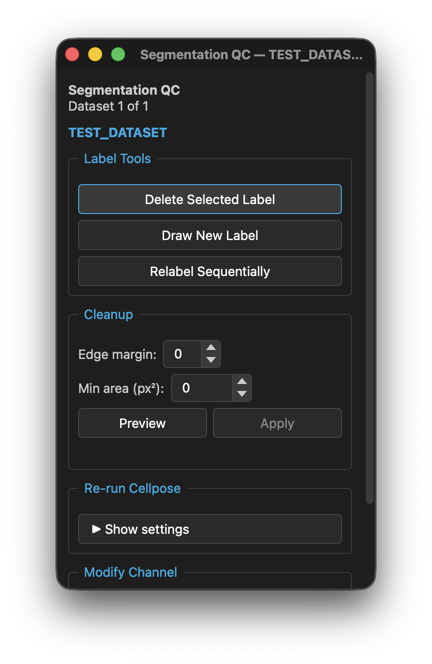 | 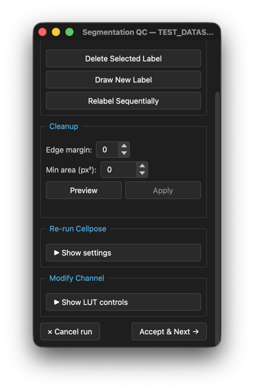 |

**Show settings** opens the Cellpose settings for a re-run, and **Show LUT controls** opens the contrast controls of **Modify Channel**. The viewer shows the segmentation being reviewed:

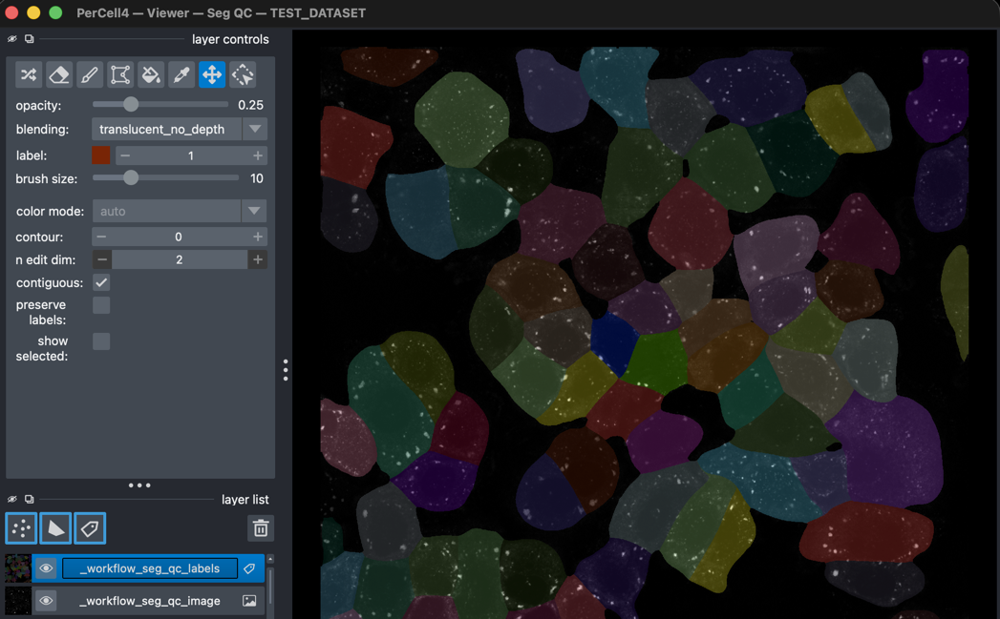

The dilute-phase mask step shows its own Group Preview and Threshold QC for each round, then this window:

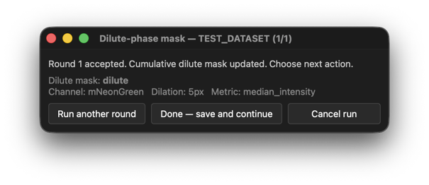

### Output

In each dataset: the segmentation (`cp_mask`, plus `cp_mask_tracked` for time-lapse), a mask per round, the group of each cell, CNR masks if chosen, and the dilute-phase mask.

In the output folder, a run folder `run_<date-time>_<id>/` with:

| File | Contents |
|---|---|
| `combined.csv` | All cells from all datasets. |
| `per_dataset/<dataset>.csv` | One file per dataset. |
| `measurements.parquet` | The same data in parquet format. |
| `summary_groups.csv`, `summary_datasets.csv` | Summaries per group and per dataset. |
| `particles.csv`, `particles.parquet` | One row per particle, with particle analysis. |
| `complete_tracks.csv` | Cells present at every timepoint, for time-lapse data. |
| `run_config.json`, `run_log.jsonl` | The settings used and a log of the run. |

---

## Dilute phase mask generation

Makes a dilute-phase mask for the open dataset: the cell area outside the condensates. It works in rounds. Each round groups the cells, thresholds the condensed phase, grows it by the dilation radius, and removes it from the dilute phase.

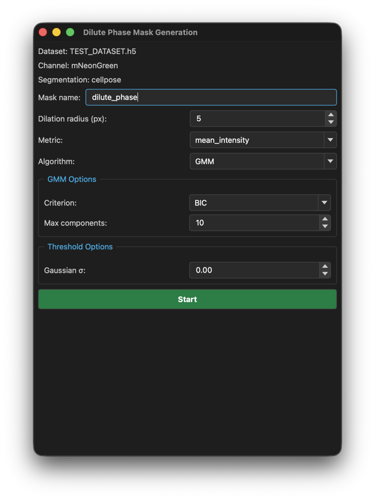

- The panel shows the **Dataset**, **Channel** and **Segmentation** it will use (the active ones).
- **Mask name:** (default `dilute_phase`) and **Dilation radius (px):** (default 5).
- The grouping settings, as in [Grouped Thresholding](06-analysis.md#grouped-thresholding).
- **Start** runs round 1 and shows how much condensed signal was removed.
- **Run another round** repeats. **Done — Save dilute phase mask** saves the mask. **Cancel** stops.

Each round shows a Group Preview and Threshold QC, as in [Grouped Thresholding](06-analysis.md#grouped-thresholding). The viewer shows the condensed pixels found so far:

| Round 1 groups | Round 2 groups |
|---|---|
| 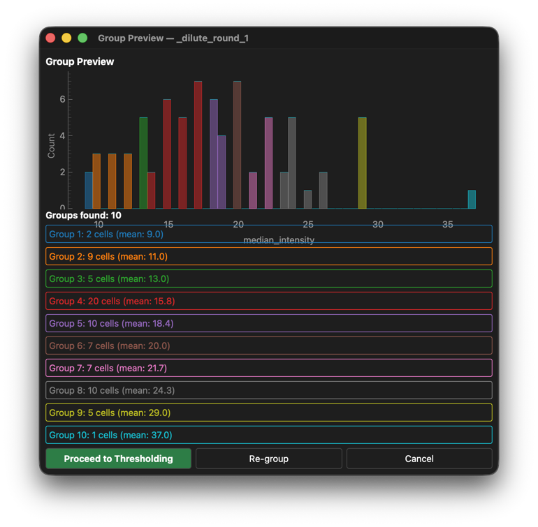 | 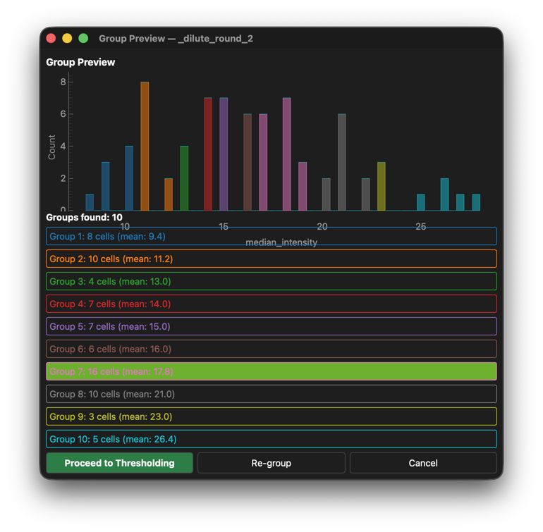 |

| Condensed pixels (red) | Thresholding a region |
|---|---|
| 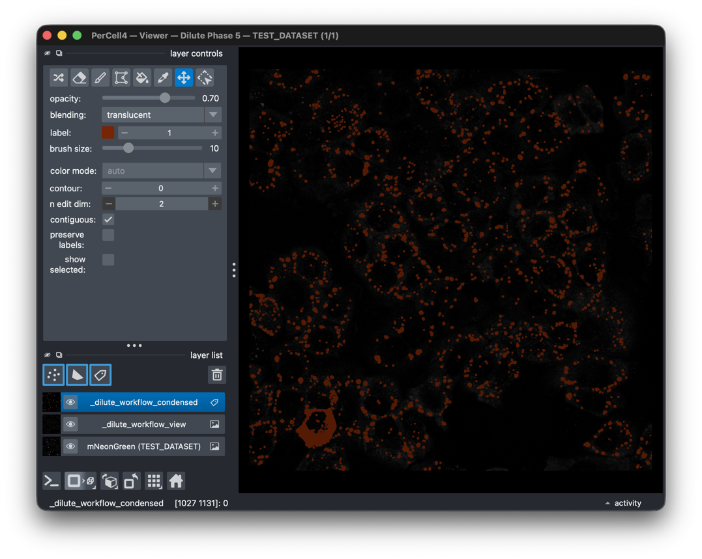 | 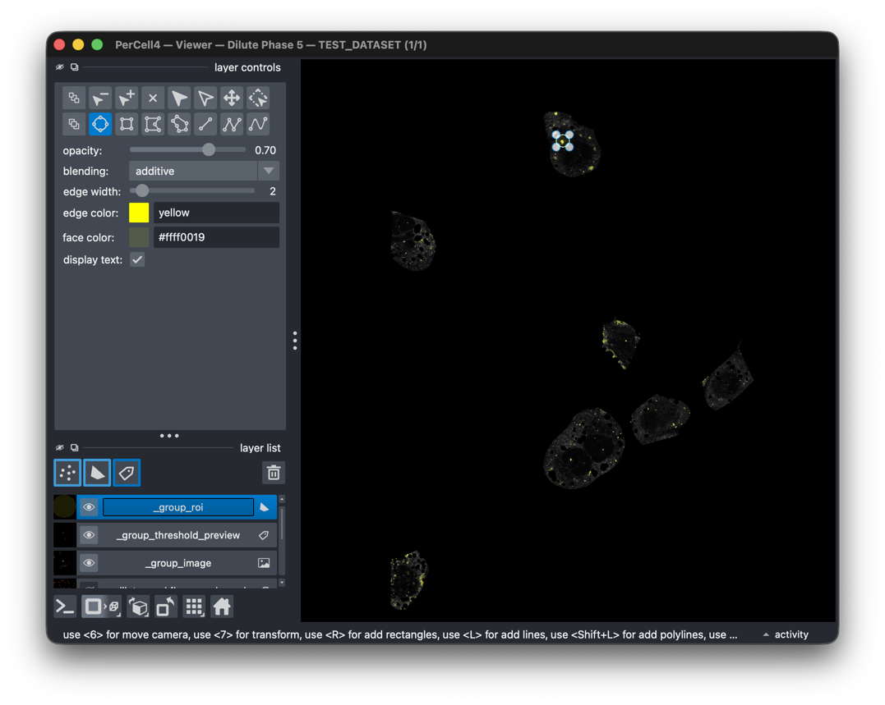 |

## Dilute phase mask from mask

Makes dilute-phase masks across many datasets from a condensate mask they already have: the cells minus the condensate mask grown by a radius.

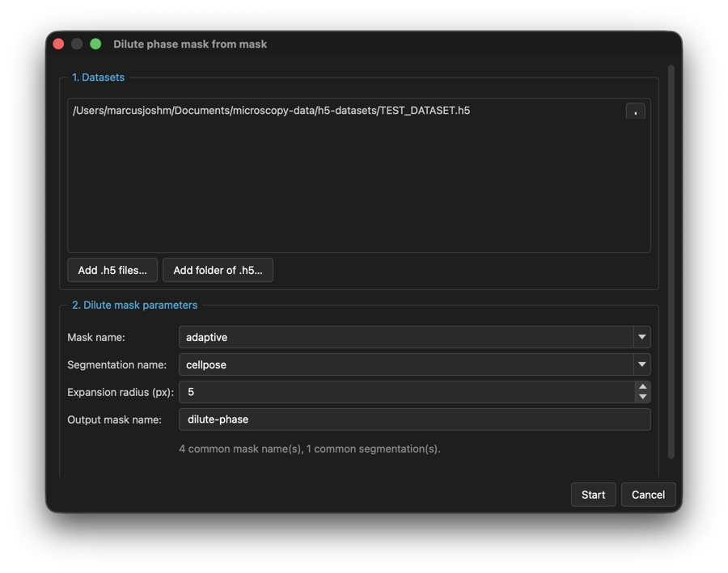

1. **Datasets** — Add the `.h5` files.
2. **Dilute mask parameters** — **Mask name:** (the condensate mask) and **Segmentation name:**, from the names common to all datasets. **Expansion radius (px):** (default 5). **Output mask name:** (default `dilute`).
3. Click **Start**. Each dataset gets the new mask.

## Automated phasor-masks workflow

Makes two lifetime masks per channel in many datasets. It fits a GMM ellipse to the phasor cloud, then applies it at a permissive and a conservative intensity threshold.

| Datasets and channels | Parameters |
|---|---|
| 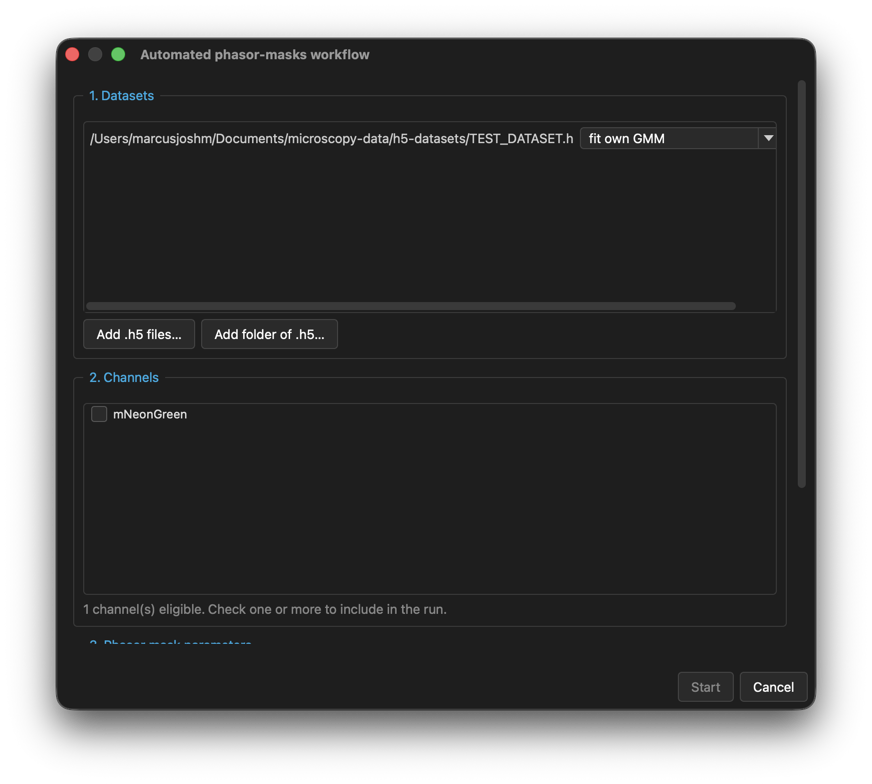 | 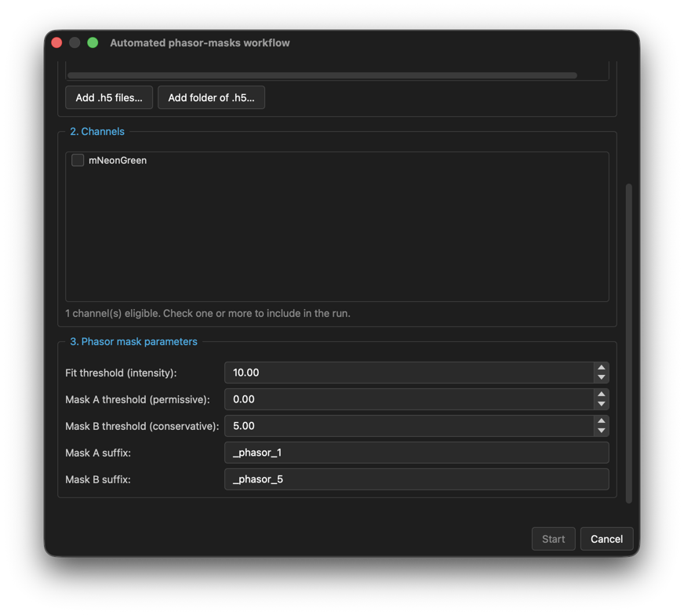 |

1. **Datasets** — Add `.h5` files. For each, the ROI source is **fit own GMM**, or the ellipse fitted for another dataset.
2. **Channels** — Tick the channels to process. Only channels with decay data in every dataset are listed.
3. **Phasor mask parameters** — **Fit threshold (intensity):** (default 10) for fitting the ellipse. **Mask A threshold (permissive):** (default 0) and **Mask B threshold (conservative):** (default 5). **Mask A suffix:** `_phasor_1` and **Mask B suffix:** `_phasor_5`.
4. Click **Start**. Each dataset gets `<channel>_phasor_1` and `<channel>_phasor_5`. A missing phasor is computed first.

## FLIM-FRET analysis

Compares pairs of datasets, a donor-only sample and a donor + acceptor sample, and computes FRET efficiency from their lifetimes, per pair or per cell.

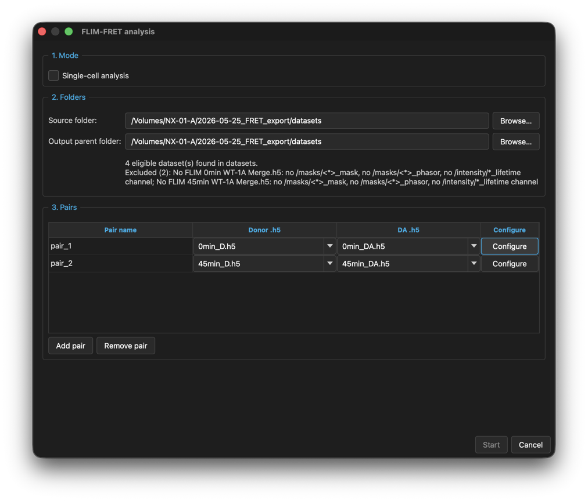

1. **Mode** — Tick **Single-cell analysis** to compute FRET per cell instead of per pair.
2. **Folders** — The **Source folder:** of datasets and the **Output parent folder:**. PerCell reports how many datasets it can use, and lists each one it excludes with the layers it is missing.
3. **Pairs** — **Add pair** and choose the donor and donor + acceptor datasets. **Configure** each pair: the **Mask layer:**, **Phasor mask:** and **Lifetime channel:** for each side, and the **Segmentation:** in single-cell mode.

   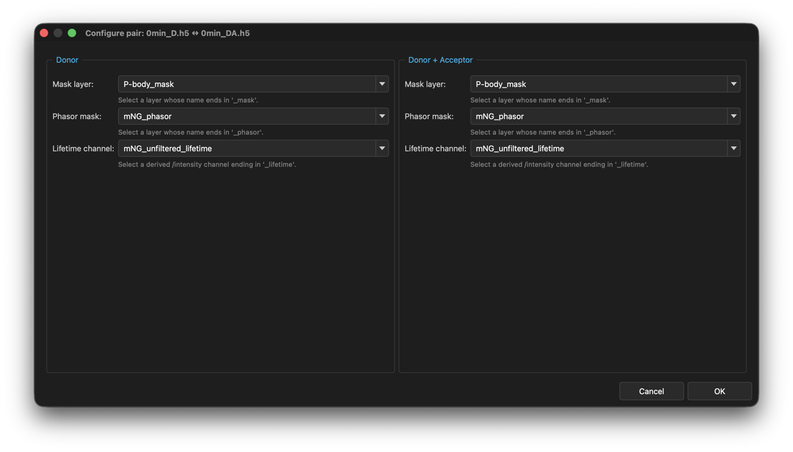

   Each list offers only layers with the right name ending: masks ending in `_mask`, phasor masks ending in `_phasor`, and lifetime channels ending in `_lifetime`.
4. Click **Start**. Results go to `flim_fret_run_<date-time>/flim_fret_results.csv`.

The datasets need a mask, a phasor mask and a lifetime channel. Make them first with the FLIM tab or the phasor-masks workflow.

---

## Analyses

The three analyses share one dialog layout:

1. **Datasets** — **Add .h5 files…**, **Add folder of .h5…**, **Clear**.
2. **Layer map** — Which mask or channel in the datasets plays each role the analysis needs. **—** means none.
3. **Parameters** — The analysis settings. Some analyses offer presets that fill in and lock the parameters; **Preset locked** shows beside the preset.
4. **Outputs (will be produced)** — The tables the run will produce with the current settings. A table that the settings turn off is shown struck through.
5. **Output folder** — Where the run folder is created.

**Start** runs the analysis. Results go to `analysis_run_<date-time>_<id>/`: a combined CSV, one CSV per dataset, and `run_config.json`. Any masks made are saved in the datasets.

### Per-particle donut background subtraction

| Datasets and layer map | Parameters with the m7g-cap-v1 preset |
|---|---|
| 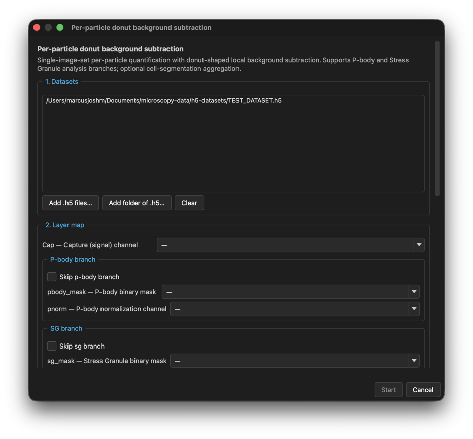 | 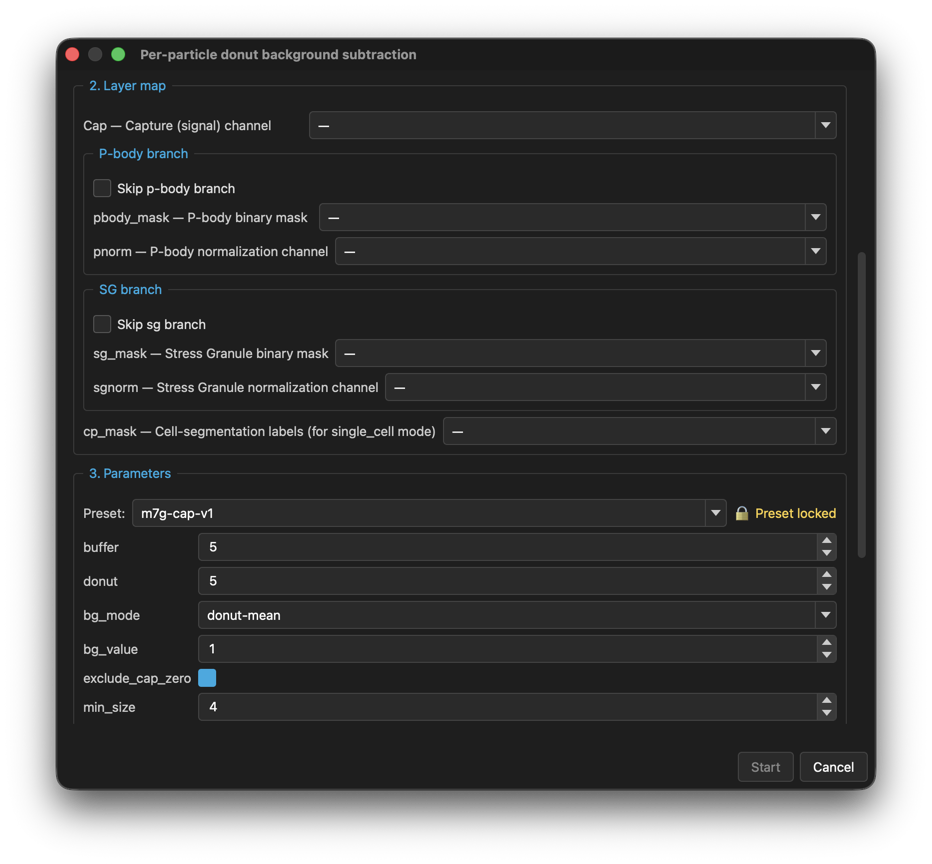 |

Measures the intensity of each particle with the local background, taken from a ring ("donut") round the particle, subtracted. Roles: the cap channel, a P-body branch (P-body mask and normalisation channel), a stress-granule branch (SG mask and normalisation channel), and the cell segmentation. Either branch can be skipped with **Skip p-body branch** or **Skip sg branch**. The cell segmentation (`cp_mask`) is needed only for per-cell results. The **m7g-cap-v1** preset sets the parameters of the original command-line analysis, so results match it exactly. Parameters include the buffer and donut widths in pixels, the background mode (**donut**, **donut-mean** or **flat**), the minimum particle size, and whether to report per cell and export the donut masks.

### Per-particle multi-channel intensity

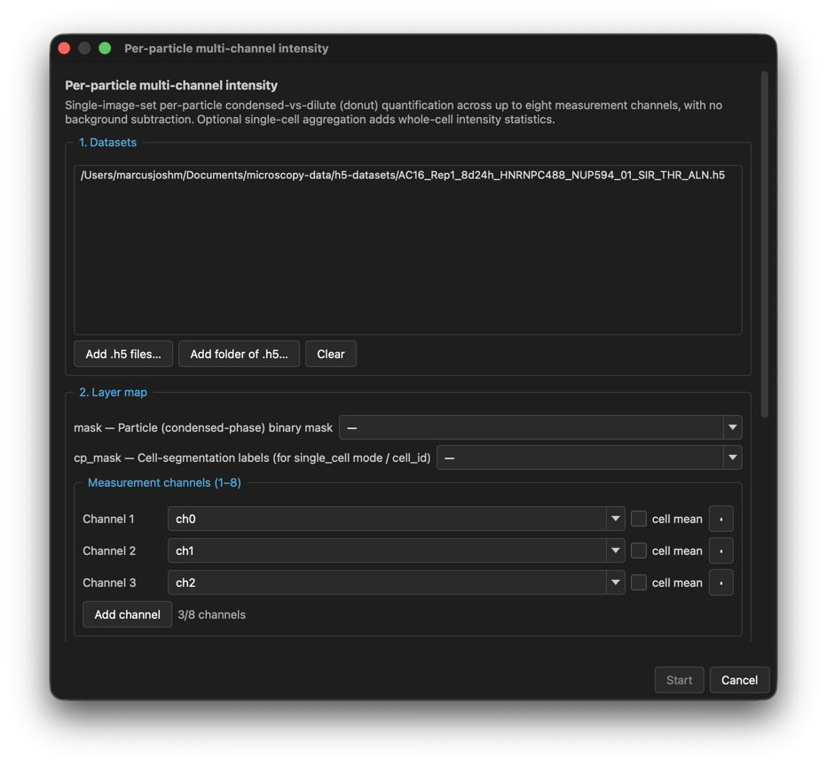

Measures each particle of a mask in up to eight channels, comparing the condensed phase (the particle) with the dilute phase in a ring ("donut") round it. No background is subtracted. Map the mask and cell segmentation, then add channels with **Add channel** (the counter shows how many of eight are used) and remove one with its **✕** button; tick **cell mean** to also report each channel's mean over the cell. Parameters: buffer, donut width, minimum particle size, per-cell output and donut export.

### Whole-field decapping-sensor intensity

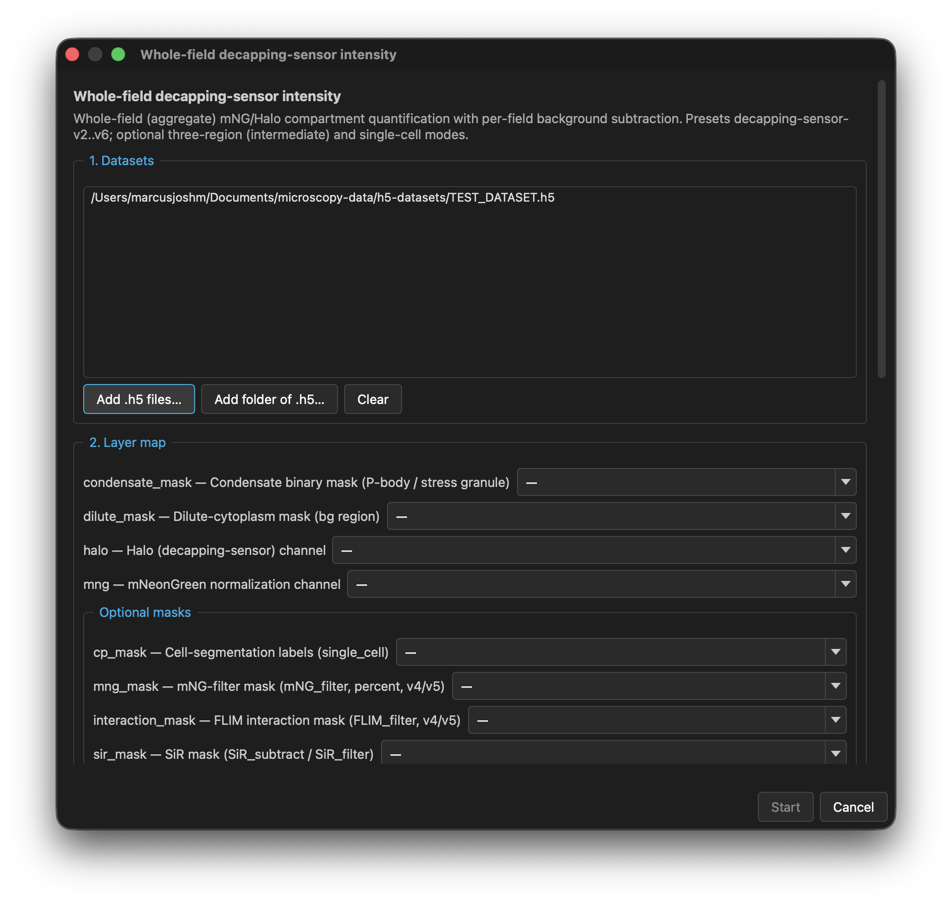

Measures the mNeonGreen and Halo intensities of the condensate and dilute compartments over the whole field, with background subtraction per field, for decapping-sensor experiments. Required roles: the condensate mask, the dilute-cytoplasm mask (used as background), the Halo decapping-sensor channel, and the mNeonGreen normalisation channel. Under **Optional masks**, map the cell segmentation for single-cell results and the extra masks some protocol versions use (mNG filter, FLIM interaction, SiR and intermediate masks). Presets **decapping-sensor-v2** to **v8** set the parameters for each version of the protocol. **v7** and **v8** measure three regions, each with its own mask: the condensate, the **intermediate_mask** and the dilute mask. They need the mNG filter, interaction and intermediate masks. v7 leaves out Halo pixels outside the interaction mask; v8 counts them as zero. The preset locks the scientific parameters. **single_cell**, **channel_cell_mean** and **export_particles** stay editable, because they choose how results are reported, not how they are computed. Optional modes add a third, intermediate region and per-cell results.

| Parameters with the decapping-sensor-v6 preset | Outputs and output folder |
|---|---|
| 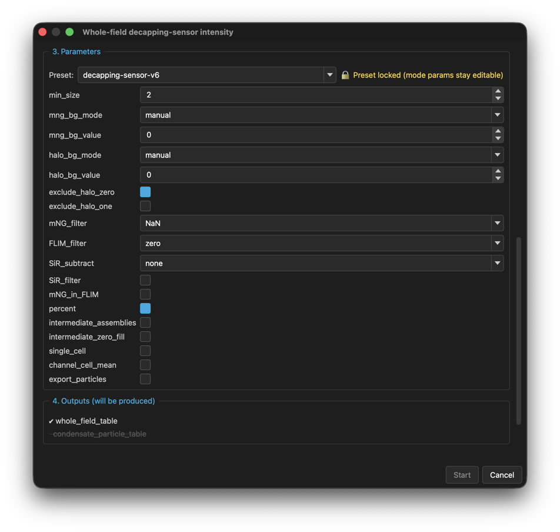 | 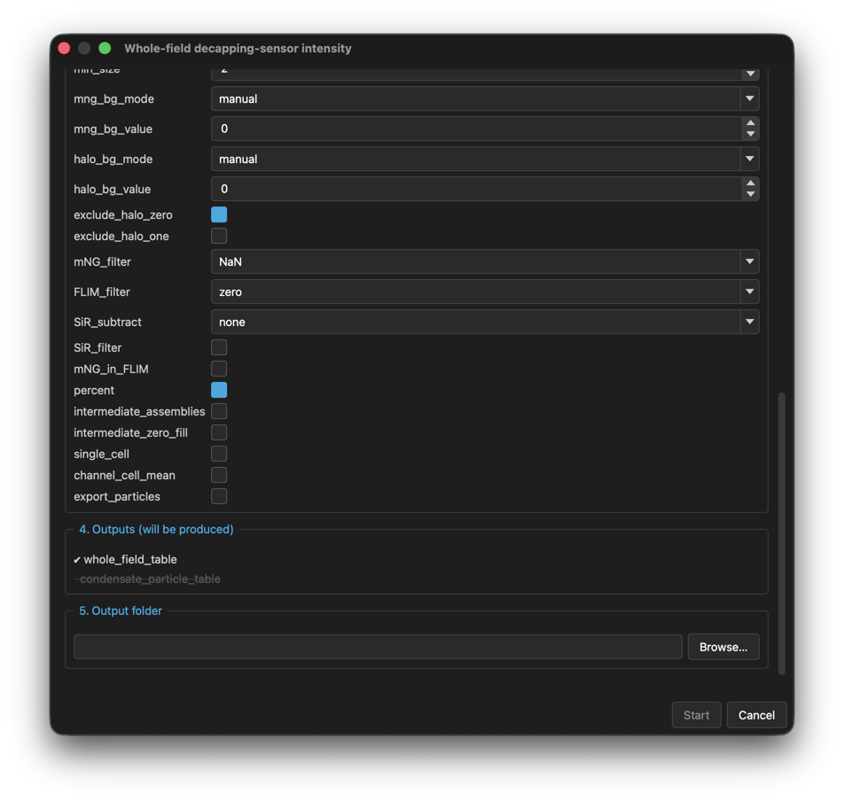 |

The run produces `whole_field_table`, and `condensate_particle_table` when **export_particles** is ticked.
