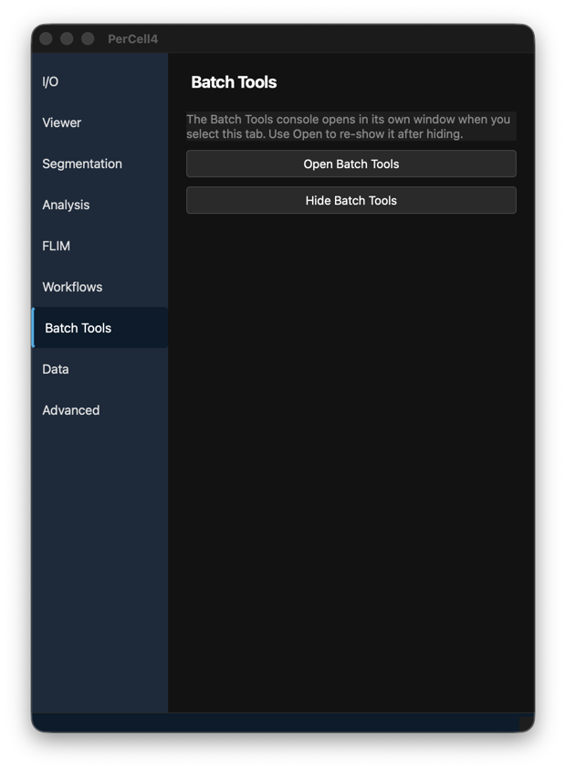
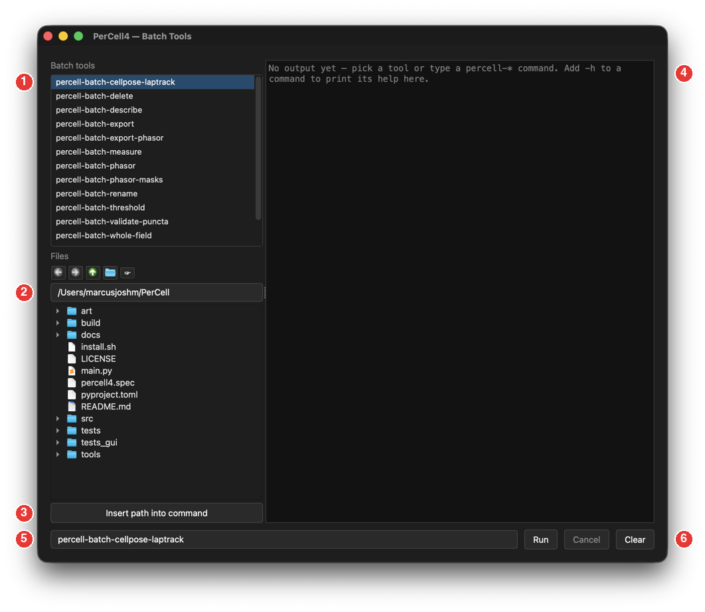

# 9. Batch Tools

## Overview

PerCell's command-line tools (`percell-batch-*` and `percell-inspect`) process many datasets without the GUI. The **Batch Tools** window runs them from inside PerCell, with a file browser to insert paths and a console for the output. Each tool is described in full in [Command-line tools](../cli.md).

---

## Dialog descriptions

### The Batch Tools tab

Selecting the tab opens the **Batch Tools** window. **Open Batch Tools** shows it again after you have hidden it; **Hide Batch Tools** hides it.

### The Batch Tools window

| # | Area | Description |
|---|---|---|
| 1 | **Batch tools** list | The available tools. Clicking one puts its name on the command line. |
| 2 | **Files** browser | Back, Forward, Up, choose a folder, and **☞** to jump to the folder of the open dataset. Double-click a file to insert its path into the command. |
| 3 | **Insert path into command** | Insert the selected file or folder's path at the cursor. |
| 4 | Output console | The tool's output, in colour. Ends with **[Done] Exit 0** and the run time, or **[Error] Exit N**. |
| 5 | Command line | Type or edit the command. Enter runs it. Up and Down recall earlier commands. Tab completes a tool name. You can also drag files onto it. |
| 6 | **Run**, **Cancel**, **Clear** | Run the command, stop it, or clear the output. |

The tools:

| Tool | What it does |
|---|---|
| `percell-batch-cellpose-laptrack` | Compress TIFFs, segment every timepoint with Cellpose, and track the cells. |
| `percell-batch-delete` | Delete a named channel, mask or segmentation, or every item of one kind, across datasets. |
| `percell-batch-describe` | Set, append to, or clear the description of many datasets. |
| `percell-batch-export` | Export layers as TIFFs. |
| `percell-batch-export-phasor` | Save phasor plots as PNG images. |
| `percell-batch-measure` | Measure existing masks and export CSV files. |
| `percell-batch-phasor` | Compute phasors and apply the wavelet filter. |
| `percell-batch-phasor-masks` | Fit a phasor ellipse and write two lifetime masks per channel. |
| `percell-batch-rename` | Rename a channel, mask or segmentation across datasets. |
| `percell-batch-threshold` | Run one thresholding round without review. |
| `percell-batch-validate-puncta` | A development tool that scores puncta detectors against ground truth. |
| `percell-batch-whole-field` | Make a whole-field segmentation, one label covering the image. |
| `percell-inspect` | Print a dataset's metadata and layers. |

---

## Instructions

### Running a batch tool

1. Open the **Batch Tools** tab. The window opens.
2. Click a tool in the list.
3. Add `-h` and click **Run** to print the tool's help.
4. Build the command: type the options, and insert paths with the **Files** browser.
5. Click **Run**. Watch the output; the run ends with **[Done]** or **[Error]**.

> **Note:** A tool cannot change a dataset that is open in PerCell. If the console reports that a dataset is locked, close it with **I/O → Close Dataset** and run the tool again.
