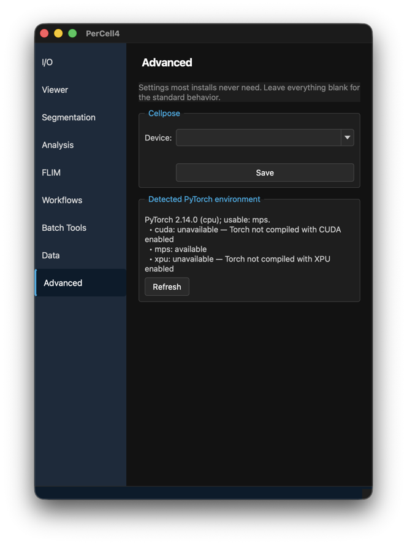

# 10. Advanced settings

## Overview

The **Advanced** tab holds settings that most installations never need. Leave them blank for the standard behaviour.

---

## Dialog descriptions

### Cellpose

- **Device:** The device Cellpose runs on when **Use GPU** is ticked. Leave it blank to let Cellpose find a GPU itself (CUDA, ROCm or Apple MPS). Or choose or type one: **cuda**, **cuda:0**, **cuda:1**, **mps**, **xpu** or **cpu**.
- **Save** — Store the device and check that it works on this computer. The message below reports the result.

The setting is stored in `advanced_settings.json` in your user settings folder:

| System | Folder |
|---|---|
| macOS | `~/Library/Application Support/PerCell4/` |
| Windows | `%APPDATA%\PerCell4\` |
| Linux | `~/.config/PerCell4/` (or `$XDG_CONFIG_HOME/PerCell4/`) |

### Detected PyTorch environment

Shows the installed PyTorch version and, for each kind of GPU, whether PerCell can use it and why not. For example, on a Mac: **mps: available**, **cuda: unavailable — Torch not compiled with CUDA enabled**. **Refresh** checks again.

---

## Instructions

### Making Cellpose use a particular GPU

1. Open the **Advanced** tab and read **Detected PyTorch environment** to see which devices are available.
2. Under **Cellpose**, choose the device, for example **cuda:1** for the second NVIDIA GPU.
3. Click **Save** and read the check result.
4. On the **Segmentation** tab, make sure **Use GPU** is ticked.

If a GPU is listed as unavailable, see [Troubleshooting](../installation.md#troubleshooting) in the installation guide.
