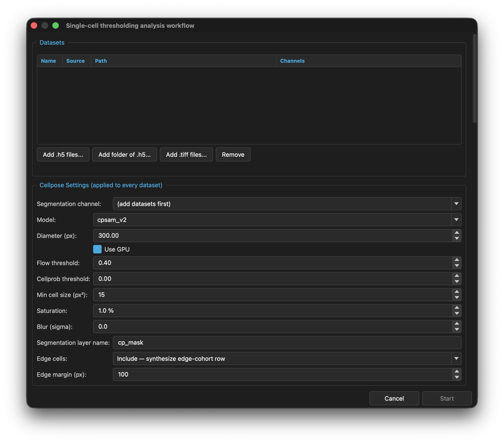

# Quick guide: Running the single-cell workflow

**You need:** TIFF folders or `.h5` datasets for the experiment.

1. Open the **Workflows** tab and click **Single-cell thresholding analysis workflow**.
2. Add datasets: **Add .h5 files...**, **Add folder of .h5...**, or **Add .tiff files...** to compress TIFFs first.
3. Under **Cellpose Settings**, choose the **Segmentation channel:** and check **Diameter (px):**.
4. Choose how to treat **Edge cells:**.
5. Under **Thresholding Rounds**, click **Add Round**. Set the **Name:**, **Channel:** and **Method:** (**Grouped Otsu** for reviewed thresholding, **Adaptive Local Thresholding** for puncta).
6. Leave **Include particle analysis** ticked to count particles per cell.
7. Choose the **Output Folder** and click **Start**.
8. During the run, review each segmentation and click **Accept & Next →**. For Grouped Otsu rounds, check each group's threshold and click **Accept**.
9. When the summary box appears, open the run folder.

**Result:** a run folder with `combined.csv`, one CSV per dataset, parquet files and the settings used.

More: [Single-cell thresholding analysis workflow](../08-workflows.md#single-cell-thresholding-analysis-workflow), [Workflow protocol](../../workflow-protocol.md).
