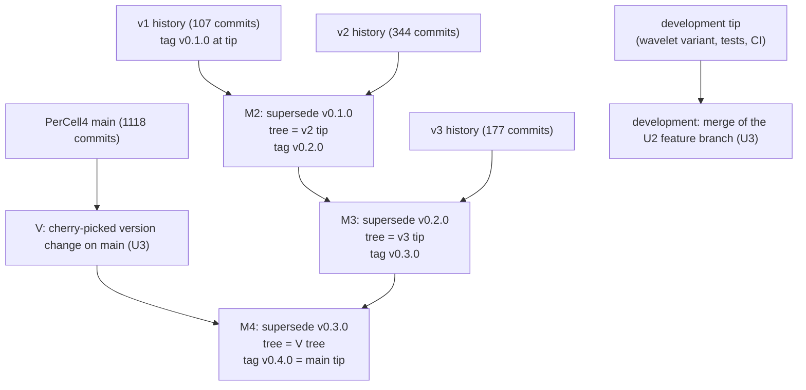
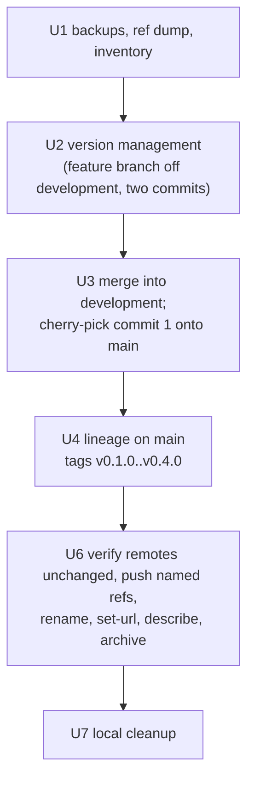

# PerCell Repository Consolidation - Plan

## Goal Capsule

**Objective.** Turn this repository into the single `PerCell` repository on GitHub, carrying the full commit history of all four generations (`microscopy-analysis-single-cell`, `percell`, `percell3`, `percell4`) linked by supersede merges and annotated tags `v0.1.0` through `v0.4.0`, with the package version derived from those tags.

**Authority.** The Requirements below govern outcomes. `docs/PERCELL_MERGE_PLAN.md` is the authority on the git and GitHub command choreography for each phase; this plan binds to it and records only the deltas (see Planning Contract). Key Technical Decisions govern mechanism within the requirements. When this plan and the origin doc disagree, this plan wins, because it is grounded in the probe results recorded under Sources.

**Execution profile.** Operational and packaging work. U1, U4, U6, U7 are git and GitHub operations verified by inspection of refs, trees, and remote state. U2 is the only code-bearing unit and carries test scenarios. U3 lands U2 on both branches without ever merging one branch into the other.

**Stop conditions.** Stop and ask before continuing if: a supersede-merge verification diff is non-empty; a blob over 50 MB appears in any history; `git merge-base` finds a shared ancestor between any two generations; `origin/main` or `origin/development` has moved since U1 when U3 or U6 begins; the list of commits that pushing `development` would publish has not been shown to and approved by the user; a GitHub rename fails or reports a name conflict; `pip install -e .` on `main` at `v0.4.0` reports a version other than `0.4.0`; or any step would delete a tracked path on either branch.

**Tail ownership.** This plan owns through the pushed, renamed, archived, and verified GitHub state (U6) and local cleanup (U7). Nothing is pushed before U6. Pushes name their refs explicitly; `--all`, `--mirror`, and any force option are forbidden. Nothing is ever rebased, rewritten, or deleted.

---

## Product Contract

### Summary

Consolidate the four PerCell generations into one GitHub repository named `PerCell`, built from this `percell4` clone, with every commit of every generation reachable from `main` through three supersede merges and tagged `v0.1.0` to `v0.4.0`. Move the package from a hardcoded `0.1.0` to a tag-derived version so that tagging is releasing, convert `docs/CHANGELOG.md` to version headings, add a README Versions section, push, then rename and archive the old GitHub repositories. `development` receives the same version change and the CI fix as its own commits and is never merged with `main`.

### Problem Frame

PerCell has been rewritten four times, each time as a fresh GitHub repository with no shared history. The current repository is named `percell4`, its package reports version `0.1.0` from three independent hardcoded strings, and the changelog says there are no tagged releases. A reader cannot check out an older generation from here, `git log` stops at March 2026, and the version stamped into HDF5 provenance never changes. The origin doc lays out a consolidation with backups, a local lineage build, version management, GitHub renames, and cleanup. It was written without knowledge of this repo's actual state: the GitHub names are lowercase, the repo has a two-branch layout where tests and CI live only on `development` and where `development` carries work that is not meant for `main`, CI checkouts are shallow, and the version string is consumed by the HDF5 importer and the PyInstaller spec.

### Requirements

**Lineage and tags**

- R1. Every commit of all four repositories is reachable from `main` in the consolidated repository, with no existing commit rewritten and no ref force-pushed.
- R2. Annotated tags `v0.1.0`, `v0.2.0`, `v0.3.0` point at commits whose trees are byte-identical to the tips of `microscopy-analysis-single-cell`, `percell`, and `percell3` respectively.
- R3. Annotated tag `v0.4.0` points at `main`'s tip, whose tree equals `main`'s tree immediately before the final supersede merge and includes the version-management changes of R6 to R8 and R10 to R12.
- R4. `git log --first-parent main` shows only PerCell4 history plus one supersede merge; plain `git log main` walks back through all four generations.
- R5. `development` is never merged into `main` and `main` is never merged into `development` by this work; `development`'s tracked tree changes only by its own version-change and CI commits. The four tags exist as refs from any branch but are reachable only from `main`'s history.

**Package version**

- R6. The package version is derived from git tags at build or install time, reporting `0.4.0` at tag `v0.4.0` and a PEP 440 dev version on later `main` commits. A `development` checkout reaches no version tag and reports setuptools-scm's no-tag value `0.1.devN+g<hash>`; this is accepted because `development` is a testing branch and never user-facing. The distribution and import name stay `percell4`.
- R7. `percell4.__version__`, the value stamped into HDF5 provenance by the importer and the decay use case, and the value written into `run_config.json` all resolve from the same source and agree.
- R8. The version resolves when the package is installed (editable or wheel), when it runs from `PYTHONPATH=src` without installation, and inside the PyInstaller bundle; it never raises at import.
- R9. CI installs the package with full git history and tags so the derived version is correct wherever a tag is reachable (pull-request merge refs and `main`); on the `development` head the install succeeds with the no-tag value.

**Documentation**

- R10. `docs/CHANGELOG.md` uses Keep a Changelog version headings: `[Unreleased]`, `[0.4.0]` with the existing PerCell4 entries beneath it, and one-line entries for `[0.3.0]`, `[0.2.0]`, `[0.1.0]` dated by each generation's last commit.
- R11. The README states the current version scheme and has a Versions section that tells a user what each generation is and how to check it out by tag, written for the README's lab-user audience.
- R12. User-facing references to the `percell4` GitHub URL and to the literal `0.1.0` wheel filename are updated so no active doc contradicts the new state.

**GitHub**

- R13. `main`, `development`, and the four version tags are pushed to the existing `percell4` repository with plain named-ref pushes and verified there, and CI is dispatched by hand on the pushed `development` head; only then is GitHub `percell` renamed `percell2` and `percell4` renamed `PerCell`.
- R14. `microscopy-analysis-single-cell`, `percell2`, and `percell3` get a description pointing at `PerCell` and the matching tag, then are archived. No repository is deleted.

**Safety**

- R15. Mirror backups of all four repositories and a dump of every local and remote ref exist before any lineage work starts, and every unit's verification passes before the next unit begins.

### Scope Boundaries

- The import package, distribution name, console-script names, PyInstaller bundle name, and bundle identifier stay `percell4`. Renaming the package to `percell` is a separate project.
- No content from older generations is merged into the current tree; supersede merges keep `main`'s tree exactly.
- The paper-strict wavelet variant already on local `development` (two commits above `origin/development`) is `development`-only work by the user's direction. It is not part of `v0.4.0` and is not carried to `main`. Pushing `development` in U6 publishes it to `origin/development`, which the user approves at that step.
- GitHub Releases are not created. Each can be added later with one `gh release create` per tag.
- Other local clones on other machines are not touched; U7 records what to do there.

#### Deferred to Follow-Up Work

- CI triggers on push to `main` only while the workflow file lives on `development`; pull-request runs cover the current flow. Aligning the trigger with the branch layout is separate work.
- `.github/workflows/build-lif-extractor.yml` and `tools/extract_lif_metadata.py` exist on `main` but not on `development`. Bringing `development` up to date with those files is separate work. Note for that work: a plain merge of `main` into `development` would delete the test tree, because `main`'s history records those files as removed relative to the branches' common ancestor. Features move from `main` to `development` by cherry-pick or by merging the feature branch into both branches, never by merging `main` itself.
- A `docs/solutions/` learning capturing the consolidation, the cherry-pick landing rule, and the tag-derived versioning workflow, written after the work lands.

---

## Planning Contract

### Key Technical Decisions

- KTD1. **Full linked history through `-s ours` supersede merges with `--allow-unrelated-histories` for every pair.** (session-settled: user-directed — chosen over keeping only PerCell4 history with snapshot tags for v1 to v3: the per-commit history of three repos is preserved for no real cost.) The probe found all six pairwise merge-bases empty, so every supersede merge needs `--allow-unrelated-histories` and the origin doc's "related" branch never applies. Governs R1, R2, R4.
- KTD2. **Version management lands before the `v0.4.0` tag, not after.** The origin doc tags `v0.4.0` on the supersede merge and then adds version management as later commits. With tag-derived versioning that leaves `v0.4.0` reporting the static `0.1.0` and `main` reporting `0.4.1.devN` forever. Instead U2 and U3 land the version-management change on `main` first, then U4 performs the final supersede merge on top and tags it. Tagging the merge commit (distance 0 from `main`'s tip) rather than the version commit beneath it is what makes `main` report exactly `0.4.0`; `-s ours` guarantees the merge tree equals the version commit's tree, so `git checkout v0.4.0` still reproduces PerCell4 plus the version change. Governs R3, R6.
- KTD3. **Tag-derived version via setuptools-scm with a generated `src/percell4/_version.py` and a file-first resolver.** (session-settled: user-approved — chosen over a static `version = "0.4.0"` bump: nothing to forget at release time; tagging is releasing.) `pyproject.toml` declares `dynamic = ["version"]`, adds `setuptools-scm>=8` to the build requirements, and sets `version_file` and `fallback_version`. Place `[tool.setuptools_scm]` directly after `[build-system]` and `[project.urls]` directly after `classifiers`, regions identical on both branches, so the same patch applies cleanly to both `pyproject.toml` variants. `percell4/__init__.py` resolves `__version__` through a small function: the generated `_version.py` first (it sits beside the code, so `PYTHONPATH=src` runs and the PyInstaller bundle, which collects all submodules, both work), installed metadata second, the string `0.0.0+unknown` last; import never raises. The generated file is gitignored and excluded from ruff, because setuptools-scm's template fails the `UP` rules this repo selects. `fallback_version` applies only outside a git checkout; inside one with no reachable version tag setuptools-scm reports `0.1.devN+g<hash>`. The existing `pre-ui-cleanup` tag is ignored by setuptools-scm's default describe match because it contains no digit. Governs R6, R7, R8.
- KTD4. **One version source in code.** `run_folder.percell4_version()` returns `percell4.__version__` instead of calling `importlib.metadata` itself, so provenance in HDF5 files and `run_config.json` agree. No consumer parses or compares the string, so the PEP 440 dev format is safe. No import-linter contract names the root package or `percell4._version`, and `add_decay_to_dataset.py` and `importer.py` already import from the root package. Governs R7.
- KTD5. **PyInstaller spec copies package metadata and reads the version at build time.** `copy_metadata("percell4")` joins the spec's data list so `importlib.metadata` works in the frozen app. The two macOS plist version strings are computed when the spec runs from the installed metadata's base version (dotted integers only, as Apple expects; a dev suffix is dropped), with a `0.0.0` fallback so the spec never aborts. An editable install does create the dist-info that `copy_metadata` needs. Governs R8.
- KTD6. **CI checkouts fetch full history.** The `test` and `gui-tests` jobs in `.github/workflows/ci.yml` set `fetch-depth: 0` on `actions/checkout`; the lint job does not install the package and is left alone. Governs R9.
- KTD7. **Changelog stays at `docs/CHANGELOG.md` and converts in place.** (session-settled: user-approved — chosen over a new root `CHANGELOG.md` as the origin doc suggests: the link-resolution test and the README documentation table already pin the current path.) The existing month sections nest one heading level deeper under `[0.4.0]`, the duplicated Added/Changed pairs in Unreleased fold into one, and the stale "no tagged releases" preamble is rewritten. Governs R10.
- KTD8. **`development` and `main` are never merged with each other.** (session-settled: user-directed — chosen over a `-s ours` merge of `main` into `development` to carry the lineage: the user keeps `development` separate from `main`, and such a merge would also move the branches' merge base so that the next `development` to `main` merge deletes main-only files.) `development` gets the version change and CI fix as its own commits; `main` gets the version change by cherry-pick. The lineage and the version tags are reachable from `main` only; `development` reports the no-tag version (R6) and that is accepted. Governs R5, R6.
- KTD9. **Push first, rename second, archive last.** The push is the only step that cannot be undone without a force operation, so it runs while both public names are still unchanged and every failure mode (auth, network, non-fast-forward, size) leaves a consistent `percell4`. Renames are reversible by renaming back; archiving is reversible by unarchiving. `percell` must become `percell2` before `percell4` can become `PerCell` because GitHub repository names are case-insensitive. GitHub redirects `percell4` to `PerCell` indefinitely unless a repository is later created at `percell4`. The `percell` to `percell2` redirect does not survive: the second rename occupies the name `percell` (case-insensitive), so the old v2 URL resolves to the consolidated repository, and any v2 clone must be re-pointed at `percell2` by hand. No reusable actions or Pages sites reference these repos. Descriptions are set before archiving because archived repositories reject edits, and `percell2`'s description also says that the old `percell` URL now resolves to `PerCell`. Governs R13, R14.
- KTD10. **Execute in this clone.** (session-settled: user-approved — chosen over the origin doc's fresh clone in a separate directory: the working tree is clean, branches and remotes are known, and the mirror backups are the rollback either way.) Governs R15.
- KTD11. **The version change lands on `main` by cherry-pick, not by merging `development`.** (session-settled: user-directed — chosen over the repo's trimming-merge recipe: `development` carries the wavelet variant, which must not reach `main`, and any merge of `development` would carry it.) U2 is authored on a feature branch off `development` as two commits: one touching only files that exist on `main`, one touching `development`-only files (`.github/workflows/ci.yml`, the new test file). The feature branch merges into `development` normally; only the first commit is cherry-picked onto `main`. Because KTD3 places the packaging edits in regions identical on both branches, the cherry-pick applies to `pyproject.toml` without conflict, and the set of added and removed lines between the two branches' `pyproject.toml` files stays exactly what it was before U2. `docs/CHANGELOG.md` is the one file that already differs: `development` carries a wavelet-variant entry under Unreleased that `main` lacks. If the cherry-pick conflicts there, keep `main`'s side of that hunk; U3 asserts the wavelet entry is absent from `main`. Governs R5, R6, R9.

### High-Level Technical Design

Target commit graph. Boxes are commits; `M2`, `M3`, `M4` are `-s ours` supersede merges. Tree labels name whose tree each merge commit carries. `development` is drawn separately because it never joins this graph.

Unit sequencing. Nothing leaves the machine until U6, and inside U6 the push precedes every rename.

### Deltas from the origin document

The origin doc's command choreography is followed except where listed here.

| Origin doc | This plan |
|---|---|
| `<gh-user>/PerCell`, `/PerCell3`, `/PerCell4` | Actual names are `marcusjoshm/percell`, `percell3`, `percell4`; the final name is `PerCell` |
| Phase 0.5 branches on related vs unrelated | All pairs unrelated; always pass `--allow-unrelated-histories` |
| Phase 2 after Phase 1, `v0.4.0` on the merge before version management | Version management (U2, U3) before the final supersede merge and tag (KTD2) |
| Fresh clone in `~/percell-merge` | This clone (KTD10) |
| Root `CHANGELOG.md` | `docs/CHANGELOG.md` converted in place (KTD7) |
| Phase 3.1 renames, then Phase 3.2 pushes | Push and verify on `percell4` first, then rename (KTD9) |
| Phase 3.2 pushes `main` and `--tags` | Pushes `main`, `development`, and the four version tags by name, atomically |
| Phase 3.3 archives, description optional | Description set first, then archive (KTD9) |
| Option B with `[tool.setuptools_scm]` alone | Adds `version_file`, `fallback_version`, the `__init__` resolver, ruff exclusion, spec metadata copy, and CI fetch depth (KTD3 to KTD6) |
| Single-branch repo | Two branches that never merge; `main` receives the change by cherry-pick; `development` reports the no-tag version (KTD8, KTD11) |

### Assumptions

- `gh` is authenticated as `marcusjoshm`, who owns all four repositories (auth verified; ownership verified by `gh repo view` on each).
- `development` has no upstream configured; the two commits above `origin/development` are the wavelet variant merge. No other machine has pushed to `origin/main` or `origin/development` since 2026-08-31; U3 and U6 re-check this.
- `development` never has a version tag in its ancestry, so installs and provenance stamps from it carry `0.1.devN+g<hash>`; `main`, tag checkouts, and pull-request merge refs carry `0.4.x`. Accepted by the user because `development` is testing-only.
- `gh repo rename` and `gh repo archive` prompt for confirmation; the U6 commands pass `--yes` so the step does not stall.
- The `.venv` interpreter can build with pip's isolated build environment, which fetches setuptools-scm from PyPI; if the machine is offline at that moment, install setuptools-scm into `.venv` first. PyInstaller is not installed in `.venv`; the spec check in U2 needs it installed.

### Risks

| Risk | Mitigation |
|---|---|
| `origin/main` or `origin/development` moved between U1 and U6, making the push non-fast-forward | Fetch and compare against the U1 ref dump at the start of U3 and U6; stop if different |
| Pushing `development` publishes the wavelet variant commits | U6 shows the exact commit list `origin/development..development` and waits for approval before pushing |
| Push succeeds partially (branches pushed, tags missing) | One atomic push of all named refs; post-push hash equality per ref |
| A rename fails midway, leaving `percell2` renamed but `percell4` not | Rename back with the same command; the pushed repository is already complete under its old name |
| Editable install reports a stale version after a new tag | Documented in the README Versions section: re-run `pip install -e .` after tagging; tests never assert on the value |
| A future repo created at the old name `percell4` breaks GitHub's redirect | U7 updates every known clone's remote URL, so redirects are a convenience only |
| The cherry-pick onto `main` conflicts on `pyproject.toml` | KTD3 puts the edits in regions identical on both branches; U1 saves the pre-change inter-branch added/removed lines and U3 asserts they are unchanged |
| The cherry-pick conflicts on `docs/CHANGELOG.md` because `development` carries the wavelet entry under Unreleased | Resolve by keeping `main`'s side of that hunk; U3 asserts the wavelet entry is absent from `main` |
| Existing clones of the v2 repository silently point at the consolidated repository after the rename | KTD9 records that the `percell` redirect is consumed; U7 re-points any v2 clone at `percell2` and the `percell2` description says so |
| setuptools-scm 10.0.1 was yanked for breaking editable installs | Build requirement is `setuptools-scm>=8`; pip resolves to a non-yanked release |

---

## Implementation Units

### U1. Safety and inventory

**Goal:** Mirror-back up all four repositories, dump every ref, add the three older repos as remotes, and re-confirm the probe findings before anything else changes.

**Requirements:** R15, R1.

**Dependencies:** none.

**Files:** none in the repo tree. Creates `~/percell-backups/*.git` mirrors, `~/percell-backups/refs-u1.txt` (output of `git for-each-ref` for this clone), and `~/percell-backups/pyproject-branch-diff-u1.txt` (the added and removed lines of the `pyproject.toml` diff between `main` and `development`). Adds git remotes `v1`, `v2`, `v3`.

**Approach:**
1. Working tree must be clean apart from the origin doc and this plan; commit those two files on `development` first so `git status` is empty.
2. Fetch `origin` and record that `origin/main` is `f417848` and `origin/development` is `cf926fb`; record the local `main` and `development` hashes and the full ref dump.
3. Save the inter-branch `pyproject.toml` diff reduced to its added and removed lines only (hunk headers, index lines, and context lines shift after U2 and are not compared); U3 compares against it.
4. Create the four mirror clones per origin doc Phase 0.1 with the lowercase GitHub names.
5. Add remotes `v1`, `v2`, `v3` and fetch with `--no-tags` per Phase 0.3.
6. Re-run the Phase 0.4 to 0.6 checks. Expected: default branch `main` for all three; all pairs unrelated; no blob over 10 MB in v1 to v3; two PDFs of about 10 MB in this repo's history, both under GitHub's warning threshold.

**Test scenarios:** Test expectation: none -- read-only inventory; verification is by inspection.

**Verification:** Four mirror directories exist and each reports the same tip hash as GitHub. The ref dump and pyproject diff files exist. `git remote -v` lists `origin`, `v1`, `v2`, `v3`. `git merge-base` returns non-zero for `v1/main` vs `v2/main`, `v2/main` vs `v3/main`, and `v3/main` vs `main`. The large-file scan shows nothing over 50 MB. Findings are reported to the user before U2 starts, as the origin doc requires.

### U2. Tag-derived package version and versioned docs

**Goal:** Replace the three hardcoded `0.1.0` strings with a tag-derived version resolved from one place, make CI and the PyInstaller spec compatible with it, convert the changelog to version headings, and add the README Versions section.

**Requirements:** R6, R7, R8, R9, R10, R11, R12.

**Dependencies:** U1.

**Files:**

Commit 1 (files that exist on `main`; cherry-picked in U3):
- `pyproject.toml` (build requirements, `dynamic = ["version"]`, `[tool.setuptools_scm]`, new `[project.urls]`, ruff `extend-exclude` entry)
- `src/percell4/__init__.py` (version resolver function)
- `src/percell4/application/analysis/run_folder.py` (delegate to `percell4.__version__`)
- `percell4.spec` (metadata copy, build-time bundle version)
- `.gitignore` (`src/percell4/_version.py`)
- `docs/CHANGELOG.md` (version headings)
- `README.md` (version statement in the pre-release note, Versions section, issues URL, changelog row wording)
- `docs/installation.md` (version-agnostic wheel filename)

Commit 2 (`development`-only files):
- `.github/workflows/ci.yml` (`fetch-depth: 0` on the two installing jobs)
- `tests/test_version.py` (new)
- `tests/test_docs/test_doc_links_resolve.py` (unchanged; must keep passing)

**Approach:**
1. Author on a feature branch off `development`, as exactly the two commits above (KTD11).
2. Packaging per KTD3, with the new tables placed in the branch-identical regions named there. `fallback_version` is `0.0.0`. `[project.urls]` gets Homepage and Issues pointing at `github.com/marcusjoshm/PerCell`.
3. Resolver per KTD3 and KTD4 in `src/percell4/__init__.py`: a function tries `_version.py`, then installed metadata, then `0.0.0+unknown`; `__version__` is its result. Keep the existing `hdf5plugin` registration. `run_folder.percell4_version()` returns `percell4.__version__`.
4. Spec per KTD5.
5. CI per KTD6.
6. Changelog per KTD7. Version dates: `0.4.0` is the planned tag date, and U4 is run on that date so the entry stays correct; `0.3.0` is 2026-03-09; `0.2.0` is 2026-02-18; `0.1.0` is 2025-06-30. The one-line entries describe each generation for a user (v1: LAS X export workflow with Cellpose and an interactive CLI; v2: Cellpose plus ImageJ macros behind a CLI; v3: OME-Zarr and SQLite platform with Cellpose and napari; v4: standalone GUI on HDF5 and pandas). Note in the `0.2.0` entry that the v2 package called itself `1.0.0`.
7. README per R11 and R12, following `docs/solutions/conventions/user-facing-docs-authoring-conventions-2026-05-21.md`: the Versions section lists the four generations in plain language, gives the tag checkout commands in one fenced block, and states that the version reported by the package comes from the tag, that an editable install is refreshed by reinstalling, and that a `development` checkout reports a `0.1.devN` placeholder because it is a testing branch. Update the Reporting issues URL and the Documentation table's changelog wording.

**Execution note:** Packaging and docs work; prove it with install and runtime checks first, then the small unit test file.

**Patterns to follow:** `run_folder.percell4_version()` already shows the metadata-with-fallback shape. `tests/test_docs/test_doc_links_resolve.py` shows the docs test style. `docs/solutions/build-errors/cross-platform-packaging-review-fixes.md` records the rule that every packaging declaration is verified after `pip install -e .`.

**Test scenarios:**
- Installed package: `percell4.__version__` equals `importlib.metadata.version("percell4")` and parses as a PEP 440 version.
- Fallback order: with the `_version` module import patched to fail and metadata lookup patched to raise `PackageNotFoundError`, the resolver returns `0.0.0+unknown`; with only the module import failing, it returns the metadata value; the resolver never raises. Use monkeypatch on the resolver function rather than reloading the package, which would re-run the `hdf5plugin` import.
- `run_folder.percell4_version()` returns the same string as `percell4.__version__`.
- Provenance stamping: the decay use case and the importer write `percell4.__version__` into `importer_version`; existing tests in `tests/test_add_decay_to_dataset.py` and `tests/test_io/` keep passing unchanged.
- Docs links: `tests/test_docs/test_doc_links_resolve.py` passes with the new README section and the restructured changelog; `test_cli_docs_match_argparse.py` passes (the Versions fence contains no `percell4-` invocations).
- Changelog shape: `docs/CHANGELOG.md` has exactly one `## [Unreleased]`, one `## [0.4.0]`, and one heading each for `[0.3.0]`, `[0.2.0]`, `[0.1.0]`, in that order, and no top-level month headings remain.

**Verification:** From `.venv`, `pip install -e .` succeeds and the package reports `0.1.dev<N>+g<hash>`, setuptools-scm's value when no version tag is reachable (the exact `0.4.0` check happens in U4 on `main`). `src/percell4/_version.py` exists and is untracked. `.venv/bin/pytest` passes. `ruff check` passes with the generated file excluded. With PyInstaller installed in `.venv`, evaluating the spec's data list and bundle version expression succeeds; a full bundle build is not required.

### U3. Land the version change on development and main

**Goal:** Merge the feature branch into `development`, then cherry-pick commit 1 onto `main`, so `main` gains only the version change and `development` keeps everything it has.

**Requirements:** R5, R6, R9, R3.

**Dependencies:** U2.

**Files:** the commit 1 file list from U2, applied to `main`. No `development`-only file reaches `main`.

**Approach:**
1. Fetch `origin`; stop if `origin/main` or `origin/development` differs from the U1 record.
2. Merge the feature branch into `development` (normal merge).
3. On `main`, cherry-pick commit 1 (KTD11). Do not merge `development`, and do not use the trimming recipe.
4. Record `main`'s resulting commit hash; U4 compares the `v0.4.0` tree against it.

**Test scenarios:** Test expectation: none -- branch landing; verified by diff inspection.

**Verification:** On `main`, `git diff --name-status origin/main` lists exactly the eight commit-1 files, all `M`, with no `A` and no `D` entries. The added and removed lines of the `pyproject.toml` diff between `main` and `development` are byte-identical to the U1 saved file. `docs/CHANGELOG.md` on `main` contains no `Paper-strict wavelet` entry, and the inter-branch changelog diff shows `development` adding lines only, removing none. `pip install -e .` on `main` succeeds. On `development`, `.venv/bin/pytest` passes and `git log origin/development..development` shows the wavelet commits, the U1 docs commit, and the feature merge only.

### U4. Build the lineage on main

**Goal:** Create the four annotated tags and the three supersede merges so `main` reaches every generation, with `main`'s tree unchanged.

**Requirements:** R1, R2, R3, R4.

**Dependencies:** U3.

**Files:** none in the tree. Creates refs: tags `v0.1.0` to `v0.4.0`, temporary branch `lineage` (deleted at the end).

**Approach:**
1. Follow origin doc Phase 1.1 to 1.4 verbatim with `--allow-unrelated-histories` on every merge and the remote branches named `v1/main`, `v2/main`, `v3/main`.
2. The final merge on `main` (Phase 1.4) sits on top of U3's commit; tag it `v0.4.0`. `main`'s tip and `v0.4.0` now name the same commit.
3. Delete the `lineage` branch.

**Test scenarios:** Test expectation: none -- git graph construction; verified by the diffs below.

**Verification:** Every check in origin doc Phase 1.5 holds, with one substitution: `git diff --stat v0.4.0 <U3 commit>` is empty instead of the comparison against `origin/main`. `git rev-parse main` equals `git rev-parse v0.4.0^{commit}`. `git describe --tags main` prints `v0.4.0`. `pip install -e .` on `main` makes `percell4.__version__` report exactly `0.4.0`. The `git checkout v0.2.0` demonstration runs in a temporary `git worktree` so the main working tree and its ignored `_version.py` are untouched.

### U6. Push, rename, describe, archive

**Goal:** Publish the consolidated repository, then rename it `PerCell` and archive the three old repositories.

**Requirements:** R13, R14, R5.

**Dependencies:** U4.

**Files:** none in the tree. Changes `origin`'s URL in `.git/config`. Writes `~/percell-backups/refs-u6-pre-push.txt`.

**Approach:**
1. Fetch `origin`; stop if `origin/main` or `origin/development` differs from the U1 record. Dump refs again.
2. Show the user `git log --oneline origin/development..development` and wait for approval; those commits, including the wavelet variant, become public on `origin/development`.
3. One atomic push to the current `percell4` URL naming `main`, `development`, `v0.1.0`, `v0.2.0`, `v0.3.0`, `v0.4.0` explicitly. `development` has no upstream, so the refspec must be spelled out.
4. Compare `git ls-remote origin` against local refs: `origin/main` equals local `main` equals the `v0.4.0` commit; `origin/development` equals local `development`; each remote tag object hash equals the local annotated tag object hash.
5. List the account's repositories once with exact-case names (`gh repo list` with a name query); the list must contain neither `percell2` nor `PerCell` (`percell` is expected: it is the repository being moved). Do not test with `gh repo view`, because lookups are case-insensitive and follow redirects, so `PerCell` always resolves. Then rename `percell` to `percell2`, then `percell4` to `PerCell` (KTD9), passing `--yes`.
6. Point `origin` at the new URL and repeat the `ls-remote` comparison through it.
7. Set each old repository's description to "Superseded — see marcusjoshm/PerCell (tag v0.N.0)"; for `percell2` add "the old percell URL now resolves to PerCell". Then archive `microscopy-analysis-single-cell`, `percell2`, `percell3` with `--yes`.
8. Post-launch checks: a fresh clone of the new URL into a temporary directory lists the four version tags, `git describe --tags` at its `main` prints `v0.4.0`, and `pip install -e .` there reports `0.4.0`; the old `percell4` URL answers with a redirect; CI is dispatched by hand on the pushed `development` head (`gh workflow run` on `ci.yml`, because the workflow runs automatically only on pushes to `main` and on pull requests) and watched to green, with the `0.1.devN` install visible in its log.

**Test scenarios:** Test expectation: none -- remote operations; verified by inspection.

**Verification:** All ref equalities in steps 4 and 6 hold. `gh repo view marcusjoshm/PerCell` shows default branch `main`, not archived. The three old repos report `isArchived: true` and carry the new descriptions. All step 8 checks pass. `git grep` on `main` for `github.com/marcusjoshm/percell4` finds nothing outside `docs/archive/` and `docs/plans/`.

### U7. Local cleanup and memory

**Goal:** Remove the temporary remotes, record the new state, and note follow-ups for other clones.

**Requirements:** R15 (backups retained).

**Dependencies:** U6.

**Files:** none in the tree. Removes remotes `v1`, `v2`, `v3`. Updates the agent memory note on branch layout to record the new repo name, the tag-derived versioning, and the cherry-pick landing rule.

**Approach:** Remove the three remotes. Keep `~/percell-backups` for a few weeks. List for the user the other machines and clones that should run a remote-URL update and a pull, and any clone of the v2 repository, which must be re-pointed at `percell2` because the old `percell` URL now resolves to `PerCell`.

**Test scenarios:** Test expectation: none -- housekeeping.

**Verification:** `git remote -v` shows only `origin` pointing at `PerCell`. `git status` is clean on both branches.

---

## Verification Contract

| Gate | Command or check | Applies to |
|---|---|---|
| Unit and docs tests | `.venv/bin/pytest` from repo root on `development` | U2, U3 |
| Lint | `.venv/bin/ruff check` | U2 |
| Install and version | `.venv/bin/pip install -e .` then print `percell4.__version__` | U2 (`0.1.devN` on `development`), U4 (`0.4.0` on `main`) |
| Branch landing | `git diff --name-status origin/main` on `main`: eight `M` lines, no `A`, no `D`; inter-branch pyproject added/removed lines equal the U1 file; no wavelet entry in `main`'s changelog | U3 |
| Supersede integrity | Origin doc Phase 1.5 diffs, with the `v0.4.0` comparison against U3's commit; `main` equals `v0.4.0` | U4 |
| Remote freshness | `git fetch` then `origin/*` equals the U1 record | U3, U6 |
| Remote state | `git ls-remote origin` ref-by-ref equality with local refs, before and after the rename; `gh repo view` on all four names | U6 |
| Post-launch | Fresh clone: four tags, `describe` gives `v0.4.0`, install reports `0.4.0`; old URL redirects; CI dispatched by hand on the `development` head and green | U6 |
| Docs | `git grep` for the old GitHub URL and for `0.1.0` as a current version on `main` finds only archive and plan files | U6 |

---

## Definition of Done

- All four tags exist on `origin`, each verified against its source repo's tip tree (R2, R3).
- `git log main` reaches the first commit of `microscopy-analysis-single-cell`; `git log --first-parent main` shows PerCell4 history plus one merge (R1, R4).
- Neither branch was merged into the other; `development`'s diff against `origin/development` before the push contains only its own commits (R5).
- `percell4.__version__` reports `0.4.0` on `main` at the tag and the documented `0.1.devN` placeholder on `development`, from a single resolver used by provenance and run configuration (R6, R7, R8).
- CI, dispatched by hand, passes on `development` with full-history checkouts (R9).
- `docs/CHANGELOG.md` and `README.md` carry the version headings and the Versions section; no active doc mentions `0.1.0` as the current version or the `percell4` GitHub URL (R10 to R12).
- GitHub shows `marcusjoshm/PerCell` with the full history and three archived predecessors with pointer descriptions; old URLs redirect (R13, R14).
- Mirror backups and ref dumps exist; temporary remotes and the `lineage` branch are gone; no force-push, rebase, or deletion happened anywhere (R15).
- No abandoned experiments remain: `main`'s only change beyond the supersede merges is the eight-file version commit; `development`'s only changes are that commit and the CI plus test commit.

---

## Sources

- `docs/PERCELL_MERGE_PLAN.md` — command choreography for every phase and the rollback procedure.
- Probe of the four histories (2026-09-10): v1 107 commits, last 2025-06-30, two root commits; v2 344 commits, last 2026-02-18, `pyproject` name `percell` version `1.0.0`; v3 177 commits, last 2026-03-09, name `percell3` version `0.1.0`; v4 1118 commits, last 2026-08-31. All pairwise merge-bases empty. No tags in v1 to v3. No blob over 10 MB in v1 to v3; `docs/reference/*.pdf` at about 10 MB in v4.
- Local branch state (2026-09-10): `main` `f417848` equals `origin/main`; `development` `a3ae281`, no upstream, two commits above `origin/development` `cf926fb` (wavelet variant merge); only tag `pre-ui-cleanup`, identical on `origin`. `main` carries `.github/workflows/build-lif-extractor.yml` and `tools/extract_lif_metadata.py`, which `development` lacks.
- GitHub state: `marcusjoshm/{microscopy-analysis-single-cell,percell,percell3,percell4}`, all default branch `main`, none archived; `gh` authenticated as `marcusjoshm`.
- Version consumers: `src/percell4/__init__.py:1`, `pyproject.toml:7`, `percell4.spec:129-130`, `src/percell4/adapters/importer.py:1015-1034`, `src/percell4/application/use_cases/add_decay_to_dataset.py:26,428`, `src/percell4/application/analysis/run_folder.py:48-57`, `src/percell4/domain/io/models.py:212-254`.
- Inter-branch `pyproject.toml` diff: four hunks only (dev extras, `[tool.pytest.ini_options]`, ruff `src`, tests per-file-ignores); `[build-system]`, `[project]` head, and `[tool.ruff]` `extend-exclude` are identical on both branches.
- Docs pins: `tests/test_docs/test_doc_links_resolve.py:21-32` (checked docs list), `README.md:19,38,102`, `docs/installation.md:253-256`, `docs/CHANGELOG.md:3-8` preamble and duplicated Unreleased groups at lines 12/80 and 122/132.
- CI: `.github/workflows/ci.yml:17,30,82` bare checkouts; install steps at lines 58 and 110. `lint-imports` is not run by CI or any hook.
- Learnings: `docs/solutions/workflow-issues/complete-branch-before-merge-2026-05-06.md`, `docs/solutions/build-errors/cross-platform-packaging-review-fixes.md`, `docs/solutions/conventions/headless-test-suite-tiers.md`, `docs/solutions/conventions/user-facing-docs-authoring-conventions-2026-05-21.md`.
- setuptools-scm configuration and runtime pattern: https://setuptools-scm.readthedocs.io/en/latest/config/ and /usage/ (10.2.3 current; 10.0.1 yanked; `write_to` deprecated in favour of `version_file`; default describe match `*[0-9]*`).
- Shallow checkout behaviour: https://github.com/actions/checkout/issues/338, https://github.com/pypa/setuptools-scm/issues/480.
- PyInstaller metadata collection: https://pyinstaller.org/en/stable/hooks.html (`copy_metadata`).
- GitHub renames and redirects: https://docs.github.com/en/repositories/creating-and-managing-repositories/renaming-a-repository; `gh repo rename`, `gh repo archive`, `gh repo edit` manuals.
