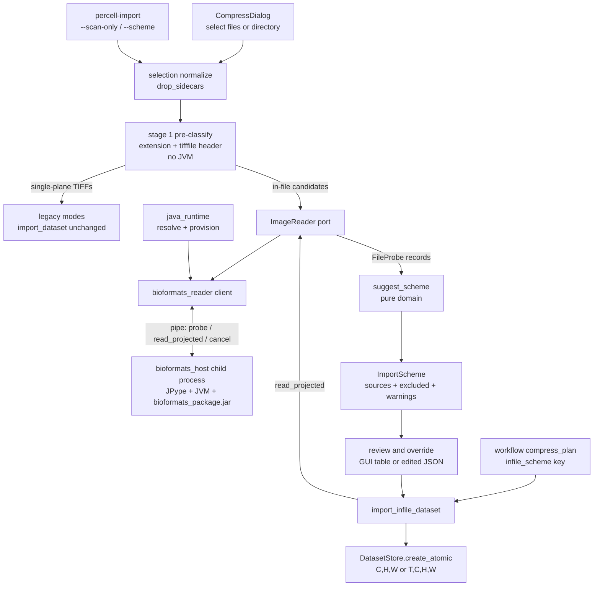
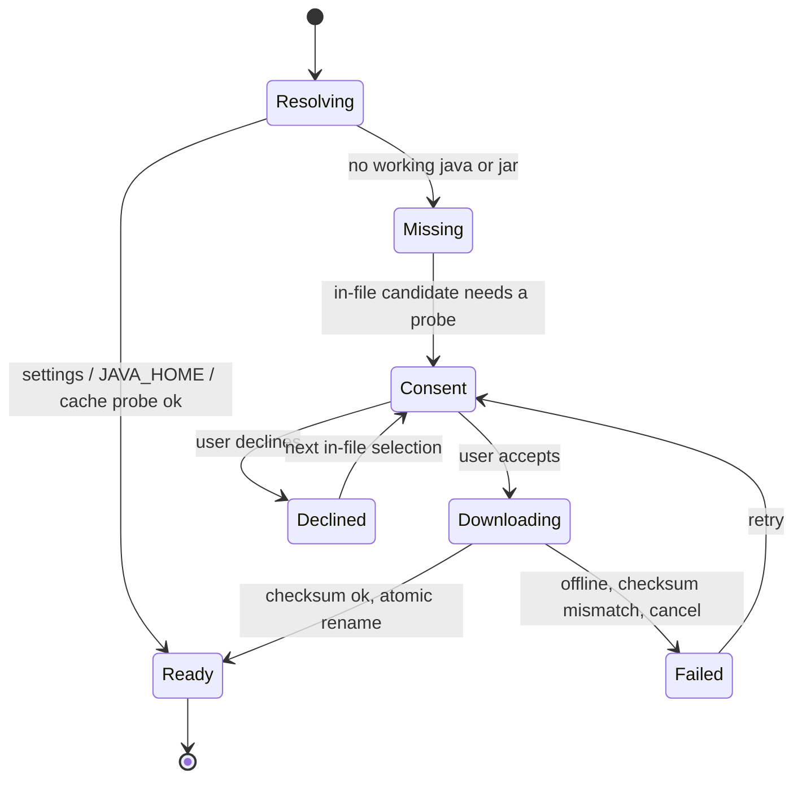
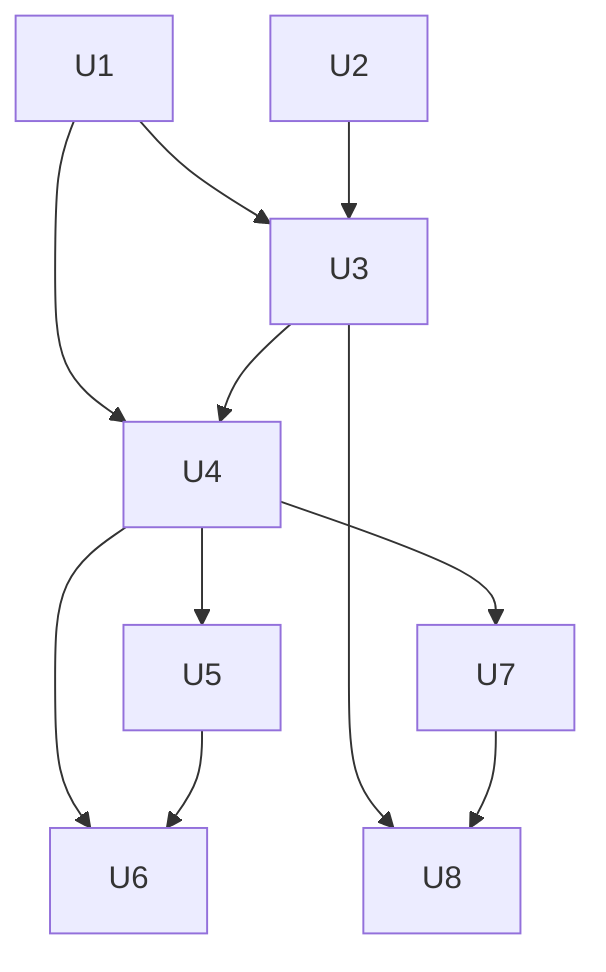

# In-File Multi-Dimensional Import - Plan

## Goal Capsule

**Objective.** Let PerCell import microscopy files whose channels, z-series, time points and series live inside one file, read through OME Bio-Formats. The user picks files or a directory. PerCell inspects metadata only, suggests an import scheme, and imports after the user accepts or overrides it. The GUI and a headless command share one classifier and one scheme format.

**Authority.** The Requirements govern outcomes. The Key Technical Decisions govern mechanism within them. The session-settled decisions (Bio-Formats as the engine, the full GPL Bio-Formats package, Z always projected, GUI plus headless) are fixed. Do not reopen them. Report new evidence against them instead.

**Execution profile.** Feature work across the domain, adapters, GUI, CLI, workflow and packaging layers.
- U1 is pure domain code and is written test-first.
- U2 and U3 add the Java runtime and the Bio-Formats reader behind a port. A fake reader keeps every other unit testable without Java.
- U4 to U7 wire the reader into import, the dialog, workflow replay and the CLI.
- U8 covers packaging, CI and docs.

**Stop conditions.** Stop and ask before continuing if any of these occur:
- Bio-Formats reads the IDR0089 test file with axes or calibration that disagree with its ImageJ metadata.
- Any step would download data, or wait on a download. Real-data checks use only the single local test file named in AE1; if it is missing, skip and report.
- A Bio-Formats reader groups two independent files into one dataset even with file grouping off.
- The legacy token-import regression test (U4) shows any byte difference.
- JVM startup inside the reader child process fails on macOS arm64.
- A frozen build cannot start the reader child process.
- Provisioning would need to download anything without user consent.

**Tail ownership.** All work lands as commits on `development` only. Nothing merges or is cherry-picked to `main`. Pushing is out of scope unless the user asks.

---

## Product Contract

### Summary

Add an in-file import mode. It reads multi-dimensional files through Bio-Formats, which runs in a separate reader process that PerCell provisions with the user's consent. A metadata-only classifier turns a selection of files or a directory into a suggested import scheme. The GUI shows the scheme in a review table where the user can override it. A new `percell-import` command writes the same scheme to an editable file and replays it. In-file Z is projected at import, and the projected datasets use the existing store layout. Existing token-based imports of single-plane files are unchanged and never need Java. Legacy modes now exclude multi-plane files with a reason instead of mis-importing them.

### Problem Frame

PerCell imports one 2D plane per file. It parses channel, z, tile and timepoint from filename tokens. Many microscopes and processing tools instead write one file that carries every dimension. An example is the IDR0089 SIM data: an ImageJ hyperstack TIFF of 77 z × 3 channels × 1024 × 1024, about 485 MB each, in a folder of 12.

Today PerCell imports such a file wrongly and without warning. It stores the whole ZCYX array under `dims=['H','W']` as one channel `ch0`, with no pixel size. The ImageJ calibration (`unit=micron`, `spacing=0.125`) is lost because the TIFF ResolutionUnit is `NONE`.

The import dialog also makes the user choose a discovery mode by hand, accepts a directory only, and shows no preview of how data will be interpreted. The "none" z-projection choice is broken: it raises inside `project_z`.

### Requirements

**Selection and detection**
- R1. The user can select one or more files, or a directory, as the import source, in both the GUI and the headless command.
- R2. PerCell classifies the selection from metadata only. It never decodes pixel data to classify.
- R3. PerCell suggests an import scheme. The user reviews it before any import runs and can accept or override it.
- R4. Every selected file appears in the review, including files that cannot be imported. Each one shows a reason. Formats outside the TIFF family are attempted on a best-effort basis and are never hidden.

**In-file reading**
- R5. A single file that carries channels, z and time imports with those dimensions read from the file itself.
- R6. In-file z-series are projected at import by max, mean or sum. The stored dataset has no Z axis.
- R7. A directory of N in-file stacks imports as N datasets under one shared scheme. Per-file size differences, such as z-count, do not break the shared scheme. When z-count varies and the z method is sum, the scheme warns that summed intensities scale with z-count and are not comparable across datasets, and recommends max or mean.
- R8. A file with several series yields one dataset per included series.
- R9. Physical pixel size and z-spacing from the file are recorded in the dataset metadata in µm.

**Overrides**
- R10. The user can override the axis interpretation, series inclusion, channel inclusion and z method. Calibration follows a reassigned axis.
- R11. A file whose axes are ambiguous is not imported until the user confirms its axes. Ambiguous means no axis metadata, a likely Z stored as T, or a likely T stored as Z (Z > 1 with no z-spacing in the file).

**Headless and replay**
- R12. A headless command produces the same suggested scheme as the GUI as an editable file, and imports from a scheme file.
- R13. Saved single-cell workflow plans can carry in-file sources and replay them headlessly. Plans without in-file sources behave exactly as before.

**Safety and compatibility**
- R14. Existing token-based and tokenless TIFF imports stay byte-identical for single-plane files and never need Java. In a legacy mode, files that stage one marks as multi-plane are excluded with the reason "multi-plane file, import with In-file mode".
- R15. In-file import can be cancelled. Cancel or failure leaves no partial dataset file.
- R16. When Java or Bio-Formats is missing, PerCell states what is needed and offers to set it up. It never downloads without consent.

### Key Decisions

- **Z is always projected at import.** In-file Z is collapsed with max, mean or sum. The broken "none" choice is removed from the dialog. A Z axis in the store is deferred to its own plan. Governs R6, R9. (session-settled: user-approved — chosen over adding a Z axis to the store and over a projection z-range picker: the store has no Z axis and 3D analysis is out of scope)
- **GUI and headless both get detection and the suggested scheme.** Governs R1, R3, R12, R13. (session-settled: user-approved — chosen over GUI-first with headless deferred: one shared scheme keeps the two surfaces in parity)
- **Formats beyond the TIFF family are best-effort but visible.** Governs R4. (session-settled: user-approved — chosen over hiding unverified formats until each is verified)

### Acceptance Examples

- AE1. Covers R1, R2, R5, R9. (R7 directory behaviour is covered by synthetic stacks.)
  - **Given:** the single local IDR0089 test file `AC16_Rep2_8d24h_HNRNPC488_NUP594_01_SIR_THR_ALN.tif` (97 z × 3 channels × 1024 × 1024, uint16, ImageJ `spacing=0.125`, `unit=micron`).
  - **When:** the user selects the file.
  - **Then:** the suggestion is in-file mode with 1 dataset, 3 channels, Z projected by max. Nothing is decoded.
  - **Then, after accepting:** the output `.h5` holds `/intensity` of shape (3, 1024, 1024) float32 with dims C, H, W, `pixel_size_um` ≈ 0.041 and `z_spacing_um` = 0.125.
- AE2. Covers R4, R14.
  - **Given:** a directory with 2 hyperstacks, 6 token-named single-plane TIFFs, one `._x.tif` AppleDouble file and one `.docx`.
  - **Then:** the suggestion is Flat mode, because it imports the most files. No probe runs and no Java consent is asked.
  - The 2 hyperstacks are listed as excluded, with the reason "multi-plane file, import with In-file mode".
  - The `.docx` is listed as unsupported.
  - The AppleDouble file is dropped silently, as today.
  - **When the user switches to In-file mode:** the Java check and probe run. The suggestion becomes 2 datasets, and the single-plane TIFFs are listed as excluded with the reason "single-plane series, import with Flat or Subdirectory mode".
- AE3. Covers R10, R11.
  - **Given:** an ImageJ TIFF with T=77, Z=1 and a `spacing` value.
  - **Then:** the row is flagged "possible Z stored as T" and is excluded until the user confirms or reassigns the axes.
  - **After reassigning T to Z:** the row shows Z=77 with z-spacing 0.125.
- AE4. Covers R16.
  - **Given:** no Java on the machine.
  - **When:** the selection contains an in-file stack.
  - **Then:** a setup dialog states the download source, size and cache location. On decline, the rows show "needs Java". Switching to Flat mode imports only the single-plane files; the stack stays excluded with its reason.
- AE5. Covers R15. When the user cancels while file 3 of 12 is importing, files 1 and 2 remain, and no file-3 `.h5` or temporary file remains.
- AE6. Covers R13, R14. When a workflow plan saved before this change is replayed, `import_dataset` receives exactly the keyword arguments it received before this change.
- AE7. Covers R11. A 50-plane stack with no z-spacing is flagged "possible T stored as Z" and excluded until the user confirms Z or reassigns it to T. After reassigning to T, it imports as (50, H, W) with `n_timepoints` = 50.

### Scope Boundaries

- Tiles of a mosaic spread across in-file stacks are not stitched in in-file mode. Stitching stays a token-mode feature.
- FLIM `.bin` decay files are not combined with in-file datasets. In-file mode excludes `.bin` files with a reason.
- Multi-file datasets are listed and excluded with a reason in v1. These are `.companion.ome` sets, MetaMorph `.nd` sets, and any file whose Bio-Formats used-file list names other files.
- One run imports one mode. The suggested mode is the one that imports the most selected files. In-file mode is suggested only when in-file candidates are the majority or the only importable group. When a legacy mode is suggested, in-file candidates are listed as excluded without a probe or a Java consent prompt. The rest of a mixed selection is listed as excluded with the mode that would import it.
- The dead `gui/import_dialog.py::ImportDialog` is not revived.
- Anisotropic X/Y pixel size stays out of scope. The store keeps one scalar `pixel_size_um`.

#### Deferred to Follow-Up Work

- A Z axis in the store (see the Z Key Decision).
- Importing mixed selections in one pass.
- In-file support in `percell-batch-cellpose-laptrack`. Headless in-file import goes through `percell-import`, and the batch pipeline consumes the resulting `.h5` files.
- Multi-file dataset import.
- The legacy "Overwrite" path in `import_dataset`, which appends into the old `.h5` instead of replacing it.
- Removing the dead `ImportDialog`.

---

## Planning Contract

### Key Technical Decisions

- KTD1. **Bio-Formats is the reading engine for in-file data.** PerCell reads Bio-Formats' Java `loci.formats` API directly through JPype. Scyjava, jgo and Maven are not used at runtime, because PerCell pins and fetches the jar itself (KTD3). JPype 1.7.1 ships cp312 wheels, including macOS universal2. (session-settled: user-directed — chosen over tifffile-native reading behind a pluggable seam, and over evaluating bioio: the user wants one universal reader now)
  - **Conflict note (research, not a blocker):**
    - `tifffile` already parses the example's ZCYX axes and ImageJ calibration without a JVM.
    - This machine and CI have no working Java.
    - A JVM adds provisioning and packaging cost.
    - The plan proceeds as settled. It contains the cost with a JVM-free pre-classifier (KTD6), a fake reader for tests, and a Java CI job.
- KTD2. **Bio-Formats runs in a separate, long-lived reader process, not in the GUI process.**
  - The parent starts the child with the `spawn` context. The child imports only JPype, numpy and stdlib.
  - Probe and read requests go over a pipe. The child streams projected planes back, so only C × T planes of (H, W) cross the process boundary.
  - Reason:
    - A JVM crash or out-of-memory error cannot take down the GUI.
    - Cancel can kill the child.
    - The heap size applies to the next child without an app restart.
    - Import already runs on the GUI main thread, where JVM thread-attach rules and a past bus error from native I/O in a Qt worker thread are risks.
  - The child restarts on the next request after a crash or kill.
- KTD3. **PerCell provisions Java and Bio-Formats on first use, with consent, into a per-user cache.**
  - Resolution order for Java:
    1. `java_home` in advanced settings
    2. `JAVA_HOME`
    3. the PerCell cache
  - Each candidate is probed by executing `java -version`. The macOS `/usr/bin/java` stub exists but fails.
  - The JRE comes from `cjdk` at a pinned vendor and version, with a pinned per-platform archive SHA-256 (macOS arm64 and x86_64, Windows, Linux) verified before extraction.
  - The jar is the pinned Bio-Formats `bioformats_package.jar`, 8.5.0, fetched by direct URL and checked by SHA-256.
  - Both downloads use HTTPS only and are atomic (temp file and rename).
  - The JRE fetch runs in a child process that cancel terminates. A fetched JRE counts as provisioned only after its `java -version` probe succeeds.
  - The frozen app uses the same path and bundles neither a JRE nor the jar. This keeps the bundle small, avoids notarizing a JRE, and keeps GPL code out of PerCell's distributed bundle.
- KTD4. **The full GPL Bio-Formats package is used on every install.** All vendor readers are available once provisioned. PerCell stays MIT, and the jar is fetched to the user's machine (KTD3), never shipped in a PerCell artifact. `docs/installation.md` states the jar's licence. (session-settled: user-directed — chosen over a BSD-only default with GPL readers as an opt-in download: the user wants every format readable out of the box)
- KTD5. **Bio-Formats is configured defensively.**
  - Pin version ≥ 8.3.1; 8.5.0 is the target. CVE-2026-22187 is unsafe deserialization of `.bfmemo` files.
  - Never instantiate `Memoizer`, so nothing is read or written beside user data.
  - Call `setGroupFiles(false)`.
  - Keep flattened resolutions off.
  - Start the JVM with `-Djava.awt.headless=true`.
  - A used-file list longer than one marks the file as part of a multi-file dataset.
- KTD6. **Classification runs in two stages, and the first stage never needs Java.**
  - Stage one sorts the selection with `drop_sidecars`, the extension, and a `tifffile` header read:
    - A TIFF whose own header declares one plane stays with the legacy modes.
    - A TIFF declaring more than one plane (ImageJ `images`, OME-XML, or several pages), and any other extension Bio-Formats claims, becomes an in-file candidate.
  - "Extensions Bio-Formats claims" is a pinned constant, `BIOFORMATS_SUFFIXES`, taken from the Bio-Formats 8.5.0 reader suffix lists. A JVM-gated test checks it against the reader's own list.
  - Stage one also picks the suggested mode (the Scope Boundaries rule). Stage two probes candidates through the reader only when In-file mode is suggested or chosen.
  - This keeps R14 true: token imports never start the JVM.
- KTD7. **Detection follows a dumb-record, then resolver pattern (after the LIF plan KTD5).**
  - The reader returns plain `FileProbe` and `SeriesProbe` records.
  - A pure function, `suggest_scheme`, turns them into a frozen `ImportScheme` of `ImportSource` entries plus excluded items with reasons.
  - The GUI, the CLI and workflow replay all consume that same scheme object. One JSON serializer, with a `version` field, owns the file format.
  - The importer consumes exactly the listed sources and never re-scans a directory.
- KTD8. **In-file channels use the channel index as the channel token.**
  - The tokens are `"0"`, `"1"`, `"2"`, and display names come from `channel_display_name` (`ch0`, `ch1`, `ch2`).
  - Metadata channel names are shown in the review as information. They are not applied as names. This avoids the `"488"` → `ch488` mangling and keeps the single-producer channel-name rule.
  - The user renames channels through the existing rename controls.
- KTD9. **Projection streams plane by plane in the child.**
  - Max keeps the native dtype.
  - Sum and mean accumulate in float64.
  - The output is float32, as today.
  - No per-plane rescaling is applied. The SIM data's negative metadata ranges are ignored.
  - Size arithmetic uses `math.prod`.
- KTD10. **In-file outputs are written atomically through `DatasetStore.create_atomic`.**
  - Overwriting an existing output replaces the whole file.
  - The pre-flight lists derived layers (labels, masks, measurements) that will be lost.
  - The legacy writer path is untouched.
- KTD11. **Ambiguity is flagged, never guessed silently.** These rows need confirmation:
  - T > 1 with Z = 1 and a z-spacing present (possible Z stored as T)
  - Z > 1 with no z-spacing in the file (possible T stored as Z)
  - a multipage TIFF with no axis metadata (defaults to Z)
  - a channel count that differs from the scheme's modal count

  Unconfirmed rows are excluded from import. Headless import refuses to run while such rows are included.

### High-Level Technical Design

Component and data flow:

Classification of each selected file:

| Evidence | Class | Default in scheme |
|---|---|---|
| AppleDouble `._*` sidecar | dropped | not listed (as today) |
| `.bin` | legacy FLIM | excluded: "use token mode" |
| TIFF with one plane in its header | single-plane series | excluded: "use Flat or Subdirectory mode" |
| TIFF with >1 plane, or other Bio-Formats-claimed extension, probe ok, one used file | in-file stack | included |
| same, used files > 1, or `.companion.ome` / `.nd` present | multi-file dataset | excluded: "multi-file datasets not supported yet" |
| probe raised a Java exception | unreadable | excluded with a one-line reason |
| extension no reader claims | unsupported | excluded: "format not recognised" |
| in-file stack with an ambiguous axis (KTD11) | in-file stack | excluded until confirmed |

Java provisioning states:

Headless never enters `Consent`. It fails with the reason unless `--provision-java` is passed.

### System-Wide Impact

- **Entry points that reach import:**
  - `main_window._run_batch_compress`
  - the single-cell workflow (`_build_compress_plan` → `phases.compress_one`)
  - the new `percell-import`

  All three consume the same `ImportScheme`. `percell-batch-cellpose-laptrack` and `add_layer_dialog.py` are unchanged.
- **Batch Tools Console:** `percell-import` appears there automatically through `catalog.list_batch_tools`.
- **Dataset metadata contract:** three new flat `/metadata` keys, `z_spacing_um`, `z_projection` and `source_series`. When absent they read as empty, so older `.h5` files are unaffected. `percell-inspect` and the data panel display them.
- **Process model:** PerCell gains one optional child process that holds a JVM. It never starts for token imports, analysis or viewing.
- **Dependencies:** a new optional extra, `bioformats`. The core install and the headless test suite stay Java-free.

### Assumptions

- The pinned JRE is a current LTS (Java 17 or 21). The exact vendor and version are fixed in U2.
- The artifact URL and SHA-256 for `bioformats_package.jar` 8.5.0 are fixed in U2, from the OME downloads site.
- JVM startup in the child costs a few seconds per session. The child stays alive for the session, so the cost is paid once.

### Risks

| Risk | Mitigation |
|---|---|
| JPype in a frozen app fails to find its internal jar (jpype issue #876) | U8 uses JPype's bundled PyInstaller hook, adds a custom hook only if needed, and runs a frozen smoke test that probes a `.fake` file. |
| Bio-Formats reads uncompressed TIFF more slowly than tifffile | Measure on the single test file `AC16_Rep2_8d24h_HNRNPC488_NUP594_01_SIR_THR_ALN.tif` in U3. If import is much slower than reading the bytes, raise it with the user; do not switch engines silently. |
| First use needs network access | Offline gives a clear failure with manual steps (set `java_home`, place the jar). Consent states the download size. |
| The child process misses the CI no-Java environment | A Java CI job (U8) runs the gated reader tests. `tests/` stays green without Java through the fake reader. |
| Frozen builds lack `multiprocessing.freeze_support()` | U8 adds it to `src/percell4/app.py`, the frozen entry point that `percell4.spec` builds from. It also fixes a latent issue for the existing `parallel_decode` spawn pool. |
| GPL obligations if a future build bundles the jar | KTD3 and KTD4 keep the jar out of PerCell artifacts. `docs/installation.md` records this. |

---

## Implementation Units

### U1. In-file scheme domain model

**Goal:** Pure records, classification and scheme suggestion for in-file data, plus the scheme JSON format.

**Requirements:** R2, R3, R4, R7, R8, R10, R11. Implements KTD6 (stage-one rules), KTD7, KTD8 and KTD11.

**Dependencies:** none.

**Files:**
- `src/percell4/domain/io/infile.py` (new)
- `src/percell4/domain/io/scheme_json.py` (new)
- `src/percell4/domain/io/models.py` (add `DiscoveryMode.INFILE`)
- `src/percell4/domain/errors.py` (add `ImportSchemeError`)
- `tests/test_io/test_infile_scheme.py` (new)
- `tests/test_io/test_scheme_json.py` (new)

**Approach:**
1. Define `SeriesProbe`. Its fields are: index, name, T/C/Z/Y/X sizes, dimension order, pixel type, `is_rgb`, `is_interleaved`, physical X/Y/Z in µm or None, channel names, and an axis source (`metadata` or `assumed`).
2. Define `FileProbe`: path, size, mtime, format name, series, used files, and an error string.
3. Define `ImportSource`. Its fields are:
   - path, series index and axis map
   - included channel indices
   - output name
   - expected size and mtime
   - a `needs_confirmation` reason
4. Define `ImportScheme`: version, z method, sources, excluded entries with reasons, and warnings.
5. Add a stage-one pre-classifier that takes paths and a header-reader callable. It stays pure; the callable is injected. It returns the groups and the suggested mode (Scope Boundaries rule), and uses the pinned `BIOFORMATS_SUFFIXES` constant.
6. Add `suggest_scheme(probes, z_method)` implementing the classification table and KTD11, including the R7 sum warning.
7. Multi-series output names are `<stem>_s<NN>`. Collisions are detected across the whole scheme.
8. Axis reassignment rebuilds the sizes and moves the physical Z size with the axis.
9. The serializer rejects unknown versions. Missing optional keys take defaults. It rejects any output name that is empty, absolute, or contains a path separator or `..`, raising `ImportSchemeError`.

**Patterns to follow:** `domain/io/lif_header.py` and `domain/io/lif_calibration.py` (record then resolver). `domain/io/tokenless.py` (discovery returns its artifact).

**Execution note:** Implement test-first. This unit has no I/O beyond the injected callables.

**Test scenarios:**
- Covers AE1. Twelve probes with 3 channels and z-counts 65 to 77 give 12 included sources, one z method, and one "z-count varies" warning. No source is flagged.
- Covers AE2. The mixed stage-one input suggests Flat mode. The 2 stacks are excluded with "multi-plane file, import with In-file mode", and the `.docx` as unsupported. The `._x.tif` file never appears.
- With In-file mode forced on the same input, the 2 stacks are candidates and the 6 single-plane TIFFs are excluded with their reason.
- A directory of 3 stacks and 1 single-plane TIFF suggests In-file mode.
- Covers AE7. Z=50 with no physical Z size is flagged "possible T stored as Z". After reassigning Z to T, the sizes are T=50, Z=1.
- Z varying across sources with z method sum gives the "summed intensities are not comparable" warning. With mip, only the "z-count varies" note appears.
- A `.czi` path is an in-file candidate through `BIOFORMATS_SUFFIXES`; a `.docx` path is unsupported.
- A scheme whose output name is `../x`, `/abs/x`, `a/b` or empty raises `ImportSchemeError` on load.
- Covers AE3. T=77, Z=1 with a physical Z size is flagged "possible Z stored as T". After reassigning T to Z, the sizes are Z=77, T=1 and the physical Z is carried over.
- A multipage TIFF probe with the axis source `assumed` is flagged and defaults to Z.
- One file with 4 channels among files with 3 is excluded as a channel-count outlier, with a warning.
- A file with 3 series gives `stem_s00` to `stem_s02`. Two files that would both produce `a_s00` raise a collision warning.
- C=1, Z=1, T=1 gives one source with no warnings.
- An RGB interleaved probe gives 3 channel indices.
- A probe with used files longer than one is excluded as a multi-file dataset.
- A probe with an error string is excluded as unreadable, with that string as the reason.
- The element count for T=200, Z=100, C=4, 2048 × 2048 is computed exactly. There is no int32 wrap.
- A scheme survives a JSON round trip unchanged.
- An unknown version raises `ImportSchemeError`.
- A scheme missing optional keys loads with defaults.

**Verification:** Every stage-one and `suggest_scheme` branch in the classification table has a passing test. The module imports nothing from `adapters`, Qt or h5py.

### U2. Java runtime resolution and provisioning

**Goal:** Find or provision a working Java and the pinned Bio-Formats jar, with consent, and describe the environment without raising.

**Requirements:** R16. Implements KTD3, KTD4 and KTD5 (version pin).

**Dependencies:** none.

**Files:**
- `src/percell4/adapters/java_runtime.py` (new)
- `src/percell4/config/advanced.py` (add `java_home`, `bioformats_jar`, `java_max_heap_mb` and `java_download_consent`)
- `src/percell4/domain/errors.py` (add `JavaUnavailableError` and `BioformatsUnavailableError`)
- `pyproject.toml` (new `bioformats` extra with `jpype1` and `cjdk`; add it to `all`)
- `tests/test_adapters/test_java_runtime.py` (new)
- `tests/test_config/test_advanced_java_settings.py` (new)

**Approach:**
1. Resolve Java in the KTD3 order. Probe each candidate by executing it with a timeout.
2. Resolve the jar from its settings override first, then the cache.
3. `provision(progress, cancel)` fetches the jar through an injected downloader, and the JRE through an injected `cjdk` seam that runs in a child process with `cache_dir` set to the PerCell cache. It verifies both SHA-256 values and renames atomically. Cancel terminates the JRE child.
4. `describe_java_environment()` returns a record with a reason and never raises.
5. Pin the jar version, URL and checksum, and the per-platform JRE archive checksums, as module constants. Refuse non-HTTPS URLs.
6. Consent is recorded together with the pinned artifact versions, so a later version bump asks again.

**Patterns to follow:** `adapters/torch_device.py` (import seam, probe by execution, resolution with reason, a describe function that never raises). `config/advanced.py` (the "nothing here may raise" contract and `config_path()` as the single call site).

**Test scenarios:**
- A fake `java` that exits nonzero, as the macOS stub does, resolves as unavailable with a reason.
- A fake executable script under a temporary `JAVA_HOME` that prints a version resolves as ready.
- A `java_home` setting wins over `JAVA_HOME`.
- A jar whose checksum mismatches is deleted, and the error names the mismatch.
- A JRE archive whose checksum mismatches is deleted before extraction, and the error names the mismatch.
- An `http://` artifact URL is refused.
- Cancel during a download leaves neither the jar nor the temp file in the cache.
- A cancelled JRE fetch leaves no JRE that resolves as ready.
- Consent recorded for an older pinned version does not count as consent for the current one.
- Offline (the downloader raises) gives a failure that names the manual steps.
- Corrupt advanced-settings JSON still returns defaults, and `describe_java_environment` still returns a record.
- No test touches the network. Downloaders are injected.

**Verification:** Resolution and provisioning are fully covered with injected seams. `pip install -e ".[bioformats]"` installs on Python 3.12.

### U3. Bio-Formats reader port, host process and client

**Goal:** Probe files and stream projected planes through Bio-Formats in a child process, behind a port that has a fake implementation.

**Requirements:** R2, R5, R6, R8, R9, R15. Implements KTD1, KTD2, KTD5 and KTD9.

**Dependencies:** U1, U2.

**Files:**
- `src/percell4/ports/image_reader.py` (new protocol)
- `src/percell4/adapters/bioformats_host.py` (new; child entry point)
- `src/percell4/adapters/bioformats_reader.py` (new; parent client)
- `tests/fakes/fake_image_reader.py` (new)
- `tests/conftest.py` (add a `jvm_available` fixture that tries to start the reader)
- `tests/test_adapters/test_bioformats_reader.py` (new)

**Approach:**
1. The port has two calls:
   - `probe(paths, on_file, is_cancelled) -> list[FileProbe]`
   - `read_projected(source, z_method, on_plane, is_cancelled) -> iterator of (t, c, plane)`

   The client polls the pipe with a short timeout. It calls `on_file` or `on_plane` after each result and checks `is_cancelled` between polls; cancel kills the child. This lets the GUI pump events and keep its generation guard working during a probe.
2. The child starts the JVM with the jar classpath, headless AWT and `-Xmx` from settings.
3. The child wraps `ImageReader` with an OME-XML metadata store, per KTD5.
4. Planes come from `getIndex` and `openBytes`, converted with `np.frombuffer`.
5. The child checks for cancel between planes.
6. A per-file Java exception becomes a one-line error string. The full trace goes to the log.
7. The client owns spawn, request, kill-on-cancel and restart-after-crash.
8. The client shuts the child down on app exit and at the end of each CLI run. An exit handler also covers abnormal exit, so no JVM process outlives PerCell.

**Patterns to follow:** `adapters/parallel_decode.py` (spawn rules, a module-level worker, no Qt in the worker module).

**Execution note:** Start with the fake reader so U4 to U7 can proceed. Gate the real reader tests on `jvm_available`, which tries to start the child. `pytest.importorskip` is not enough, because JPype imports without Java.

**Test scenarios:**
- (fake) The fake reader satisfies the port protocol. Other units' tests use it.
- (JVM) `test&sizeZ=5&sizeC=3&sizeT=2&sizeX=64&sizeY=48.fake` probes to Z=5, C=3, T=2, 64 × 48.
- (JVM) The max projection of the `.fake` file equals numpy max over the same planes. Mean and sum match float64 references.
- (JVM) A `tifffile` ImageJ ZCYX file written with `unit=micron` and `spacing=0.125` probes with physical Z = 0.125.
- (JVM) Three numbered hyperstacks in one directory each report one used file.
- (JVM) A junk `.tif` returns an error string, and the next request on the same host succeeds.
- (JVM) Cancel mid-read ends the iterator, and the next request starts a fresh child that succeeds.
- (JVM) After probing, no `.bfmemo` file exists beside the input.
- (JVM) After the client shuts down, the child process has exited.
- (JVM) `BIOFORMATS_SUFFIXES` equals the suffix set reported by the loaded reader.
- (fake transport) `probe` calls `on_file` once per file, and `is_cancelled` returning True mid-probe ends the call and kills the child.
- (JVM, real data, skipif the file is missing) The single test file `AC16_Rep2_8d24h_HNRNPC488_NUP594_01_SIR_THR_ALN.tif` probes to Z=97, C=3, 1024 × 1024 with physical X ≈ 0.041 and Z = 0.125. Record the JVM start, probe and one mip read timings for that file only. Never probe the whole folder, and never download or wait for data.
- Directory-scale behaviour (N stacks → N datasets, z-count variation) is tested only with small synthetic stacks, for example 5 × 3 × 64 × 64.

**Verification:** The gated tests pass on a machine with Java. The real-file test passes, and its timings are recorded in the commit message.

### U4. In-file importer and calibration metadata

**Goal:** Import one `ImportSource` into an atomic `.h5` with the existing store layout, and record z-spacing and projection provenance.

**Requirements:** R5, R6, R9, R14, R15. Implements KTD8, KTD9 and KTD10.

**Dependencies:** U1, U3.

**Files:**
- `src/percell4/adapters/importer.py` (add `import_infile_dataset`)
- `src/percell4/store.py` (accessors for `z_spacing_um`, `z_projection` and `source_series`)
- `src/percell4/interfaces/cli/inspect_dataset.py`
- `src/percell4/interfaces/gui/task_panels/data_panel.py`
- `tests/test_io/test_importer_infile.py` (new)
- `tests/test_io/test_importer.py` (legacy regression)
- `tests/test_cli_inspect_dataset.py`

**Approach:**
1. Check the source's size and mtime against the scheme. Check that the resolved output path stays inside the output directory.
2. Stream projected planes through the port.
3. Assemble the planes to (H, W), (C, H, W), (T, H, W) or (T, C, H, W) float32 and set `n_timepoints`.
4. Apply `creation_bin`.
5. Write through `create_atomic`, with the same metadata keys as `import_dataset` plus the new keys. `pixel_size_um` is scaled by `creation_bin`; `z_spacing_um` is not.
6. Update `project.csv` as `import_dataset` does.
7. Leave `import_dataset` unchanged.

**Patterns to follow:**
- `import_dataset`'s metadata and `project.csv` tail. Share it through a small helper only if the legacy regression test stays byte-identical.
- The dataset-description accessor pattern in `store.py` for the new keys.

**Test scenarios:**
- Covers AE1 (fake reader). 3-channel ZCYX gives (3, H, W) with dims C, H, W, channel names `ch0` to `ch2`, `pixel_size_um` from X, `z_spacing_um`, and `z_projection` = `mip`.
- TZCYX with T=4 gives (4, C, H, W) with `n_timepoints` = 4.
- C=1, T=1 gives (H, W).
- Covers AE5. The reader raising or being cancelled mid-file leaves neither the `.h5` nor a `.h5.tmp`.
- A source file whose size changed since the scan raises before anything is written.
- `creation_bin` = 2 halves H and W and doubles `pixel_size_um`, and leaves `z_spacing_um` unchanged.
- An unknown physical size stores no `pixel_size_um`. There is no default.
- Legacy: an existing token fixture imports to byte-identical datasets and attributes before and after this change.
- `percell-inspect` shows z-spacing and projection in human and JSON output. Absent keys render empty.

**Verification:** The in-file importer tests pass with the fake reader. The legacy regression test is unchanged and passing.

### U5. Import dialog: selection, suggestion, review and Java setup

**Goal:** `CompressDialog` accepts files or a directory, suggests a mode and scheme, shows the review table with overrides, and runs in-file imports with per-plane progress and cancel.

**Requirements:** R1, R2, R3, R4, R10, R11, R15, R16. Implements KTD6 and KTD11.

**Dependencies:** U4.

**Files:**
- `src/percell4/gui/compress_dialog.py`
- `src/percell4/gui/infile_review.py` (new review-table widget)
- `src/percell4/gui/java_setup_dialog.py` (new)
- `src/percell4/interfaces/gui/main_window.py` (`_run_batch_compress` routing)
- `tests/test_gui/test_compress_dialog_infile.py` (new)
- `tests/test_gui/test_java_setup_dialog.py` (new)

**Approach:**
1. Add a "Select files…" action next to the directory browse, through `_dialog_utils.open_file_names`.
2. On a source change, run stage one and preselect the suggested mode in the discovery combo, with a one-line banner saying why. The combo remains the override.
3. Legacy modes exclude files that stage one marks as multi-plane, and list them with the R14 reason. Single-plane discovery is otherwise unchanged.
4. Only when In-file mode is suggested or chosen: run the Java check, then any consent, then the probe. Run the probe with a modal progress dialog and cancel, through the port's `on_file` and `is_cancelled` hooks, under the existing `_discovery_generation` guard.
5. The Java setup dialog offers two routes: download, or "Use an existing Java…". The second stores `java_home` in advanced settings after a successful probe. The download route follows the KTD3 state diagram:
   - Downloading shows determinate progress and a Cancel button.
   - Ready closes the dialog and resumes the pending probe.
   - Failed shows the reason (offline, checksum mismatch, cancelled) with Retry and Close.
6. In INFILE mode, show the review table and the z method. Hide the token, stitching and FLIM groups, and the Datasets and Channels lists.
7. Table rows show the file, series, dims, calibration, the metadata channel names with a per-channel include checkbox, the row include box, and the warning or reason. Checked channels become the source's included channel indices.
8. The axis override and the confirm action edit the scheme.
9. In INFILE mode, the Compress button is enabled when at least one included, confirmed row has at least one checked channel. It does not read the legacy lists.
10. Remove "none" from the z combo.
11. `compress_config` carries the `ImportScheme`.
12. `_run_batch_compress` sends in-file sources to `import_infile_dataset`, one progress tick per plane. It checks cancel between planes and runs the collision and overwrite pre-flight from KTD10.

**Patterns to follow:**
- The tokenless mode in `compress_dialog.py` (cache the synthesized artifact and pass the identical object on).
- `gui/_dialog_utils.py` helpers and `blocking_progress_modality()`.
- `docs/solutions/conventions/qt-wire-user-edit-signals-2026-05-12.md`.

**Test scenarios:**
- Three fake hyperstack files selected with "Select files…" preselect INFILE with 3 included rows.
- A token-named single-plane directory preselects Flat mode. A spy shows the reader was never called.
- Covers AE2. A mixed directory preselects Flat mode, lists the 2 stacks as excluded, and never calls the reader or the Java check. Switching to INFILE then probes and shows 2 rows plus excluded single-plane rows.
- Unchecking one channel of a 3-channel row gives that source 2 included channel indices.
- In INFILE mode the Datasets and Channels lists are hidden, and Compress is enabled by one confirmed row with a checked channel.
- The Java setup dialog: a successful fake download closes it and the probe runs; a failed fake download shows the reason and Retry; cancel during download ends in the failed state with "cancelled".
- Covers AE3. A flagged row is unchecked. Reassigning axes through the widget's signal updates the dims and z-spacing. Confirming makes it importable.
- Changing the selection during a probe discards the stale probe result.
- Covers AE4. Java unavailable and the user declining the setup dialog marks rows "needs Java". Switching to Flat mode imports only the single-plane files.
- "Use an existing Java…" with a folder whose `java` fails the probe is rejected, and `java_home` is not saved.
- The z combo offers only mip, mean and sum.
- Covers AE5. Cancel in `_run_batch_compress` during the third dataset keeps the first two and leaves no third output or temp file.
- Overwriting an existing output lists its derived layers in the confirmation.
- The existing dialog compliance tests (`test_dialog_helper_compliance.py`, `test_popup_window_compliance.py`, `test_progress_dialog_modality.py`) still pass.

**Verification:** `tests/test_gui` passes. `tests_gui/` passes when run explicitly. A manual run on the single test file imports one dataset matching AE1.

### U6. Workflow plan replay and field parity

**Goal:** Single-cell workflow plans carry in-file schemes and replay them headlessly. Old plans are unchanged.

**Requirements:** R13, R14. Implements KTD7.

**Dependencies:** U4, U5.

**Files:**
- `src/percell4/gui/workflows/single_cell/config_dialog.py` (`_build_compress_plan`; `dedupe_key` includes series)
- `src/percell4/workflows/phases.py` (`compress_one`; pre-flight)
- `tests/test_gui_workflows/test_compress_plan_field_parity.py`
- `tests/test_workflows/test_phases_compress_field_parity.py`
- `tests/test_workflows/test_phases_infile_replay.py` (new)

**Approach:**
1. Workflow plans are per dataset entry. In INFILE mode, `_add_tiff_via_compress_dialog` iterates the included `ImportScheme.sources`. Each `_PendingDataset` gets a `compress_plan` holding one serialized `ImportSource` plus the scheme's z method under the key `infile_source`. Its `channel_names` come from that source's included channel indices through `channel_display_name`. `compress_one` calls `import_infile_dataset` exactly once for that entry. If the key is absent, replay takes today's path.
2. Workflow start checks Java when any in-file source exists, and fails before the first dataset with the reason.
3. A legacy plan whose z method is `"none"` fails validation with a clear message. It already fails at runtime today.
4. Extend the parity tests to cover `_run_batch_compress`.

**Test scenarios:**
- Covers AE6. A legacy plan dict yields `import_dataset` kwargs identical to a recorded baseline.
- N in-file entries yield N `import_infile_dataset` calls, one per entry, with no directory re-scan.
- An in-file entry's `channel_names` match the channel names written to its `.h5`.
- Two series of one file are both kept, not deduplicated.
- With no Java, the pre-flight fails before any dataset starts, and the reason is named.
- A legacy `"none"` plan gives a validation error that names the field.
- The parity tests fail if a new scheme field is added to `CompressConfig` without the serializer and replay.

**Verification:** The parity and replay tests pass, and the legacy baseline is unchanged.

### U7. Headless `percell-import` command

**Goal:** One argparse command that scans, writes an editable scheme, and imports from a scheme or directly.

**Requirements:** R1, R2, R3, R4, R11, R12, R15, R16.

**Dependencies:** U4.

**Files:**
- `src/percell4/interfaces/cli/import_data.py` (new)
- `pyproject.toml` (`[project.scripts]`: `percell-import`)
- `docs/cli.md` (new section, and the command-index count)
- `tests/test_cli_import.py` (new)

**Approach:**
1. Flags are:
   - positional sources (files or directories)
   - `--output-dir`
   - `--scan-only` and `--scheme-out PATH`
   - `--scheme PATH`
   - `--z-method {mip,mean,sum}`
   - `--overwrite`
   - `--provision-java`
   - `--json`
2. `percell-import` always runs In-file mode. Single-plane files are listed as excluded with their reason. The default run scans, then imports the suggested scheme. It refuses with exit code 2 if any included source needs confirmation.
3. `--scan-only` never writes `.h5` files.
4. Provisioning happens only with `--provision-java`.
5. Use flat flags, not subcommands, so the existing docs-versus-argparse check applies unchanged.

**Patterns to follow:** `interfaces/cli/*.py` (`main(argv=None) -> int`). The CLI tests call `main([...])` and read `capsys`.

**Test scenarios:**
- `--scan-only --scheme-out s.json` writes a scheme matching the GUI's `suggest_scheme` for the same probes, and no `.h5`.
- `--scheme s.json` imports exactly the listed sources and ignores other files in the directory.
- A default run with a flagged source exits 2, writes nothing, and prints the reason.
- With no Java and no `--provision-java`, the command exits nonzero with the reason, and the downloader is never called.
- An existing output without `--overwrite` exits nonzero and leaves the file untouched.
- `--json` output parses.
- `percell-import` appears in `list_batch_tools()`.
- The CLI docs tests pass.

**Verification:** The CLI tests and `tests/test_docs` pass.

### U8. Packaging, CI and documentation

**Goal:** The frozen app can start the reader child. CI runs the Java-gated tests. Users have install and usage docs.

**Requirements:** R16, and support for R5 in frozen builds.

**Dependencies:** U3, U7.

**Files:**
- `percell4.spec` (hooks path, hidden imports for the host module)
- `packaging/pyinstaller_hooks/hook-jpype.py` (new, only if JPype's bundled PyInstaller hook fails the frozen smoke test)
- `src/percell4/app.py` (`multiprocessing.freeze_support()` as the first statement of `main()` and under its `__main__` guard; `percell4.spec` builds from this file, not `main.py`)
- `.github/workflows/ci.yml` (a Java job with `actions/setup-java` and a cached jar)
- `docs/installation.md` (the Bio-Formats extra, Java provisioning, offline steps, the jar licence)
- `docs/cli.md` (from U7)
- `docs/CHANGELOG.md`

**Approach:**
1. Try JPype's bundled PyInstaller hook first. Add the custom hook, collecting `org.jpype.jar` and the native extension, only if the frozen `.fake` probe fails without it.
2. The CI job installs Java, provisions the jar into a cached directory through the U2 code path, and runs the gated tests.
3. The docs describe the in-file mode, the review table, `percell-import`, and that Bio-Formats is the GPL-licensed package fetched on first use.

**Execution note:** Prefer a frozen-build smoke run over unit coverage. Build on macOS arm64, start the app, and probe a `.fake` file through the dialog path.

**Test expectation:** Smoke verification only, because this unit is packaging and configuration. The docs link and CLI docs tests cover the documentation changes.

**Verification:**
- A frozen macOS build probes a `.fake` file.
- The Java CI job runs the gated tests.
- `tests/test_docs` passes.

---

## Verification Contract

| Gate | Command | Applies to |
|---|---|---|
| Headless suite | `.venv/bin/pytest` | every unit |
| Lint | `.venv/bin/ruff check src tests tests_gui` | every unit |
| Layering | `lint-imports` (install `import-linter` first); the domain contract must hold | U1, U3, U4 |
| GUI suite | `.venv/bin/pytest tests_gui/` | U5 |
| Java-gated reader tests | `.venv/bin/pytest tests/test_adapters/test_bioformats_reader.py` on a machine with Java | U3, U4 |
| Real-data check | The real-file test in U3 on the single test file, plus a GUI import of that file matching AE1 | U3, U5 |
| Frozen smoke | PyInstaller build on macOS arm64 probes a `.fake` file | U8 |

---

## Definition of Done

- R1 to R16 are met, and AE1 to AE6 each have a passing test or a recorded manual check.
- The legacy token-import regression test is byte-identical.
- The headless suite passes on a machine with no Java.
- The Java-gated tests pass on a machine with Java.
- The single IDR0089 test file imports as one dataset matching AE1. The probe and import timings for that file are recorded.
- `percell-import` is documented in `docs/cli.md`. `docs/installation.md` covers provisioning and the jar licence.
- No `Memoizer` use exists. No `.bfmemo` file appears beside the data.
- All commits are on `development`. Nothing is merged or cherry-picked to `main`.
- Code from abandoned approaches is removed from the diff.

---

## Sources

- Repo seams:
  - `src/percell4/gui/compress_dialog.py` (the live import dialog; `ImportDialog` is dead)
  - `src/percell4/adapters/importer.py::import_dataset`
  - `src/percell4/domain/io/assembler.py::project_z`
  - `src/percell4/store.py::DatasetStore.create_atomic`
  - `src/percell4/adapters/readers.py::_pixel_size_um_from_tags`
  - `src/percell4/adapters/parallel_decode.py`
  - `src/percell4/adapters/torch_device.py`
  - `src/percell4/config/advanced.py`
  - `src/percell4/io/paths.py`
  - `src/percell4/interfaces/cli/catalog.py`
- Prior plans:
  - `docs/plans/2026-07-23-003-feat-tokenless-named-channel-import-plan.md` (discovery returns its artifact; legacy modes byte-identical)
  - `docs/plans/2026-08-10-001-feat-lif-calibration-source-plan.md` (record then resolver). This plan reverses that plan's no-new-dependency stance for in-file import only.
- Learnings:
  - `docs/solutions/architecture-patterns/channel-name-contract-and-tokenless-discovery-2026-07-23.md`
  - `docs/solutions/logic-errors/large-file-load-metadata-read-full-decode-2026-06-07.md`
  - `docs/solutions/logic-errors/batch-compress-development-lessons.md`
  - `docs/solutions/conventions/gui-panel-and-batch-workflow-method-parity-2026-07-13.md`
  - `docs/solutions/conventions/headless-test-suite-tiers.md`
  - `docs/solutions/runtime-errors/appledouble-sidecar-files-break-exfat-scans-2026-08-04.md`
  - `docs/solutions/logic-errors/numpy-prod-int32-overflow-windows-2026-06-07.md`
  - `docs/solutions/build-errors/cross-platform-packaging-review-fixes.md`
- External:
  - Bio-Formats releases: https://github.com/ome/bioformats/releases
  - `formats-bsd` readers: https://github.com/ome/bioformats/tree/develop/components/formats-bsd/src/loci/formats/in
  - CVE-2026-22187: https://github.com/advisories/GHSA-qjm3-cvp9-3jj3
  - JPype user guide (one JVM per process, no restart): https://jpype.readthedocs.io/en/latest/userguide.html
  - JPype and PyInstaller: https://github.com/jpype-project/jpype/issues/876
  - Bio-Formats fake files: https://bio-formats.readthedocs.io/en/stable/developers/generating-test-images.html
  - OMERO import candidates and dry run (`import -f`): https://omero.readthedocs.io/en/stable/users/cli/import-target.html
