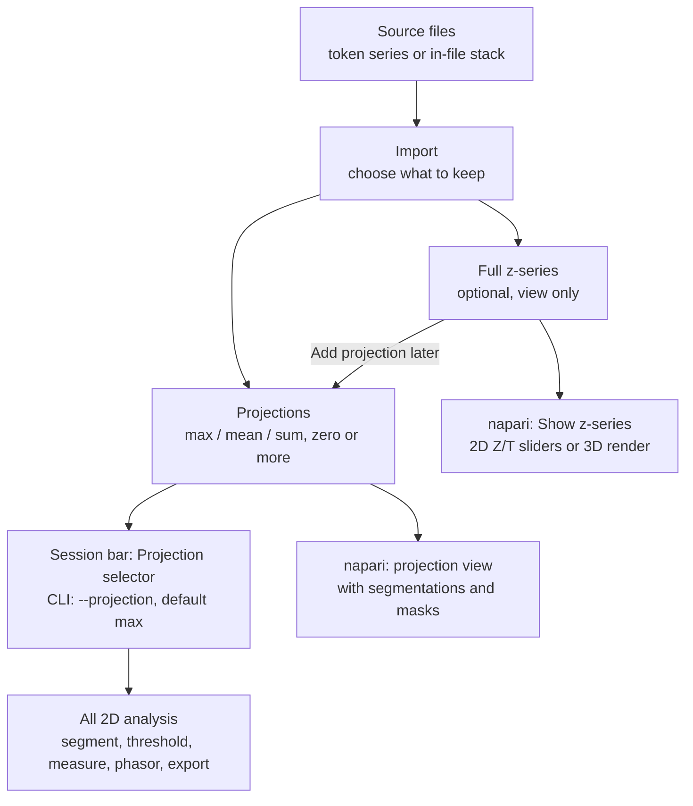
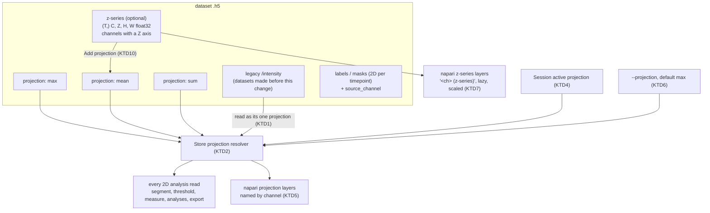
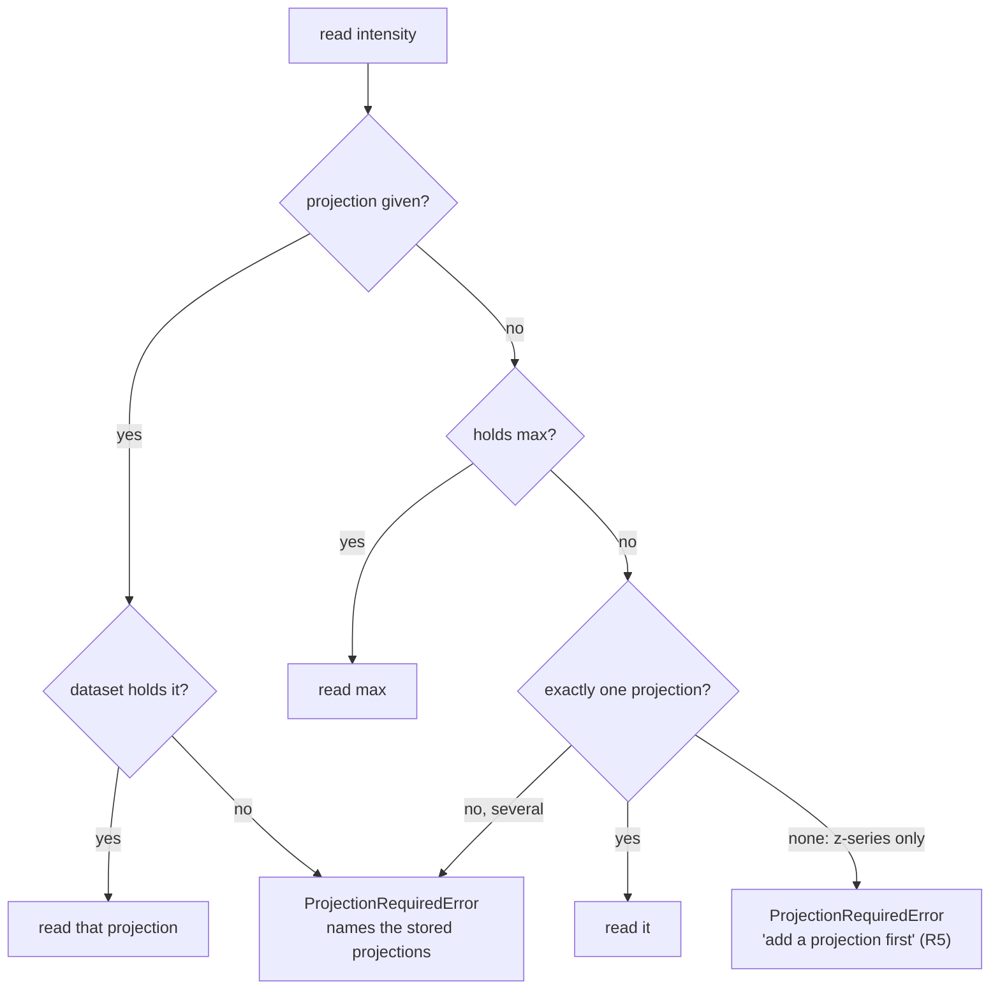
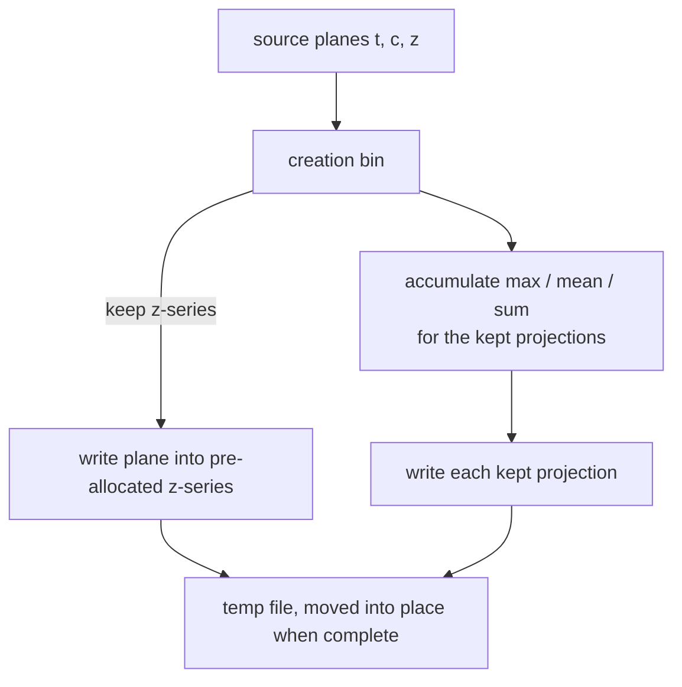
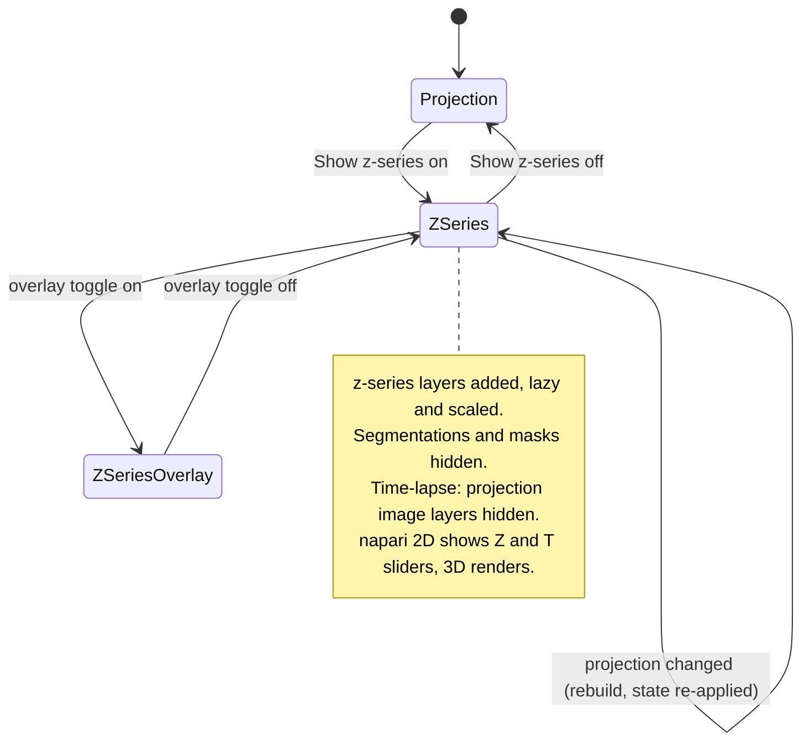

# Z-Stack Storage and 3D Viewing - Plan

## Goal Capsule

**Objective.** Let a PerCell dataset keep its full z-series and several Z projections, and let users view the z-series in napari as Z/T slices or a rotatable 3D render. All analysis stays 2D and runs on a projection the user picks in the Session bar.

**Authority.** The Product Contract governs behavior. Its Key Decisions were made by the user and are fixed. The Key Technical Decisions govern mechanism within them. The z-series is for viewing only; 3D analysis is outside this plan.

**Execution profile.** Deep, cross-cutting feature work.
- U1 changes the store's layout contract and is written test-first; every later unit depends on it.
- U2 and U3 extend the two importers. U4 exposes the storage choice in the dialog, the workflow and `percell-import`.
- U5 and U6 route the projection choice through the Session bar and the headless commands. U7 adds provenance.
- U8 adds z-series viewing. U9 adds projections later. U10 covers inspection and docs.

**Stop conditions.** Stop and ask before continuing if any of these occur:
- An existing dataset (legacy `/intensity`) reads or analyses differently after U1 or U5.
- A max-only import reads or analyses differently from the same import before this change (same pixels through every tool). New imports all use the named-projection layout (KTD1); old files keep theirs.
- Any step would read a whole z-series into memory to answer a shape or metadata question.
- A GUI analysis tool reads a z-series layer as its input.
- Real-data checks would need more than the single local IDR0089 test file, or any download.

**Tail ownership.** All work lands as commits on `development` only. Nothing merges or is cherry-picked to `main`. Pushing is out of scope unless the user asks.

**Open blockers.** None.

---

## Product Contract

### Summary

Import lets the user keep the full z-series, one or more projections (max, mean, sum), or all of them, inside the `.h5`. In napari, a Show z-series control loads the stored stack, and napari's own 2D/3D toggle gives Z/T sliders or a rotatable render at the true z-spacing. Every analysis tool works on the projection chosen in a new Projection selector in the Session bar. A dataset that kept its z-series can gain more projections later without re-importing.

### Problem Frame

PerCell stores only 2D data. Every import collapses Z into one projection chosen at import (max, mean or sum), and the z-series is discarded. The `.h5` layout has no Z axis: `/intensity` is `(H, W)`, `(C, H, W)`, `(T, H, W)` or `(T, C, H, W)`, and the viewer builds its layers from that.

Two things follow. A user cannot look through the stack inside PerCell to judge the data, check focus, or see where a projection's signal comes from. And a projection choice made at import is final: comparing max against mean means importing again.

The in-file import plan (`docs/plans/2026-09-18-001-feat-infile-multidim-import-plan.md`) fixed Z as always projected and deferred a Z axis in the store to its own plan. This is that plan.

### Key Decisions

- **The full z-series is stored inside the `.h5`, as float32.** It travels with the dataset and matches the existing intensity data type. Governs R3. (session-settled: user-directed — chosen over storing the original bit depth, over making the z-series optional per import only, and over linking to the source file: the dataset stays self-contained)
- **What to keep is chosen at import: full z-series, one or more projections, or any combination.** Governs R1, R2, R4. (session-settled: user-directed — chosen over always storing the full z-series as float32: large batches that need no 3D viewing stay small)
- **The analysis projection is a session choice, not a dataset property.** A Projection selector in the Session bar drives every GUI tool, the way Pixel Binning does. Governs R8, R9. (session-settled: user-directed — chosen over one projection fixed at import, a picker in each tool, and exposing projections as extra channels)
- **Headless tools take a projection flag that defaults to max; import records no default.** Governs R11. (session-settled: user-directed — chosen over a per-dataset default recorded at import and over "last used")
- **Viewing uses napari's own 2D/3D toggle.** PerCell adds only a Show z-series control. Governs R13, R14. (session-settled: user-directed — chosen over a PerCell view-mode control and over folding view modes into the Projection selector)
- **Segmentations and masks are hidden in the z-series views, with a toggle to show them repeated through Z.** Governs R15. (session-settled: user-directed — chosen over always repeating them on every slice and over hiding them with no toggle)
- **More projections can be added later from a stored z-series.** Governs R6. (session-settled: user-directed — chosen over requiring a re-import for a new projection)
- **Segmentations and masks do not belong to a projection.** Any of them works with any projection. They record the channel they were made from. Governs R10. (session-settled: user-directed — chosen over tying a segmentation to the projection it was made on)
- **A dataset may keep only its z-series.** It is view-only until a projection is added. Governs R5. (session-settled: user-directed — chosen over requiring at least one projection at import)
- **Import pre-selects today's behavior: max projection only.** Keeping the z-series is opt-in because it costs about 1 GB per dataset. Governs R2. (session-settled: user-approved — proposed in the scoping summary and confirmed)

### Requirements

**Import: what a dataset keeps**
- R1. Every import path lets the user choose what to keep: the full z-series, one or more of max, mean and sum projections, or any combination. The paths are the In-file mode, the token modes (including stitched mosaics), single-cell workflow imports, and `percell-import`.
- R2. The choice starts at max projection only. Keeping the z-series is an explicit opt-in, and the import states its approximate size before it runs.
- R3. A kept z-series is the full stack at the dataset's XY grid, so any projection, segmentation or mask lines up with every slice. It keeps the source's time axis and records the z-spacing.
- R4. Source data without a Z axis (single-plane files) imports as today; the storage choice does not appear.
- R5. A dataset that keeps only its z-series opens for viewing. Analysis tools and batch commands refuse it with a message saying to add a projection first.

**Adding projections later**
- R6. When a dataset holds its z-series, the user can add a max, mean or sum projection from it without re-importing, in the GUI and headlessly. A dataset without a z-series cannot, and says why.
- R7. An added projection is at once available in the Projection selector and to every tool, exactly like one kept at import.

**Analysis on projections**
- R8. The Session bar shows a Projection selector next to Channel, Mask, Segmentation and Pixel Binning. It lists the projections the open dataset holds.
- R9. Every GUI analysis and export tool reads intensity from the projection selected in the Session bar. Nothing reads the z-series for analysis.
- R10. Segmentations and masks work with any projection. Each records the channel it was made from.
- R11. Every headless command that reads intensity takes a projection option that defaults to max. A dataset with exactly one projection uses it without the option. When a dataset lacks the requested projection, the command stops for that dataset with a message naming the projections it has.
- R12. Measurement output records which projection produced it.

**Viewing in napari**
- R13. When the open dataset holds a z-series, the viewer offers a Show z-series control that adds it to napari and removes it again.
- R14. In napari's 2D mode the z-series shows one slice at a time with Z and T sliders. In 3D mode it renders as a rotatable volume, scaled by the recorded z-spacing and pixel size.
- R15. Segmentations and masks are hidden when the z-series is shown. A toggle shows them repeated on every Z slice, and as columns through the volume in 3D.
- R16. The projection view is unchanged: a dataset opens as it does today, on the projection selected in the Session bar, with its segmentations and masks.

**Compatibility**
- R17. Datasets created before this change open and analyse exactly as today, as projection-only datasets. They gain a z-series only by re-importing.
- R18. When a dataset opens, the Session bar selects max if the dataset holds it, otherwise the first stored projection.

### Key Flows

- F1. Import with a z-series
  - **Trigger:** The user imports stacks and wants to view them in 3D later.
  - **Steps:** In the import dialog the storage choice starts at max only. The user also ticks the full z-series and mean, and sees the size estimate. Import runs.
  - **Outcome:** Each dataset holds its z-series plus max and mean projections.
  - **Covered by:** R1, R2, R3
- F2. Look through the stack
  - **Trigger:** The user opens a dataset that holds a z-series.
  - **Steps:** The dataset opens on its projection with segmentations and masks. The user turns on Show z-series and moves the Z and T sliders. They switch napari to 3D and rotate the volume. They turn on the overlay toggle to see a segmentation through Z.
  - **Outcome:** The user has inspected the stack without leaving PerCell or changing any analysis input.
  - **Covered by:** R13, R14, R15, R16
- F3. Compare projections in analysis
  - **Trigger:** The user wants to measure the same cells on max and on mean.
  - **Steps:** With max selected in the Session bar, the user segments and measures. They switch the selector to mean and measure again with the same segmentation.
  - **Outcome:** Two measurement outputs, each recording its projection.
  - **Covered by:** R8, R9, R10, R12
- F4. Add a projection later
  - **Trigger:** The dataset kept max and the z-series; the user now wants sum.
  - **Steps:** The user adds a sum projection from the stored z-series.
  - **Outcome:** Sum appears in the Projection selector.
  - **Covered by:** R6, R7

### Acceptance Examples

- AE1. Covers R5, R6.
  - **Given:** a dataset imported with only its z-series.
  - **When:** the user starts segmentation.
  - **Then:** the tool refuses and says to add a projection first. After adding max, segmentation runs on it.
- AE2. Covers R6.
  - **Given:** a dataset imported with max only and no z-series.
  - **When:** the user tries to add a mean projection.
  - **Then:** the action is unavailable and says the z-series was not kept.
- AE3. Covers R11.
  - **Given:** a dataset holding only mean and sum.
  - **When:** a batch command runs without a projection option.
  - **Then:** it stops for that dataset, names mean and sum, and asks for the option. With `--projection mean` it runs.
- AE4. Covers R10, R12.
  - **Given:** a segmentation made from ch0 while max was selected.
  - **When:** the user selects mean and measures.
  - **Then:** the measurement uses the same segmentation on the mean projection and records mean. The segmentation still records ch0.
- AE5. Covers R15.
  - **Given:** a dataset with a z-series, a segmentation and a mask.
  - **When:** the user turns on Show z-series.
  - **Then:** the segmentation and mask are hidden. With the overlay toggle on, they appear on every slice.
- AE6. Covers R17, R18.
  - **Given:** a dataset imported before this change.
  - **When:** it opens.
  - **Then:** it shows as today. The Projection selector lists its one projection and Show z-series is not offered.
- AE7. Covers R4.
  - **Given:** a folder of single-plane TIFFs.
  - **When:** the user imports it.
  - **Then:** the Keep choice does not appear, and the dataset holds one projection with the same pixels as today.

### Scope Boundaries

- 3D analysis is out of scope: no segmentation, thresholding, measurement or phasor analysis on the z-series, and no 3D segmentations or masks.
- Exporting the z-series (for example as a TIFF stack) is deferred.
- FLIM decay data does not gain a Z axis.
- Z-range selection for projections (projecting only some slices) is deferred.
- Converting existing datasets to hold a z-series without re-importing is out of scope (R17).

#### Deferred to Follow-Up Work

- Keeping measurements for several projections inside one `.h5` (today's in-file measurement table holds the latest run; exported CSVs keep each run).
- Multiscale pyramids for very large z-series in 3D.
- napari's experimental asynchronous slicing.
- Removing the unused `gui/import_dialog.py` and `interfaces/gui/app.py`.

### Dependencies / Assumptions

- A kept z-series costs roughly 1.2 GB per dataset for a 97 z × 3 channel × 1024 × 1024 stack in float32, against about 12 MB for one projection. Blosc compression measured about 3.4× on real data, so about 360 MB on disk. The size estimate in R2 exists because of this.
- napari reads the z-series lazily, one plane per slider step. In 3D mode napari loads the whole volume of each visible channel for the shown timepoint (about 400 MB per channel in the example), which fits GPU 3D-texture limits on current hardware.

### Outstanding Questions

**Deferred to Implementation**
- Exact contrast limits for z-series layers: taken from each channel's stored projection, or from a small sample of planes.
- Whether per-plane stitching for token-mode z-series reuses the registered offsets from the first timepoint for every plane, or needs its own check on real mosaics.
- The display dtype for 3D rendering (float32 as stored, or float16 for memory), decided after measuring on the single IDR0089 test file.

### Product Contract preservation

Changed: R11 — adds "a dataset with exactly one projection uses it without the option", confirmed by the user in the planning summary, so legacy datasets keep running as today (R17). AE7 added to cover R4 (no new behavior). Sources corrected for the viewer entry point. Otherwise unchanged.

### Sources / Research

- Store layout and dims checks: `src/percell4/store.py` (`_infer_bin_metadata`, `DimsConsistencyError`, `LayerSizeMismatchError`) and `src/percell4/domain/io/layout.py` (`split_intensity_layers`, `intensity_channel_count`).
- Where Z is projected today: `src/percell4/adapters/importer.py` (`_assemble_plane`, `import_infile_dataset`), `src/percell4/domain/io/assembler.py` (`project_z`), `src/percell4/ports/image_reader.py` (`read_projected`).
- Viewer: the GUI fills napari in `src/percell4/interfaces/gui/main_window.py` (`_load_h5_into_viewer`, `_populate_viewer_from_store`, `_populate_parallel`, `_populate_serial`); `src/percell4/adapters/napari_viewer.py` (`show_dataset`) serves only the headless pipeline. `src/percell4/gui/viewer.py` (`add_image`) sets no `scale` today.
- Session bar and session state: `src/percell4/interfaces/gui/peer_views/session_window.py` and `src/percell4/application/session.py` (`active_bin`, the pattern for a session-wide choice).
- Prior plan that deferred this work: `docs/plans/2026-09-18-001-feat-infile-multidim-import-plan.md`.

---

## Planning Contract

### Key Technical Decisions

- KTD1. **Projections are named arrays; `/intensity` becomes a legacy alias.**
  - Every new import, including the default max-only import, stores each kept projection as its own array, one per name (`max`, `mean`, `sum`), and the optional z-series as a separate array. Only files written before this change carry `/intensity`. (session-settled: user-approved — chosen over keeping max-only imports in today's single-array format: one format for new data, and new data records its projection)
  - A dataset written before this change keeps its single `/intensity`. The store reads it as one projection, named from its recorded `z_projection` (`mip` → `max`), or `projection` when none is recorded.
  - Product names are `max`, `mean`, `sum`. The internal method names `mip`, `mean`, `sum` map to them in one domain helper.
  - Chosen over keeping `/intensity` as max with extras stored beside it: a dataset kept without max would then have no `/intensity`, and two projection homes would need two read rules. (session-settled: user-approved — confirmed in the planning summary over the "/intensity stays max" alternative)
- KTD2. **One store-level projection resolver is the seam every read goes through.**
  - A store opened with a projection answers every read of the intensity path from that projection. Shape, dtype, existence, frame and channel reads all resolve the same way.
  - Opened without one, it uses the preferred projection (`max`, one shared constant) if present, else the sole projection. Several projections and no max raise a typed `ProjectionRequiredError` naming what the dataset holds (R11).
  - Existence checks return False when the dataset holds no projection; only data, shape and dtype reads raise. A z-series-only dataset therefore opens for viewing (R5).
  - The store also reports the HDF5 path its active projection lives at, so readers that bypass it (the parallel viewer decoder, batch image export, FLIM-FRET discovery) read the same array.
  - Callers pass the projection once, where they open the store or repository, never per read. Long-lived stores are replaced, not reused, when the projection changes (KTD4). This avoids the failure recorded for Pixel Binning, where a per-call option was accepted by use cases but never passed by GUI callers (`docs/solutions/integration-issues/phasor-view-bin-not-forwarded-from-gui-callers-2026-05-18.md`).
- KTD3. **The z-series is one array of shape (T, C, Z, H, W) or (C, Z, H, W), float32, chunked one plane per chunk row.**
  - It shares the dataset's XY grid and creation bin (R3), with explicit dims.
  - It holds only channels that had a Z axis. Channels without one (FLIM lifetime, channels added from a TIFF, `.bin` intensity) are written into every projection as the same image and are absent from the z-series. Metadata lists the z-series channels. (session-settled: user-approved — confirmed in the planning summary)
  - It is written plane by plane into a pre-allocated array, never assembled in memory. Projections accumulate from the same plane stream, in one pass (sum and mean in float64).
- KTD4. **The Session owns the active projection, mirroring `active_bin`.**
  - The Session gains an active projection with its own change event and a projection-list event. On dataset change it picks max, else the first stored projection (R18).
  - A projection change first replaces the launcher's current store and clears the repository's cached stores for that dataset, then rebuilds the viewer the way a Pixel Binning change does, then re-applies the z-series view state.
  - Every GUI surface that opens a store or repository takes the projection from the Session.
- KTD5. **GUI tools keep reading projection layers by channel name; z-series layers never use a bare channel name.** Several tools find their input as the napari Image layer named after the active channel. The projection view keeps those names. z-series layers are named `<channel> (z-series)`, so no tool can pick one up.
- KTD6. **Headless commands share one projection option.** One argparse helper adds `--projection {max,mean,sum}`. Its default is "not given", so the resolver applies R11: max if present, else the sole projection, else a per-dataset error. The user-visible default stays max through the shared preferred-projection constant, which the Session also uses; a parity test pins it. A single-cell workflow run records its projection in its config and `run_config.json`; a config without one means "not given". The workflow dialog offers only projections the run's own import keeps, seeds from the Session when that projection is among them, and blocks Start when the import keeps only the z-series. (session-settled: user-approved — the workflow rule was confirmed in the planning summary)
- KTD7. **The viewer reads the z-series lazily.**
  - Each channel's z-series is a lazy array whose plane read opens the file read-only, slices one plane, and closes it. No file handle stays open between reads, because an open read handle blocks every store write in the same process.
  - At Pixel Binning k > 1 each plane is sum-binned as it is read, so the z-series matches the other layers; a bin change rebuilds it.
  - It is added with a relative scale (z-spacing ÷ pixel size, 1, 1), or (1, 1, 1) when either is unknown, so XY stays in the pixel units every other layer uses and 3D keeps true proportions.
  - Contrast limits are explicit, so napari never scans the data: from the max projection when stored, otherwise from a few sampled planes (first, middle, last Z).
  - When the z-series is shown on a time-lapse dataset, the projection image layers are hidden, because napari aligns layers by trailing axes and would otherwise put T on the Z slider.
  - The overlay toggle (R15) shows segmentations and masks as read-only views broadcast through Z with the same relative scale, at no memory cost. It is greyed out, with a tooltip, when the dataset has no segmentation or mask.
  - `dask` becomes a declared dependency and a PyInstaller hidden import.
- KTD8. **z-spacing comes from the file, then from the user.**
  - In-file import takes it from the probe.
  - Token import reads the ImageJ `spacing` of the first z-plane file, otherwise an optional *Z step (µm)* field in the dialog and `--z-step` on the command line.
  - When unknown, 3D renders with cube voxels (Z scaled like XY) and inspect reports the spacing as unknown. (session-settled: user-approved — confirmed in the planning summary)
- KTD9. **Provenance lives on the layer and in the outputs.**
  - Segmentations and masks gain a `source_channel` attribute at every write site (R10).
  - Measurement outputs gain a `projection` column only when the dataset stores named projections. Datasets with a legacy `/intensity` keep today's columns, so R17 holds.
  - The in-file measurement table keeps the latest run. Exported CSVs keep each run (see Deferred to Follow-Up Work).
- KTD10. **Adding a projection later is a creator action.**
  - It streams the stored z-series plane by plane into a temporary array inside the file, then renames it to its final name; cancel or failure deletes the temporary array.
  - It follows the store → viewer → refresh lists → (no focus change) sequence in `docs/solutions/architecture-patterns/creator-contract-four-step-sequence-2026-05-18.md`. Like adding a channel, it does not change the active projection.

### High-Level Technical Design

Dataset contents after this change:

Resolving which projection a read uses:

Import data flow, one pass per source (KTD3):

Viewer state when the user shows the z-series:

### System-Wide Impact

- **Every intensity reader** changes where it opens a store or repository, not per read (KTD2). That covers:
  - 66 store constructions in `src`, most of them in the single-cell workflow runner.
  - The repository.
  - The analysis loader.
  - Five places that read the file directly: batch image export, FLIM-FRET discovery, and three store internals.
- **Channel add, rename and delete** must cover every projection and the z-series:
  - Data panel delete.
  - Add-layer channel writes.
  - The lifetime-as-channel write.
  - The batch delete command.
- **Headless commands** gaining `--projection`:
  - `percell-batch-cellpose-laptrack`
  - `percell-batch-export`
  - `percell-batch-measure`
  - `percell-batch-threshold`
  - `percell-batch-validate-puncta`
  - `percell-window-bakeoff`
  - the pipeline runner

  Phasor commands are unaffected: they read decay data, not intensity.
- **Storage choice:** `percell-import` and the workflow compress plan gain storage-choice keys. Plans saved before this change replay exactly as before.
- **New dependency:** `dask`, declared and bundled.

### Risks

| Risk | Mitigation |
|---|---|
| A GUI consumer keeps reading the old projection after a switch (the Pixel Binning failure) | One resolver seam (KTD2); an end-to-end test per consumer family in U5 |
| A tool reads a z-series layer as time frames | Distinct z-series layer names (KTD5); a test that every tool's layer lookup ignores them |
| A z-series import exhausts memory | Plane-by-plane writing and accumulation (KTD3); memory measured on the single IDR0089 test file |
| Opening a dataset decodes the z-series | Shape and existence checks read HDF5 metadata only; the z-series loads only when Show z-series is on |
| Z/T slider steps block the UI | One plane per chunk row; napari slicing stays synchronous (async slicing deferred) |
| Showing the z-series blocks saves | Plane reads open and close the file each time (KTD7); a test saves a mask and adds a projection while the z-series is shown |
| Size arithmetic overflows on Windows | `math.prod` / Python ints for every byte count (`docs/solutions/logic-errors/numpy-prod-int32-overflow-windows-2026-06-07.md`) |
| Legacy datasets change behavior | Legacy `/intensity` alias (KTD1); a regression test that an old dataset opens, analyses and measures exactly as before |

---

## Implementation Units

| U-ID | Title | Main files | Depends on |
|---|---|---|---|
| U1 | Store: projections, z-series and resolver | `store.py`, `domain/io/projections.py`, `domain/errors.py` | — |
| U2 | In-file import keeps z-series and several projections | `adapters/importer.py`, `ports/image_reader.py`, `adapters/bioformats_*.py`, `domain/io/infile.py` | U1 |
| U3 | Token import keeps z-series and several projections | `adapters/importer.py`, `adapters/readers.py` | U1 |
| U4 | Storage choice in the dialog, workflow and `percell-import` | `gui/compress_dialog.py`, `interfaces/gui/main_window.py`, `workflows/phases.py`, `interfaces/cli/import_data.py` | U2, U3 |
| U5 | Session Projection selector and GUI routing | `application/session.py`, `model.py`, `peer_views/session_window.py`, `main_window.py`, `adapters/hdf5_store.py` | U1 |
| U6 | `--projection` for headless commands and workflow runs | `interfaces/cli/*.py`, `workflows/models.py`, `workflows/artifacts.py` | U1, U5 |
| U7 | Provenance: source channel and measurement projection | write sites, `measure_cells.py`, `workflows/phases.py` | U1, U5 |
| U8 | z-series viewing in napari | `gui/viewer.py`, `main_window.py`, `task_panels/viewer_panel.py` | U1, U5 |
| U9 | Add a projection later | `application/use_cases/add_projection.py`, data panel, new CLI | U1, U5 |
| U10 | Inspect, docs and packaging | `inspect_dataset.py`, `docs/`, `pyproject.toml`, `percell4.spec` | U1–U9 |

### U1. Store: projections, z-series and resolver

**Goal:** The store can hold named projections and a z-series, read legacy `/intensity` as a projection, and resolve every intensity read through one projection choice.

**Requirements:** R3, R5, R11, R17, R18. Implements KTD1, KTD2, KTD3.

**Dependencies:** none.

**Files:**
- `src/percell4/store.py`
- `src/percell4/domain/io/projections.py` (new: names, `mip`↔`max` mapping, the resolution rule as a pure function, size estimate)
- `src/percell4/domain/errors.py` (`ProjectionRequiredError`)
- `src/percell4/adapters/hdf5_store.py` (repository opens stores with a projection; handle metadata lists projection names)
- `tests/test_store_projections.py` (new)
- `tests/test_io/test_projections.py` (new)
- `tests/test_store.py`

**Approach:**
1. Put the resolution rule (the resolver flowchart) and the name mapping in a pure domain module.
2. Give the store an optional projection at construction. Every read of the intensity path resolves through it: array, frame, channel, shape, dtype, existence and time-stacked checks.
3. Add writers for a named projection and for a pre-allocated z-series written plane by plane, plus listing helpers (projection names, z-series presence, z-series shape and channels) that read HDF5 metadata only.
4. Extend native-shape and timepoint inference, the dims-consistency check and view-bin dispatch to projections and the z-series. A z-series-only dataset infers its XY grid and timepoints from the z-series.
5. Extend the channel-rewrite helpers so a channel append or delete covers every projection and, when present, the z-series.
6. Add the resolved-path accessor (KTD2) and make existence checks return False when no projection is stored.

**Execution note:** Write the resolver and legacy-alias tests first. Add characterization tests that pin today's reads of a legacy dataset before changing any read path.

**Patterns to follow:** `active_bin`/view-bin handling in `store.py` (`_apply_view_bin`); `write_decay_streaming` in `adapters/importer.py` for pre-allocated plane writes; the `z_spacing_um` normalization in `DatasetStore.metadata`.

**Test scenarios:**
- A legacy dataset with `/intensity` and `z_projection = "mip"` lists one projection named `max`, and reads return exactly today's arrays.
- A legacy dataset with no `z_projection` lists one projection named `projection`.
- A dataset with max and mean: no projection given reads max; `mean` reads mean; `sum` raises `ProjectionRequiredError` naming max and mean.
- A dataset with only mean and sum and no projection given raises, naming both (AE3).
- A dataset with only mean reads mean when no projection is given.
- A z-series-only dataset raises "add a projection first" on any intensity data read, reports `False` for intensity existence, and still reports its XY grid and timepoints (AE1).
- The resolved-path accessor returns the named projection's path for a new dataset and `/intensity` for a legacy one.
- Shape and existence of the z-series come from HDF5 metadata; a spy shows no pixel read.
- A z-series written plane by plane reads back plane-exact, with dims attrs, including a time-lapse (T, C, Z, H, W).
- View bin 2 applies to a named projection exactly as it does to legacy `/intensity`.
- Appending a channel adds it to every projection and not to the z-series. Deleting a channel removes it from every projection and from the z-series.
- A z-series whose XY differs from the projections raises the layer-size error.
- The size estimate for T=36, C=3, Z=97, 1024×1024 is computed with Python integers and matches the exact byte count.

**Verification:** Every existing store test passes unchanged. The new tests pass. A legacy fixture reads byte-identical to before.

### U2. In-file import keeps z-series and several projections

**Goal:** An in-file import can keep the full z-series and any set of projections, in one read of the file.

**Requirements:** R1, R2, R3, R5. Implements KTD3.

**Dependencies:** U1.

**Files:**
- `src/percell4/ports/image_reader.py` (a plane-streaming read beside `read_projected`)
- `src/percell4/adapters/bioformats_host.py`, `src/percell4/adapters/bioformats_reader.py`
- `src/percell4/adapters/importer.py` (`import_infile_dataset`)
- `src/percell4/domain/io/infile.py`, `src/percell4/domain/io/scheme_json.py` (storage choice on the scheme, optional keys, no version bump)
- `tests/fakes/fake_image_reader.py`, `tests/fakes/fake_bioformats_host.py`
- `tests/test_io/test_importer_infile.py`, `tests/test_adapters/test_bioformats_reader.py`, `tests/test_io/test_scheme_json.py`

**Approach:**
1. Add a streaming read that yields raw planes after the axis map, ordered t, then c, then z (z innermost), whatever the file's dimension order, with the same callbacks and cancel as `read_projected`. The host gains the matching operation; planes cross the pipe one at a time. Z-innermost order keeps the accumulators at one (H, W) plane per kept projection.
2. The importer writes each plane into the z-series (when kept) and updates the kept projections' accumulators, then writes the projections. Output stays atomic through the existing temp-file path.
3. The scheme carries the storage choice (projection names and whether to keep the z-series). An old scheme file without these keys means one projection from its `z_method`, exactly as today.

**Patterns to follow:** `project_planes` accumulation and the `read_projected` callback shape; `_write_atomically`.

**Test scenarios:**
- (fake) Keeping z-series + max + mean writes a z-series equal to the source stack, and max and mean equal numpy's reductions.
- (fake) z-series only writes no projection and records the dataset as z-series-only.
- (fake) A time-lapse source keeps (T, C, Z, H, W) with `n_timepoints` set.
- (fake) The source is read once for any combination (one streaming call; no `read_projected` calls).
- (fake) Cancel mid-stream leaves no output and no temp file.
- (fake) An old scheme without storage keys imports one projection from its `z_method`, with the same pixels as today.
- (fake) A source whose file dimension order is Z-outer still yields z-innermost planes, and accumulator memory stays at one plane per kept projection.
- (fake) Sum over 40 uint16 planes of 60000 accumulates without overflow.
- (JVM) A `.fake` file's streamed planes match `read_plane` for every (t, c, z).
- (JVM, real data, skip when missing) The single IDR0089 test file imports with z-series + max: the z-series is (3, 97, 1024, 1024); max equals today's import; peak memory stays near one plane set, not the whole stack. Record time and peak memory.

**Verification:** In-file tests pass; the real-file check passes and its numbers are recorded.

### U3. Token import keeps z-series and several projections

**Goal:** Token-mode imports, including stitched mosaics, can keep the z-series and several projections.

**Requirements:** R1, R3, R4. Implements KTD3, KTD8.

**Dependencies:** U1.

**Files:**
- `src/percell4/adapters/importer.py` (`import_dataset`, `_assemble_plane`, `_project_tiles_over_z`)
- `src/percell4/adapters/readers.py` (ImageJ `spacing` from the first z-plane file)
- `src/percell4/domain/io/assembler.py` (z-token ordering by number, like timepoints)
- `tests/test_io/test_importer_zseries.py` (new), `tests/test_io/test_importer.py`

**Approach:**
1. When the choice is one projection and no z-series, assemble exactly as today and write it as that named projection.
2. Otherwise group each channel's files by tile and z, order z numerically, stitch every z-plane with the same grid as the projection, stream planes into the z-series, and accumulate the kept projections.
   Registered (overlap-aligned) mosaics take two passes: pass one projects tiles and solves offsets as today; pass two re-reads each tile's z-planes and stitches them at the solved offsets into the z-series.
3. Record z-spacing from the first file's ImageJ metadata, else the user value (KTD8).
4. Channels from `.bin` files join every projection as their decay-sum image and stay out of the z-series (KTD3).

**Execution note:** Pin today's token-import pixels and metadata with a characterization test before touching `_assemble_plane`.

**Patterns to follow:** `ordered_timepoint_tokens` for numeric ordering; `_stitch_tile_arrays` and the tile sink for registered offsets.

**Test scenarios:**
- Single projection, no z-series: the stored projection's pixels and metadata equal the characterization baseline, read through the store.
- A registered 2×2 mosaic with z keeps a z-series whose max equals the registered, stitched max.
- Two channels × five z-planes with z-series + max + mean: z-series (2, 5, H, W), projections match numpy.
- z tokens `z1, z2, z10` order numerically, not lexically.
- A 2×2 mosaic with z keeps a stitched z-series whose every plane matches stitching that plane alone; max of the stitched z-series equals the stitched max.
- A time-lapse with z keeps (T, C, Z, H, W).
- An ImageJ file with `spacing=0.5` records `z_spacing_um = 0.5`; with no spacing, the user value is used; with neither, none is recorded.
- A `.bin` channel is present in every projection and absent from the z-series channel list.
- A single-plane token folder shows no storage choice and imports as today (R4).

**Verification:** Token-import tests pass, including the byte-identical baseline.

### U4. Storage choice in the dialog, workflow and `percell-import`

**Goal:** Every import surface offers the storage choice, starting at max only, with a size estimate.

**Requirements:** R1, R2, R4. Implements KTD8.

**Dependencies:** U2, U3.

**Files:**
- `src/percell4/gui/compress_dialog.py` (Keep: Max / Mean / Sum / Full z-series checkboxes, size estimate, *Z step (µm)* field)
- `src/percell4/interfaces/gui/main_window.py` (`_run_batch_compress`, `_run_infile_import`)
- `src/percell4/domain/io/models.py` (`CompressConfig` storage fields)
- `src/percell4/gui/workflows/single_cell/config_dialog.py`, `src/percell4/workflows/phases.py` (compress plan keys; replay)
- `src/percell4/interfaces/cli/import_data.py` (`--keep`, `--z-step`), `docs/cli.md`
- `tests/test_gui/test_compress_dialog_storage.py` (new), `tests/test_cli_import.py`, `tests/test_gui_workflows/test_compress_plan_field_parity.py`, `tests/test_workflows/test_phases_compress_field_parity.py`

**Approach:**
1. Replace the dialog's z-projection combo with the Keep checkboxes (max checked by default). Hide them when the selection has no Z (R4).
2. Compute the size estimate from the scan (in-file probe sizes; token z-count × channels × timepoints × H × W) with the U1 helper, and show it next to the choice.
3. The *Z step (µm)* field shows only in token modes. When the first z-plane file carries ImageJ spacing, the field shows it read-only as auto-detected, like the existing header-bytes field; otherwise it is editable.
4. The In-file review table lists every kept choice per file in place of the single z method.
5. Carry the storage choice through `CompressConfig`, both main-window import loops, the workflow compress plan and replay, and `percell-import`. Plans and scheme files without the new keys replay as one projection from their old z method.
6. Extend the field-parity tests to the new fields on every surface.

**Test scenarios:**
- The dialog opens with only Max checked; unchecking every box disables Import.
- Checking Full z-series shows an estimate that grows when Mean is added only by one projection's size, not the stack's.
- Covers AE7: a single-plane selection hides the Keep choice and imports as today.
- The Z step field is hidden in In-file mode, read-only with the detected value when a token file has ImageJ spacing, and editable otherwise.
- The In-file review table shows "max, mean, z-series" for a file when those are kept.
- `percell-import --keep max,mean,zseries` imports all three; `--keep zseries` alone makes a view-only dataset.
- A workflow plan saved before this change replays with one projection from its `z_method`.
- Parity: each storage field reaches every import path (dialog, both main-window loops, workflow replay, CLI).
- `docs/cli.md` documents `--keep` and `--z-step` (the docs test passes).

**Verification:** Import-surface tests and the docs test pass.

### U5. Session Projection selector and GUI routing

**Goal:** A Projection selector in the Session bar decides what every GUI tool reads and what the viewer shows.

**Requirements:** R8, R9, R16, R18. Implements KTD2, KTD4, KTD5.

**Dependencies:** U1.

**Files:**
- `src/percell4/application/session.py` (active projection, events, pick on dataset change)
- `src/percell4/model.py` (state flag)
- `src/percell4/interfaces/gui/peer_views/session_window.py` (Projection combo)
- `src/percell4/interfaces/gui/main_window.py` (open `_current_store` with the projection; rebuild on change)
- `src/percell4/adapters/hdf5_store.py` (store cache keyed by path and projection); `src/percell4/adapters/parallel_decode.py` callers in `main_window.py`; `src/percell4/application/analysis/loader.py`, `run_analysis.py`, `run_analysis_batch.py`; `gui/whole_field_intensity_dialog.py` and the per-particle donut and multichannel dialogs; `application/use_cases/run_flim_fret.py`; the single-cell GUI queues and `gui/workflows/single_cell/runner.py` store constructions; `gui/add_layer_dialog.py`; `interfaces/gui/task_panels/data_panel.py`; `gui/export_images_dialog.py`
- `tests/test_session.py`, `tests/test_gui_workflows/test_session_window.py`, `tests/test_gui_workflows/test_launcher_projection_rebuild.py` (new), `tests/test_gui/test_projection_consumers.py` (new)

**Approach:**
1. Add the active projection to the Session with change and list events, reset and auto-pick on dataset change (R18), exactly as `active_bin` is handled.
2. Add the combo to the Session bar next to Pixel Binning, populated from the handle's projection names.
3. Open every GUI store and repository with the Session's projection. On a change, replace `_current_store`, clear the repository's cached stores for the dataset, then rebuild the viewer like a bin change (KTD4).
4. The native-bin parallel viewer load reads the resolved projection path (KTD2), not the literal `intensity`.
5. Thread the projection through the analysis dialogs to `load_layers`, and into FLIM-FRET's lifetime reads. A dataset missing the chosen projection fails for that dataset with the R11 message; the others run.
6. The Session bar gains a fifth selector; widen its default width so every control fits without resizing.
7. Viewer projection layers keep the plain channel names (KTD5).

**Execution note:** Start with a failing end-to-end test: switch the selector, then read through each consumer family and see the new projection.

**Patterns to follow:** `set_active_bin` and `ACTIVE_BIN_CHANGED`; `_rebuild_viewer_for_bin_change`; the Pixel Binning spinbox in the session window.

**Test scenarios:**
- Opening a dataset with mean and sum selects mean (first stored); with max, selects max; a legacy dataset lists its one projection.
- Switching to mean emits one change event and rebuilds the viewer once.
- After switching, each consumer family reads mean:
  - the Cellpose input layer
  - grouped thresholding
  - measurement
  - the analysis loader
  - image export
  - the single-cell queues
  - add-layer
  - the data panel's shape display
- Switching projection never changes the active channel, mask or segmentation.
- After a switch, a panel's `get_store()` and a repository read both return the new projection's data.
- At native bin, the parallel load shows the selected projection for a dataset that has no `/intensity`.
- The whole-field and per-particle analysis dialogs run on the selected projection; a multi-dataset run where one dataset lacks it fails only that dataset.
- The session window closed and reopened still follows projection changes.
- A z-series-only dataset shows an empty selector, and analysis tools say to add a projection first (AE1).

**Verification:** Session, session-window and consumer tests pass; switching projection in the running app changes Cellpose input on a two-projection fixture.

### U6. `--projection` for headless commands and workflow runs

**Goal:** Every headless command that reads intensity takes `--projection`, with default max and R11's rules; workflow runs record the projection.

**Requirements:** R11. Implements KTD6.

**Dependencies:** U1, U5.

**Files:**
- `src/percell4/interfaces/cli/_projection_option.py` (new shared helper)
- `src/percell4/interfaces/cli/{batch_process,batch_export,batch_measure,batch_threshold,batch_validate_puncta,window_bakeoff,run_pipeline}.py` and their use cases (`batch_process_datasets.py`, `batch_export_images.py`, `workflows/phases.py` callers)
- `src/percell4/workflows/models.py` (`WorkflowConfig.projection`), `src/percell4/workflows/artifacts.py`, `src/percell4/gui/workflows/single_cell/config_dialog.py`
- `docs/cli.md`
- `tests/test_cli_projection_option.py` (new), the matching `tests/test_cli_*.py`, `tests/test_workflows/test_artifacts.py`

**Approach:**
1. One helper adds the option, with "not given" as its default, and turns a `ProjectionRequiredError` into a per-dataset failure with its message.
2. Each command opens its stores with the chosen projection.
3. The workflow config dialog offers only the projections the run's import keeps (and every projection existing datasets hold), seeds from the Session when possible, and blocks Start when the import keeps only the z-series. `WorkflowConfig` carries the choice; `run_config.json` records it; a config without it means "not given".

**Test scenarios:**
- Covers AE3: a mean+sum dataset without `--projection` fails for that dataset, naming mean and sum; with `--projection mean` it succeeds; other datasets in the batch still run.
- A legacy single-projection dataset runs without the option, exactly as today, including one recorded as mean (named `mean`) and one with no recorded method (named `projection`).
- Parity: the CLI and the Session share the preferred-projection constant, and both resolve through the store resolver.
- A workflow run started with mean records `mean` in `run_config.json`; a `run_config.json` without the key loads as "not given".
- A workflow whose import keeps mean only offers only mean, even when the Session is on max; an import keeping only the z-series blocks Start with a message.
- Every affected command lists `--projection` in `docs/cli.md`.

**Verification:** CLI, workflow-artifact and docs tests pass.

### U7. Provenance: source channel and measurement projection

**Goal:** Segmentations and masks record their source channel; measurements record their projection.

**Requirements:** R10, R12. Implements KTD9.

**Dependencies:** U1, U5.

**Files:**
- Label and mask write sites: `workflows/phases.py`, `gui/segmentation_panel.py`, `gui/add_layer_dialog.py`, `gui/workflows/single_cell/seg_qc.py`, `application/use_cases/segment_cells.py`, `track_cells.py`, `run_analysis_batch.py`, `batch_create_whole_field_segmentation.py`, `adapters/importer.py`
- `src/percell4/store.py` (read helper for the attribute)
- `src/percell4/application/use_cases/measure_cells.py`, `workflows/phases.py` (measurement CSVs), `application/use_cases/run_analysis_batch.py`
- `tests/test_application/test_provenance_source_channel.py` (new), `tests/test_application/test_measure_cells_projection.py` (new)

**Approach:**
1. Stamp `source_channel` wherever a segmentation or mask is written from an intensity channel; leave it absent where no channel applies (imported masks, whole-field).
2. Add a `projection` column to measurement outputs when the dataset stores named projections; keep today's columns for legacy datasets.

**Test scenarios:**
- Covers AE4: a segmentation made from ch0 on max, then measured on mean, measures the mean image and records `mean`; the segmentation still records `ch0`.
- A Cellpose segmentation, a workflow segmentation and a threshold mask each carry `source_channel`.
- A legacy dataset's measurement CSV has exactly today's columns.
- Measuring on max then mean leaves the in-file table with the mean run and two exported CSVs, one per projection.

**Verification:** Provenance and measurement tests pass; a legacy measurement CSV is byte-identical.

### U8. z-series viewing in napari

**Goal:** A Show z-series control adds the stored stack to napari, lazily and to scale, with an overlay toggle for segmentations and masks.

**Requirements:** R13, R14, R15, R16. Implements KTD5, KTD7.

**Dependencies:** U1, U5.

**Files:**
- `src/percell4/interfaces/gui/task_panels/viewer_panel.py` (Show z-series, Show segmentations and masks through Z)
- `src/percell4/interfaces/gui/main_window.py` (add or remove z-series layers; re-apply after a rebuild)
- `src/percell4/gui/viewer.py` (add a lazy, scaled image with explicit contrast limits; broadcast overlays)
- `src/percell4/domain/io/layout.py` (z-series layer naming and scale, pure)
- `pyproject.toml` (`dask`)
- `tests/test_gui/test_zseries_viewer.py` (new), `tests/test_io/test_layout.py`

**Approach:**
1. Offer Show z-series only when the dataset holds a z-series.
2. On: add one image layer per z-series channel named `<ch> (z-series)`, backed by the per-plane open-and-close lazy array (KTD7), sum-binned at the active Pixel Binning, with the relative scale and explicit contrast limits of KTD7.
3. Hide segmentations and masks. On time-lapse data, also hide projection image layers (KTD7). The overlay toggle shows segmentations and masks as read-only views broadcast through Z; it is greyed out with a tooltip when there is nothing to overlay.
4. Off: remove the z-series layers and restore what was hidden. A projection change rebuild re-applies the current state.

**Execution note:** Real-GL rendering is covered only by CI's `tests_gui/`; locally, verify layer construction headlessly and do one manual 3D check on the single IDR0089 test file.

**Patterns to follow:** `_hide_mask_layers` / `_restore_mask_layers` in `gui/viewer.py`; `_rebuild_viewer_for_bin_change`.

**Test scenarios:**
- Show z-series on a (C, Z, H, W) dataset adds C layers named `<ch> (z-series)`, each 3D, with scale (0.125/0.041, 1, 1) for the IDR0089 metadata; z-series and projection layers have equal XY world extents.
- With the z-series shown, saving a mask and adding a projection both succeed.
- At Pixel Binning 2 the z-series planes are (H/2, W/2) and line up with the binned projection layers.
- Contrast comes from the max projection when stored; on a z-series-only dataset it comes from sampled planes, with no whole-stack read.
- With no segmentation or mask, the overlay toggle is greyed out.
- Adding the layers reads no pixel data beyond the contrast source (a spy sees no full read).
- Covers AE5: segmentations and masks are hidden when shown; the overlay toggle shows them with Z planes that all equal the 2D layer; turning Show z-series off restores their prior visibility.
- On a time-lapse dataset, projection image layers are hidden while the z-series is shown, and the T slider moves the z-series.
- The Cellpose input lookup, grouped thresholding and the other channel-name lookups never return a z-series layer.
- A projection change while the z-series is shown ends with the z-series still shown.
- No z-series: the control is absent (AE6).
- Unknown z-spacing or pixel size: scale is (1, 1, 1).

**Verification:** Viewer tests pass headlessly; a manual check on the single IDR0089 test file rotates in 3D with correct proportions.

### U9. Add a projection later

**Goal:** A dataset with a stored z-series gains a max, mean or sum projection without re-importing, in the GUI and headlessly.

**Requirements:** R6, R7. Implements KTD10.

**Dependencies:** U1, U5.

**Files:**
- `src/percell4/application/use_cases/add_projection.py` (new)
- `src/percell4/interfaces/gui/task_panels/data_panel.py` (Add projection action)
- `src/percell4/interfaces/cli/batch_add_projection.py` (new `percell-batch-add-projection`), `pyproject.toml`, `docs/cli.md`
- `tests/test_application/test_add_projection.py` (new), `tests/test_cli_batch_add_projection.py` (new)

**Approach:**
1. Stream the z-series plane by plane into the requested projection (float64 accumulation for mean and sum), written to a temporary array in the file and renamed when complete (KTD10).
2. GUI: the Data panel shows Add max, Add mean and Add sum. Each is greyed out, with a tooltip naming the reason, when that projection already exists or no z-series is stored. On success: store write → refresh the projection list → no change to the active projection.
3. The CLI takes datasets and `--projection`, and reports per dataset.

**Test scenarios:**
- Covers AE1: a z-series-only dataset gains max, then analysis runs on it.
- Covers AE2: a dataset without a z-series refuses, saying the z-series was not kept.
- Adding mean equals numpy's mean over Z of the stored z-series, per channel and timepoint.
- Adding a projection that already exists refuses without changing the file; in the GUI its action is greyed out with "already stored".
- After adding, the Session's projection list includes it and the active projection is unchanged.
- Cancel or failure leaves the dataset unchanged.
- `percell-batch-add-projection` over three datasets reports one success, one "no z-series", one "already exists".

**Verification:** Use-case, GUI and CLI tests pass; the docs test passes.

### U10. Inspect, docs and packaging

**Goal:** `percell-inspect` and the Data tab describe projections and the z-series; docs and packaging cover the feature.

**Requirements:** R8, R13, R17. Implements KTD7.

**Dependencies:** U1–U9.

**Files:**
- `src/percell4/interfaces/cli/inspect_dataset.py`, `src/percell4/interfaces/gui/task_panels/data_panel.py`
- `percell4.spec` (`dask` hidden import), `pyproject.toml`
- `docs/cli.md`, `docs/CHANGELOG.md`, `README.md` (key features)
- `tests/test_cli_inspect_dataset.py`, `tests/test_gui/test_data_panel_pixel_size.py`

**Approach:**
1. Inspect lists the projections and, when present, the z-series shape, channels and z-spacing, in text and JSON, from HDF5 metadata only.
2. The Data tab shows the same summary.
3. Document the storage choice, the Projection selector, `--projection`, Show z-series and Add projection.

**Test scenarios:**
- Inspect on a dataset with max, mean and a z-series lists both projections and `z-series: 3 × 97 × 1024 × 1024, 0.125 µm apart` in text and JSON.
- Inspect on a legacy dataset reports one projection and no z-series.
- Inspect reads no pixel data.

**Verification:** Inspect, data-panel and docs tests pass.

---

## Verification Contract

| Gate | Command | Applies to |
|---|---|---|
| Headless suite | `.venv/bin/pytest` | every unit |
| Lint | `.venv/bin/ruff check src tests tests_gui` | every unit |
| Layering | `.venv/bin/lint-imports`; the domain and ports contracts stay kept | U1, U2, U8 |
| Java-backed reader tests | `.venv/bin/pytest tests/test_adapters/test_bioformats_reader.py` (Java is provisioned on this machine) | U2 |
| Real-data check | The single local IDR0089 test file only (`AC16_Rep2_8d24h_HNRNPC488_NUP594_01_SIR_THR_ALN.tif`); never the folder, never a download | U2, U8 |
| Real-GL viewer suite | `tests_gui/` in CI only; it segfaults on this Mac in unrelated viewer tests | U8 |

---

## Definition of Done

- R1–R18 hold, and AE1–AE6 each have a passing test or a recorded manual check.
- A legacy dataset opens, analyses, measures and exports exactly as before (regression test).
- A max-only import reads and analyses identically to the same import before this change (characterization test through the store).
- Switching the Projection selector changes the input of every consumer family (end-to-end tests).
- The CLI default and the GUI default projection are the same constant (parity test).
- The single IDR0089 test file imports with z-series + max, and its import time and peak memory are recorded; its z-series renders in 3D with correct proportions (manual check).
- The headless suite passes, apart from the dialog-centring test that already fails on this machine.
- `docs/cli.md`, the changelog and the README describe the feature.
- All commits are on `development`; nothing is merged or cherry-picked to `main`.
- Code from abandoned approaches is removed from the diff.
