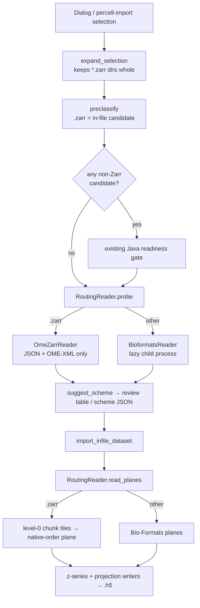

# OME-Zarr In-File Import - Plan

## Goal Capsule

**Objective.** Let the existing in-file import (the New Dataset… dialog and `percell-import`) turn an OME-Zarr store into a normal PerCell `.h5` dataset. A native Python reader serves `.zarr` stores behind the existing `ImageReader` port. No Java is needed for a Zarr-only selection.

**Authority.** The Requirements govern outcomes. The Key Technical Decisions govern mechanism within them. Three decisions were settled with the user and are fixed: integration into the existing import surfaces (no standalone converter), full-resolution level only, and OME-Zarr 0.4 on Zarr v2 only. The in-file import plan's rules still apply: `docs/plans/2026-09-18-001-feat-infile-multidim-import-plan.md` (metadata-only classification, metadata channel names shown but not applied) and `docs/plans/2026-09-18-002-feat-zstack-3d-viewing-plan.md` (z-series and projection storage).

**Execution profile.** Standard feature work across the domain, adapters, GUI, CLI and packaging layers.
- U1 is pure domain code, written test-first.
- U2 adds the reader and its codec dependency. It is tested against synthetic stores built in `tmp_path`.
- U3 routes paths between the Zarr and Bio-Formats readers and makes selection keep a `.zarr` directory whole.
- U4 removes the Java gate for Zarr-only selections in the dialog.
- U5 covers packaging and docs.

**Stop conditions.** Stop and ask before continuing if any of these occur:
- The IDR0168 example store probes with sizes, calibration or channel names that disagree with its `OME/METADATA.ome.xml`.
- Any Bio-Formats in-file import or legacy token import reads, imports or replays differently after U3.
- A Zarr-only selection starts the JVM, asks for Java consent, or needs the `bioformats` extra.
- Any step would read a whole z-series or a whole store to answer a shape or metadata question.
- A full real-data import would need more free disk space than is available. Check before running it.
- Any step would download data.

**Tail ownership.** All work lands as commits on `development` only. Nothing merges or is cherry-picked to `main`. Pushing is out of scope unless the user asks.

---

## Product Contract

### Summary

A `.zarr` directory becomes a source in in-file import. PerCell reads its OME-NGFF metadata to build the same review row a Bio-Formats file gets: series, T/C/Z/Y/X sizes, µm calibration and channel names. On import, a native reader streams full-resolution planes into the existing z-series and projection writers. Pyramid levels below full resolution are ignored.

### Problem Frame

Public imaging archives such as the IDR publish data as OME-Zarr. An example is `idr0168/MCF7_1_EIF4G1_Z-stack_HF_04_2024-03-06_YunHao_18.37.05.zarr`. It is a bioformats2raw-layout store with one series of 1 T × 4 C × 49 Z × 2048 × 2048 big-endian uint16. The store is Blosc-LZ4 compressed in 1024 × 1024 chunks, has four pyramid levels, and takes 1.7 GB on disk.

PerCell cannot import it. In-file import reads only through Bio-Formats, and Bio-Formats 8.5 has no OME-Zarr reader by default. Selection code also treats a `.zarr` store as an ordinary folder. Picking the store itself lists its `.zattrs`/`.zgroup` files as unrecognised formats. Picking its parent folder drops the store, because only files are kept.

### Requirements

**Selection and classification**
- R1. A `.zarr` or `.ome.zarr` directory is one import source. This holds when it is picked directly and when it sits directly inside a picked folder. It is never walked into as a folder of files.
- R2. PerCell classifies a Zarr store from its JSON and OME-XML metadata alone. It never decodes a chunk to classify.
- R3. Each image series in the store appears as a review row, with the same fields and override controls as a Bio-Formats series. A bioformats2raw store with several series yields one row per series.
- R4. A store PerCell cannot import still appears in the review with a reason. This covers Zarr v3 / OME-Zarr 0.5, HCS plates, unsupported codecs or filters, and malformed metadata.

**Import output**
- R5. Import reads only the full-resolution level. The resulting `.h5` uses the same layout, projections, z-series option and metadata as a Bio-Formats import of the same data.
- R6. `pixel_size_um` and `z_spacing_um` come from the full-resolution scale when the axis unit is known. They are left unset when the unit is missing or unknown and are never defaulted.
- R7. Metadata channel names are shown in the review and not applied. Stored names stay `ch0…chN`, as for Bio-Formats in-file imports.
- R8. Pixel values in the `.h5` equal the stored Zarr values in native byte order.

**Surfaces and runtime**
- R9. The New Dataset… dialog and `percell-import`, including `--scheme` replay and workflow replay, accept Zarr stores through the same flow as other in-file sources.
- R10. A selection whose in-file candidates are all Zarr stores needs neither Java nor the `bioformats` extra. The dialog shows no Java prompt for it.
- R11. Import reads plane by plane, and peak memory stays near one chunk row of one plane plus the projection accumulators.
- R12. The frozen (PyInstaller) build decodes Zarr stores.

### Acceptance Examples

- AE1. Covers R2, R3, R6.
  - **Given** the IDR0168 example store.
  - **When** it is probed.
  - **Then** there is one series with T=1, C=4, Z=49, Y=X=2048 and uint16.
  - **And** physical X ≈ 0.10049 µm and Z ≈ 0.19592 µm.
  - **And** the channel names are `YH_561_Cy3`, `YH_647_CF40`, `YH_405_DAPI` and `YH_488_GFP_CF40_Sona`.
  - **And** no chunk file is opened.
- AE2. Covers R5, R7, R8.
  - **Given** a synthetic 2-channel, 3-z, big-endian uint16 store with a second pyramid level.
  - **When** it is imported with the z-series kept and a max projection.
  - **Then** the `.h5` holds a z-series equal to the level-0 data and a max projection equal to `data.max(axis=z)`.
  - **And** the channel names are `ch0` and `ch1`.
  - **And** nothing is read from level 1.
- AE3. Covers R1, R10.
  - **Given** a folder holding `a.zarr`, `b.zarr` and a `._a.zarr` sidecar.
  - **When** the folder is picked in the dialog on a machine with no Java.
  - **Then** two in-file rows appear, the sidecar is ignored, and no Java prompt opens.
- AE4. Covers R4.
  - **Given** a store with a root `zarr.json` (Zarr v3).
  - **When** it is selected.
  - **Then** it appears as excluded, with a reason naming Zarr v3 / OME-Zarr 0.5 as unsupported.

### Scope Boundaries

- Only the full-resolution level is imported. Lower levels are never offered or read.
- The plan covers Zarr v2 with OME-NGFF 0.4 metadata, in two shapes: bioformats2raw multi-series stores and single-image stores.
- These are excluded with a reason: Zarr v3 / OME-NGFF 0.5, HCS plate and well stores, and `labels/` groups.
- Only local stores are covered. Remote (`https://`, S3) stores are out of scope.
- RGB/interleaved Zarr data and non-numeric dtypes are excluded with a reason.

#### Deferred to Follow-Up Work

- Zarr v3 / OME-NGFF 0.5 reading.
- Importing Zarr `labels/` as PerCell masks.
- Applying metadata channel names to stored names. This would change the channel-name contract for every in-file source, not only Zarr.
- Parallel chunk decoding, if profiling the real import shows decoding dominates.

---

## Planning Contract

### Key Technical Decisions

- KTD1. **Reader behind the existing `ImageReader` port, joined through a routing reader** (session-settled: user-directed — chosen over a standalone zarr→h5 converter: the scheme, review and z-series logic already exist in in-file import). A `RoutingReader` implements the port. It sends `.zarr` paths to `OmeZarrReader` and all other paths to `BioformatsReader`. It builds the Bio-Formats reader lazily, on the first non-Zarr path. It replaces the reader at every construction site: `adapters/infile_scan.py::shared_reader()` and `interfaces/cli/import_data.py::_make_reader()`. It reaches `workflows/phases.py` and `interfaces/gui/main_window.py` through those two sites. The scheme JSON already records the source path, so replay routes correctly with no scheme format change.
- KTD2. **Hand-written Zarr v2 chunk reader on `imagecodecs`, not the `zarr` package.** `imagecodecs` is already installed as a hard dependency of cellpose and ships in the frozen build. It decodes Blosc, Zstd, zlib/gzip and LZ4. The Zarr v2 on-disk format is frozen and small: a JSON array header plus one file per chunk. Adding `zarr` 3.x would bring `numcodecs` native extensions, an async I/O stack and new PyInstaller hooks. It would do so only to read a subset the port already constrains to plane access. `imagecodecs` becomes a declared base dependency, because PerCell now imports it directly.
- KTD3. **Metadata parsing is pure domain code.** A new `domain/io/omezarr.py` turns already-loaded JSON dicts and OME-XML text into `SeriesProbe` records and a per-series level-0 array spec, or into an exclusion reason. It uses only the stdlib `json`/`xml.etree`, so the import-linter contracts hold. The adapter does the file I/O and decoding only.
- KTD4. **Level 0 is `multiscales[0].datasets[0]`.** NGFF 0.4 orders datasets from highest resolution down. Calibration is that dataset's `scale` transform multiplied by any multiscale-level `scale`. Translations are ignored. Units convert to µm from the NGFF unit names. An unknown or missing unit leaves the value `None` (R6).
- KTD5. **Axes map by name, not position.** NGFF 0.4 allows 2 to 5 axes, for example `c,y,x`, `z,y,x` or `t,c,z,y,x`. A missing axis has size 1. `axis_source` is `metadata`, so the review raises no Z-vs-T ambiguity flag for Zarr sources.
- KTD6. **Channel names come from `omero.channels[].label`, then from OME-XML `Channel@Name`.** bioformats2raw stores often lack an `omero` block, as the example does, but always carry `OME/METADATA.ome.xml`. Series names and series order come from `OME/.zattrs` `series` when present. Otherwise they come from numeric child groups in numeric order.
- KTD7. **Planes are assembled from chunk tiles and returned in native byte order.** A plane is `(t, c, z, :, :)` built from every chunk that intersects it. The rules are:
  - A missing chunk file is filled with `fill_value`.
  - Both `dimension_separator` values (`.` and `/`) are supported.
  - Both chunk memory orders (`C` and `F`) are supported.
  - Non-null `filters` exclude the store at probe time.
  - When a chunk spans several z, the reader keeps that chunk row decoded until z leaves its range. This means each chunk is decoded once per `(t, c)` stack.
  - The output dtype is `dtype.newbyteorder("=")`, which matches `bioformats_host.py`.
- KTD8. **Directory fingerprint for staleness.** The probe fills `size_bytes`/`mtime_ns` from `os.stat` of the store root, which is the stat the importer already compares. This catches a replaced or renamed store, but not chunks rewritten in place. That is acceptable for archive data (see Risks).
- KTD9. **Chunk reads open exact keys and never list directories.** Store discovery filters AppleDouble sidecars through `percell4.io.paths` (see `docs/solutions/runtime-errors/appledouble-sidecar-files-break-exfat-scans-2026-08-04.md`).

### High-Level Technical Design

The data flow below shows where Zarr stores join the existing in-file pipeline. The new or changed pieces are the selection rule, the routing reader and the Zarr reader. Everything from `suggest_scheme` onward is unchanged.

### Assumptions

- Stores stay on local or mounted disk and are readable with plain file I/O.
- The IDR0168 example store stays at its current local path for the real-data check. The test skips when it is missing, like the IDR0089 test.

---

## Implementation Units

### U1. NGFF metadata parsing and Zarr classification in the domain

- **Goal:** Pure functions that recognise Zarr store paths and turn store metadata into `SeriesProbe` records or exclusion reasons.
- **Requirements:** R1, R2, R3, R4, R6, R7. KTD3, KTD4, KTD5, KTD6.
- **Dependencies:** none.
- **Files:**
  - `src/percell4/domain/io/omezarr.py` (new)
  - `src/percell4/domain/io/infile.py`
  - `tests/test_domain/test_omezarr_metadata.py` (new)
  - `tests/test_io/test_infile_scheme.py` (extend; holds the existing `preclassify` and `dataset_stem` tests)
- **Approach:**
  1. Add `ZARR_SUFFIXES` (`.ome.zarr`, `.zarr`). Add `.ome.zarr` to `_COMPOUND_SUFFIXES` so `dataset_stem` strips it whole.
  2. Add a `preclassify` branch that makes a Zarr path an in-file candidate. It counts as multi-plane, so it pushes the suggested mode toward In-file.
  3. In `omezarr.py`, take the root attrs, per-series attrs, level-0 `.zarray` dicts and optional OME-XML text. Return per series a `SeriesProbe` plus a small level-0 array spec: relative path, shape, chunks, dtype string, compressor config, order, separator, fill value, and the axis index map. When the store cannot be imported, return an exclusion reason instead.
  4. Reject Zarr v3, `plate`/`well` attrs, non-null filters, compressors outside the supported set, RGB, and dtypes outside the importer's accepted numeric set. Each gets a distinct, readable reason.
- **Execution note:** Implement test-first. The parser is pure and has many small edge cases.
- **Patterns to follow:**
  - `domain/io/infile.py` for `SeriesProbe`/`FileProbe` construction, reason constants and `BIOFORMATS_SUFFIXES` style.
  - `domain/io/naming.py` stays the only producer of stored channel names.
- **Test scenarios:**
  - Covers AE1. Metadata copied from the IDR0168 store gives C=4, Z=49, 2048², uint16, X≈0.10049 µm, Z≈0.19592 µm, and the four OME-XML channel names.
  - A single-image store with an `omero.channels` block takes its labels from `omero`, not OME-XML.
  - Axes `c,y,x` give T=1 and Z=1. Axes `z,y,x` give C=1. Axis order is resolved by name.
  - A `nanometer` space unit converts to µm. A missing unit gives `physical_*_um = None`. An unknown unit also gives `None`.
  - A multiscale-level `scale` multiplies into the dataset scale.
  - A bioformats2raw store with `OME/.zattrs` `series: ["0","1"]` gives two series in that order, named from the OME-XML Image names.
  - Covers AE4. Zarr v3, a `plate` attr, a `delta` filter, an unknown compressor id, and an RGB/structured dtype each give an exclusion reason. None of them raises.
  - Malformed JSON content (missing `multiscales`, `datasets` empty) gives an exclusion reason.
  - `dataset_stem("x.ome.zarr")` is `x`, and `preclassify` marks `x.zarr` as an in-file candidate.
- **Verification:** The domain tests pass, and `lint-imports` reports no new violations.

### U2. `OmeZarrReader` adapter and codec dependency

- **Goal:** An `ImageReader` implementation that probes Zarr stores from metadata files and streams native-order level-0 planes.
- **Requirements:** R2, R5, R8, R11. KTD2, KTD7, KTD8, KTD9.
- **Dependencies:** U1.
- **Files:**
  - `src/percell4/adapters/omezarr_reader.py` (new)
  - `src/percell4/domain/errors.py`
  - `pyproject.toml`
  - `tests/test_adapters/test_omezarr_reader.py` (new)
  - `tests/fakes/omezarr_fixture.py` (new; builds synthetic stores in `tmp_path`)
- **Approach:**
  1. `probe` reads only `.zgroup`, `.zattrs`, the level-0 `.zarray` and `OME/METADATA.ome.xml`. It hands them to U1 and emits a `FileProbe` with `format_name="OME-Zarr"`, `used_files=()` and a root stat (KTD8). A metadata read failure becomes `FileProbe(error=...)`.
  2. `read_planes` walks t → c → z with z innermost. It calls `on_plane(t, c)` before z=0, honours `source.channel_indices`, and checks `is_cancelled` between planes. It decodes chunks with `imagecodecs` per the compressor id.
  3. `read_projected` reduces `read_planes` output with the same float32 semantics the Bio-Formats host uses, so the port contract is complete. The importer uses `read_planes` today.
  4. A corrupt or truncated chunk raises a new `OmeZarrReadError(PercellError)` from the iterator. This mirrors `BioformatsReadError`.
  5. Declare `imagecodecs` in the base dependencies next to `tifffile`.
- **Patterns to follow:**
  - `adapters/bioformats_reader.py` for probe records, iterator and cancellation behaviour.
  - `bioformats_host.py` for the native byte-order conversion.
  - `tests/test_adapters/test_bioformats_reader.py` for synthetic-file tests and the skip-if-missing real-data test.
  - Use `math.prod` for all size math (`docs/solutions/logic-errors/numpy-prod-int32-overflow-windows-2026-06-07.md`).
- **Test scenarios:**
  - Covers AE2. A synthetic `>u2` Blosc-LZ4 store with `/` separator, 2 C × 3 Z, 2 pyramid levels, and chunks smaller than the plane yields planes equal to the numpy source. The planes come in t→c→z order, are native-endian and have dtype uint16.
  - Level 1 is never opened. Assert this by making the level-1 chunk files unreadable, or by deleting them.
  - A `.`-separator store, an `F`-order store, and Zstd-, zlib- and uncompressed stores all round-trip.
  - A missing chunk file yields `fill_value` in that tile.
  - A chunk shape spanning all z decodes each chunk once per `(t, c)`. Count decode calls through a patched decoder.
  - `channel_indices=(1,)` yields only channel 1, and `on_plane` fires once per stack.
  - Cancelling mid-stack ends the iterator without error.
  - A truncated chunk raises `OmeZarrReadError`.
  - Probing never opens a chunk file. Use a patched `open` or make the chunks unreadable.
  - A store whose metadata is unreadable gives an error record and does not raise.
  - The real-data test is skipped when the IDR0168 store is missing. When present, it probes as in AE1 and reads one plane per channel. Each plane has the right shape and dtype and a non-constant histogram.
- **Verification:** The adapter tests pass on base dependencies without the `bioformats` extra. The real-data probe matches AE1.

### U3. Routing reader and selection of Zarr directories

- **Goal:** Zarr stores reach the new reader from every in-file entry point, and a Zarr-only run never builds the Bio-Formats reader.
- **Requirements:** R1, R9, R10. KTD1, KTD9.
- **Dependencies:** U1, U2.
- **Files:**
  - `src/percell4/adapters/routing_reader.py` (new)
  - `src/percell4/adapters/infile_scan.py`
  - `src/percell4/interfaces/cli/import_data.py`
  - `src/percell4/ports/image_reader.py` (docstring only)
  - `tests/test_adapters/test_routing_reader.py` (new)
  - `tests/test_adapters/test_infile_scan.py`
  - `tests/test_cli_import.py`
  - `tests/test_workflows/test_phases_infile_replay.py`
- **Approach:**
  1. `RoutingReader.probe` splits paths by Zarr suffix, probes each group, and merges the results back in input order. `read_*` dispatches on `source.path`. `close` closes whichever readers were built.
  2. `shared_reader()` and `_make_reader()` return a `RoutingReader`.
  3. `expand_selection` keeps a directory with a Zarr suffix as one entry, whether it was picked itself or found directly inside a picked folder. It still drops sidecars.
  4. Legacy discovery modes exclude Zarr stores with a reason, as they do multi-plane files.
- **Patterns to follow:**
  - `tests/fakes/fake_image_reader.py` for injecting fakes behind the router.
  - `docs/solutions/conventions/retarget-test-patches-when-converting-call-sites.md` when retargeting the CLI `_make_reader` patches.
- **Test scenarios:**
  - Mixed paths `[a.tif, b.zarr, c.czi]` come back from `probe` in input order, each from the right reader.
  - A Zarr-only `probe` and `read_planes` never construct the Bio-Formats reader. Use a factory that raises if called.
  - `expand_selection([store.zarr])` gives `[store.zarr]`, not its `.zattrs`/`.zgroup`.
  - Covers AE3. `expand_selection([folder])` keeps `a.zarr` and `b.zarr` and drops `._a.zarr`. The existing file-expansion test still passes unchanged.
  - `percell-import` on a synthetic store, with no Java provisioned, writes an `.h5` whose z-series and projection match the source.
  - `--scheme` replay of a written scheme containing a Zarr source routes to the Zarr reader.
  - Workflow replay (`phases._compress_infile`) of a Zarr source produces the same `.h5` as the direct import.
  - The existing Bio-Formats and legacy import tests pass unchanged. This is the regression guard for the stop condition.
- **Verification:** A synthetic store imports end to end through the CLI in a test environment without the `bioformats` extra.

### U4. Dialog: no Java gate for Zarr-only selections

- **Goal:** The New Dataset… dialog accepts Zarr stores and asks for Java only when a non-Zarr in-file candidate is present.
- **Requirements:** R9, R10.
- **Dependencies:** U3.
- **Files:**
  - `src/percell4/gui/compress_dialog.py`
  - `tests/test_gui/test_compress_dialog_infile.py`
- **Approach:**
  - In `_run_infile_discovery`, run the `_java_ready` / `_java_setup` gate only when a stage-one candidate is not a Zarr store.
  - Picking a `.zarr` folder with "Select Source Directory" treats it as the store, through U3's `expand_selection`.
  - The review table needs no change, because Zarr rows are ordinary `ImportSource` rows.
- **Patterns to follow:** existing dialog tests that set `dlg._reader_factory` and `dlg._java_ready`.
- **Test scenarios:**
  - Covers AE3. With `_java_ready` returning False and a folder of two Zarr stores, discovery completes. `_java_setup` is not called, and two rows appear.
  - A folder with one Zarr store and one `.czi` still triggers the Java gate.
  - Picking the store folder itself gives one row with the store's series and channel names.
  - An excluded Zarr v3 store shows its reason in the excluded list.
- **Verification:** The dialog tests pass under offscreen Qt in `tests/`.

### U5. Packaging and docs

- **Goal:** The frozen build decodes Zarr stores, and the docs describe OME-Zarr import.
- **Requirements:** R12, R9.
- **Dependencies:** U2, U3.
- **Files:**
  - `percell4.spec`
  - `docs/cli.md`
  - `docs/installation.md`
  - `docs/CHANGELOG.md`
  - `README.md` (import formats list, if one exists)
- **Approach:**
  - Add `collect_submodules("imagecodecs")` and `collect_dynamic_libs("imagecodecs")` to the spec, following `docs/solutions/build-errors/cross-platform-packaging-review-fixes.md`.
  - In `percell-import` docs and installation docs, state that OME-Zarr stores are read natively and need no Java.
  - List the supported and excluded Zarr variants from Scope Boundaries.
- **Execution note:** This is packaging and docs. Prove it with a frozen-build smoke run that imports a synthetic store, not only a successful module import.
- **Test expectation:** none beyond the existing `tests/test_docs/test_cli_docs_match_argparse.py`, which must still pass. No CLI flags change.
- **Verification:** A frozen build imports a small synthetic Blosc store to `.h5` on macOS.

---

## Risks & Dependencies

| Risk | Mitigation |
|---|---|
| Hand-written reader misses a Zarr v2 variant found in the wild | Unsupported variants are excluded with a reason at probe time (R4), never mis-read. The variants covered are those written by bioformats2raw and ome-zarr-py. |
| Directory stat does not catch chunks rewritten in place (KTD8) | Archive stores are write-once. A truncated or corrupt chunk still raises `OmeZarrReadError` during import. |
| A chunk shape spanning all z raises peak memory to one chunk row × full z | This is inherent to that layout. The cost is one `(t, c)` stack of one chunk row, not the whole store. |
| `imagecodecs` wheel lacks a codec on some platform | Checked at probe time. A missing codec gives an exclusion reason naming it. |
| Full real-data import writes several GB (a float32 z-series of 4 × 49 × 2048²) | Real-data tests only probe and read planes. A full import is a manual check after confirming free disk space. |

---

## Verification Contract

| Gate | Command | Applies to |
|---|---|---|
| Lint | `uv run ruff check src tests tests_gui` | All units |
| Architecture contracts | `uv run lint-imports` | U1, U2, U3 |
| Test suite | `uv run pytest` (selection from pyproject `addopts`) | All units |
| Real-data probe | `uv run pytest tests/test_adapters/test_omezarr_reader.py` with the IDR0168 store present | U2 |
| Manual end-to-end | Import the IDR0168 store through New Dataset… with the z-series and max projection kept, then open it in the viewer | U3, U4 |
| Frozen smoke | Build with `percell4.spec`, then import a synthetic store | U5 |

---

## Definition of Done

- The IDR0168 example store imports through both the New Dataset… dialog and `percell-import`, with no Java installed. The resulting `.h5` has the full z-series and max projection, `pixel_size_um` ≈ 0.10049 and `z_spacing_um` ≈ 0.19592.
- Every acceptance example has a passing test.
- Bio-Formats and legacy import tests pass unchanged.
- The ruff, `lint-imports` and pytest gates pass on base dependencies.
- The docs and CHANGELOG describe OME-Zarr import and its limits.
- No experimental or abandoned code remains in the diff.

---

## Sources & Research

- Example store metadata: root `.zattrs` has `bioformats2raw.layout: 3`, `0/.zattrs` has NGFF 0.4 `multiscales` with 4 levels, `0/0/.zarray` is `>u2` Blosc-LZ4 with `/` separator, and `OME/METADATA.ome.xml` holds the channel names.
- Reader port and records: `src/percell4/ports/image_reader.py` and `src/percell4/domain/io/infile.py` (`SeriesProbe`, `FileProbe`, `ImportSource`).
- Reader construction sites: `adapters/infile_scan.py::shared_reader`, `interfaces/cli/import_data.py::_make_reader`, `workflows/phases.py::_compress_infile`, `interfaces/gui/main_window.py::_run_infile_import`.
- Import writer: `adapters/importer.py::import_infile_dataset` (plane loop, staleness check, `ch0…` naming).
- Java gate: `gui/compress_dialog.py::_run_infile_discovery`.
- Learnings:
  - `docs/solutions/logic-errors/large-file-load-metadata-read-full-decode-2026-06-07.md` (metadata-only probes)
  - `docs/solutions/runtime-errors/appledouble-sidecar-files-break-exfat-scans-2026-08-04.md`
  - `docs/solutions/conventions/um2-area-sibling-columns-2026-06-29.md` (never default `pixel_size_um`)
  - `docs/solutions/architecture-patterns/channel-name-contract-and-tokenless-discovery-2026-07-23.md`
- `imagecodecs` 2026.1.14 is installed through cellpose, with Blosc, Blosc2 and Zstd available.
